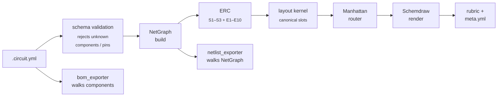
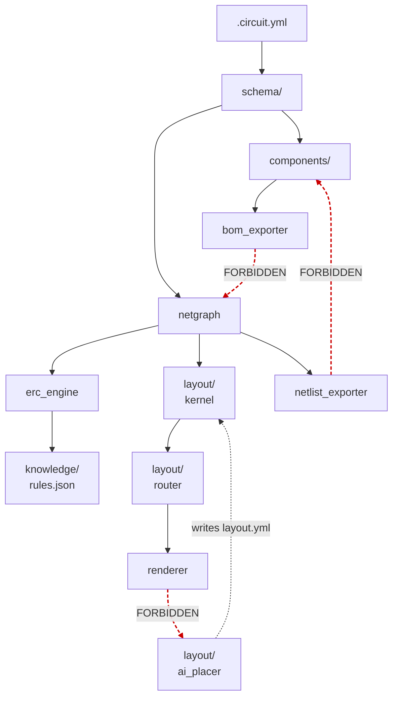

# Architecture

The one-page, top-down view of CircuitSmith. For deeper rationale,
follow the ADR links; for the original design depth, the
[IDEA-001 dossier](ideas/archived/idea-001-circuit-skill.md) and its
companion files remain the source of record.

> **Status:** the modules below describe the *target* architecture.
> None of the product code exists yet — implementation begins with
> EPIC-001 (Phase 1: component library + schema). The README's
> `## Architecture` section summarises this doc; the depth lives
> here.

## What it produces

A single `.circuit.yml` is the source of truth. The pipeline emits:

- `main-circuit.svg` — schematic, rendered via Schemdraw.
- `erc-report.md` — electrical rule check findings, with rationale.
- `bom.md` / `bom.csv` — bill of materials.
- `main-circuit.net` — KiCad-compatible netlist.
- `meta.yml` — layout provenance + readability rubric scores.

## Pipeline

Two contract points anchor the flow:

- **ERC runs strictly pre-layout** — a malformed circuit never reaches
  the router. See [ADR-0005](adr/0005-erc-pre-layout.md).
- **NetGraph is the shared contract** for ERC, layout, and netlist
  export. See [ADR-0003](adr/0003-netgraph-shared-contract.md).

## Module boundaries

The library lives at [`src/circuitsmith/`](../../src/circuitsmith/);
the agent-facing surface (SKILL.md + docs/) lives at
[`.claude/skills/circuit/`](../../.claude/skills/circuit/). See
[ADR-0012](adr/0012-library-as-installable-package.md) (supersedes
[ADR-0007](adr/0007-skill-directory-is-the-library.md)) for why
the library is published as the `circuitsmith` Python package rather
than shipped as the skill folder itself.

The three red dashed edges are the **forbidden edges** machine-checked
by [TASK-050](tasks/open/task-050-boundary-import-contract-test.md):

1. `bom_exporter` never touches `NetGraph` — it walks `components`
   directly.
2. `netlist_exporter` never reads `components` internals — it walks
   `NetGraph`.
3. `renderer` never imports `circuitsmith.layout.ai_placer` — it
   consumes pre-committed `layout.yml` via `layout.py`, preserving
   AI containment.

## Component table

| Module | Path | Governing ADR(s) | Code-owner skill | Responsibility |
|---|---|---|---|---|
| Skill prompt | `.claude/skills/circuit/SKILL.md` | [0006](adr/0006-rule-catalog-authoritative.md), [0012](adr/0012-library-as-installable-package.md) | — | LLM-facing instructions and invocation contract. |
| `renderer` | `src/circuitsmith/renderer.py` | [0002](adr/0002-ai-only-at-authoring-time.md), [0012](adr/0012-library-as-installable-package.md) | — | YAML → Schemdraw → SVG; consumes layout.yml, never the AI placer. |
| `netgraph` | `src/circuitsmith/netgraph.py` | [0003](adr/0003-netgraph-shared-contract.md) | [co-netgraph](../../.claude/skills/co-netgraph/) | The typed net graph shared by ERC, layout, and netlist export. |
| `erc_engine` | `src/circuitsmith/erc_engine.py` | [0005](adr/0005-erc-pre-layout.md), [0006](adr/0006-rule-catalog-authoritative.md) | [co-erc-engine](../../.claude/skills/co-erc-engine/) | Structural S1–S3 + electrical E1–E10 checks against `NetGraph`. |
| `bom_exporter` | `src/circuitsmith/export/bom_exporter.py` | [0004](adr/0004-exporter-decoupling.md) | — | Walks `components`; emits BOM markdown + CSV. |
| `netlist_exporter` | `src/circuitsmith/export/netlist_exporter.py` | [0004](adr/0004-exporter-decoupling.md) | — | Walks `NetGraph`; emits KiCad `.net`. |
| `layout` (CLI) | `src/circuitsmith/layout.py` | [0001](adr/0001-slots-not-coordinates.md) | — | CLI entry for `/circuit layout`; orchestrates kernel + router. |
| `layout.kernel` | `src/circuitsmith/layout/kernel.py` | [0001](adr/0001-slots-not-coordinates.md) | — | Canonical-slot placement. |
| `layout.router` | `src/circuitsmith/layout/router.py` | [0001](adr/0001-slots-not-coordinates.md) | — | Manhattan-routing of nets between placed slots. |
| `layout.ai_placer` | `src/circuitsmith/layout/ai_placer.py` | [0002](adr/0002-ai-only-at-authoring-time.md), [0008](adr/0008-phase-2b-trigger-on-evidence.md) | — | AI-driven placer; **authoring-time only**, output is committed `layout.yml`. |
| `schema/` | `src/circuitsmith/schema/*.json` | [0012](adr/0012-library-as-installable-package.md) | [co-schema](../../.claude/skills/co-schema/) | JSON-schemas for circuit + layout YAML; reject malformed inputs at the seam. |
| `components/` | `src/circuitsmith/components/*.py` | [0004](adr/0004-exporter-decoupling.md) | — | Component profiles: pin maps, footprints, BOM metadata. |
| `knowledge/` | `src/circuitsmith/knowledge/rules.json` | [0006](adr/0006-rule-catalog-authoritative.md) | — | Curated ERC rule catalog (30–50 rules). No runtime LLM authoring. |

## Decoupling — the four load-bearing seams

These are the architecture's promises. Each is enforced by either
prose ADR, machine-checked test, or both.

### 1. NetGraph as shared contract — [ADR-0003](adr/0003-netgraph-shared-contract.md)

ERC, layout, and netlist export share **one** typed graph. Three
consumers cannot drift apart on representation.
*Enforcement:* the [co-netgraph](../../.claude/skills/co-netgraph/)
code-owner skill (edit-time), the NetGraph golden-hash CI contract
([TASK-053](tasks/open/task-053-netgraph-golden-hash-contract-test.md);
post-commit).

### 2. Exporter decoupling — [ADR-0004](adr/0004-exporter-decoupling.md)

`bom_exporter` walks `components`; `netlist_exporter` walks
`NetGraph`. They **never cross**. The contract gives us the two-way
view: BOM stays sane when net topology changes; netlist stays sane
when component metadata changes.
*Enforcement:* the boundary-import contract test
([TASK-050](tasks/open/task-050-boundary-import-contract-test.md)).

### 3. ERC strictly pre-layout — [ADR-0005](adr/0005-erc-pre-layout.md)

Malformed circuits don't reach the router; they fail loud at the
NetGraph stage. Removes the "did layout corrupt my circuit, or was
the circuit broken?" failure mode.
*Enforcement:* pipeline ordering (renderer.py orchestrates).

### 4. Package portability — [ADR-0012](adr/0012-library-as-installable-package.md)

`src/circuitsmith/` contains no project-specific paths or imports.
Phase 7 (EPIC-006) publication to PyPI works because every commit
on the way passed the portability lint. The contract was originally
scoped to `.claude/skills/circuit/` under
[ADR-0007](adr/0007-skill-directory-is-the-library.md) (now
superseded); ADR-0012 migrated the contract scope to the new
package location without changing its rules.
*Enforcement:* the portability lint
([TASK-051](tasks/closed/task-051-portability-lint.md))
runs in CI and in the pre-commit hook.

## AI containment

CircuitSmith is deliberate about where the LLM runs:

- **Authoring time, yes.** The skill (`SKILL.md`) instructs Claude to
  understand the maker's natural-language request and emit `.circuit.yml`.
  The AI placer (`ai_placer.py`) optionally improves layout when the
  v0.1 kernel falls short.
- **Runtime, no.** The ERC engine never asks Claude what "good
  practice" is — it reads `knowledge/rules.json`. The renderer never
  prompts an LLM mid-render. The committed `.circuit.yml`,
  `layout.yml`, `rules.json` are the ground truth.

See [ADR-0002](adr/0002-ai-only-at-authoring-time.md) (output is
committed data) and [ADR-0006](adr/0006-rule-catalog-authoritative.md)
(rule catalog is authoritative).

The forbidden edge `renderer → layout_engine/ai_placer` in the
module-boundary graph is the structural expression of this
containment.

## Phase 2b is conditional

The AI placer (`layout_engine/ai_placer.py`) is **not always present**.
The v0.1 kernel ships first and stays in production until concrete
escalations justify the placer. The trigger is evidence-driven, not
calendar-driven — see [ADR-0008](adr/0008-phase-2b-trigger-on-evidence.md)
and [TASK-058](tasks/open/task-058-implement-check-phase2b-trigger.md).

## Where to go next

| You want… | Go to |
|---|---|
| Decisions (the *why*) | [`adr/`](adr/) — start with [`README.md`](adr/README.md) for the index. |
| Original design depth (the *thinking*) | [`ideas/archived/idea-001-circuit-skill.md`](ideas/archived/idea-001-circuit-skill.md) and its eight companion files. |
| Per-file invariants surfaced at edit time | [`CODE_OWNERS.md`](CODE_OWNERS.md) and the `.claude/skills/co-*` skills. |
| Test layers, fixtures, golden updates | [`TESTING.md`](TESTING.md). |
| CI gates and the local mirror | [`CI_PIPELINE.md`](CI_PIPELINE.md). |
| Setup, install, smoke-test | [`DEVELOPMENT_SETUP.md`](DEVELOPMENT_SETUP.md). |
| Task / epic / idea workflow | [`TASK_SYSTEM.md`](TASK_SYSTEM.md). |
| Autonomous-loop protocol | [`AUTONOMY.md`](AUTONOMY.md). |
