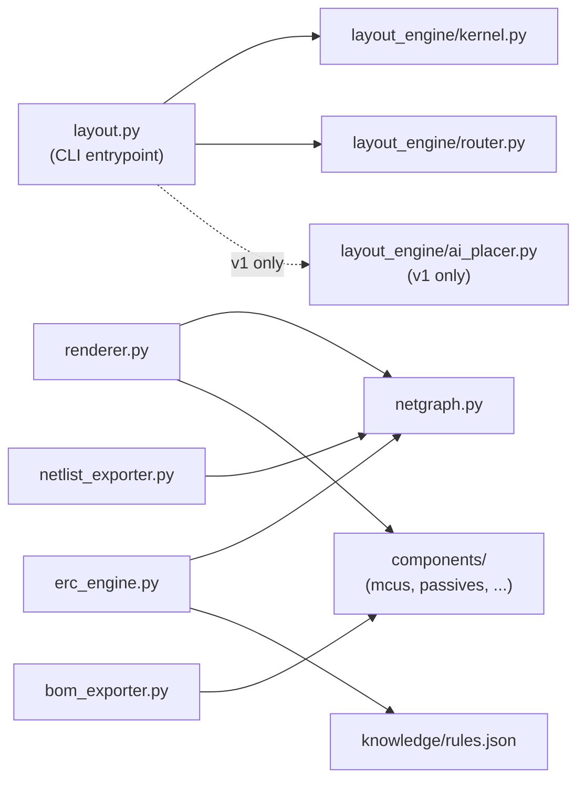
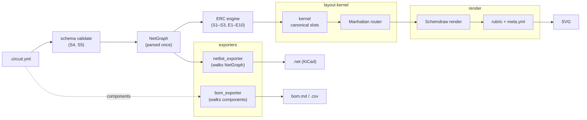
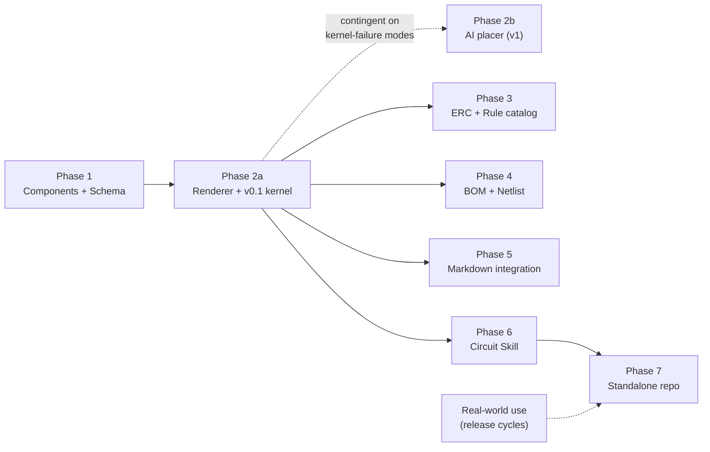

## Archive Reason

2026-05-12 — Converted to EPIC-001..006 with 45 derived tasks (TASK-001..045). Phase Plan and companion design docs remain authoritative references for the implementation; see [`docs/developers/tasks/EPICS.md`](../../tasks/EPICS.md) for the live work breakdown.

## Provenance

This dossier (`idea-001-circuit-skill.md` + 8 `idea-001.*` companion files) was
copied from [AwesomeStudioPedal](https://github.com/tgd1975/AwesomeStudioPedal)'s
[IDEA-027](https://github.com/tgd1975/AwesomeStudioPedal/blob/main/docs/developers/ideas/open/idea-027-circuit-skill.md)
on the bootstrap of CircuitSmith. Every reference in this file (and its
companions) to a predecessor artefact or sibling IDEA-NNN resolves to a file in
that repo. Anchor map (used throughout the dossier; not repeated inline):

| Predecessor reference | Lives in AwesomeStudioPedal at |
|---|---|
| `scripts/generate-schematic.py` | [`scripts/generate-schematic.py`](https://github.com/tgd1975/AwesomeStudioPedal/blob/main/scripts/generate-schematic.py) |
| `data/config.json` | [`data/config.json`](https://github.com/tgd1975/AwesomeStudioPedal/blob/main/data/config.json) |
| `docs/builders/wiring/<target>/` | [`docs/builders/wiring/`](https://github.com/tgd1975/AwesomeStudioPedal/tree/main/docs/builders/wiring) (esp32, nrf52840) |
| `TASK-200`–`TASK-207`, `TASK-239` | AwesomeStudioPedal task history (IDEA-019 implementation) |
| IDEA-011 (PCB design) | [`idea-011-pcb-board-design.md`](https://github.com/tgd1975/AwesomeStudioPedal/blob/main/docs/developers/ideas/open/idea-011-pcb-board-design.md) |
| IDEA-018 (BOM prototype) | [`idea-018-bom-prototype.md`](https://github.com/tgd1975/AwesomeStudioPedal/blob/main/docs/developers/ideas/open/idea-018-bom-prototype.md) |
| IDEA-019 (Wiring-as-code) | [`idea-019-wiring-as-code.md`](https://github.com/tgd1975/AwesomeStudioPedal/blob/main/docs/developers/ideas/archived/idea-019-wiring-as-code.md) |
| IDEA-022 (MkDocs site) | [`idea-022-mkdocs-documentation-site.md`](https://github.com/tgd1975/AwesomeStudioPedal/blob/main/docs/developers/ideas/open/idea-022-mkdocs-documentation-site.md) |
| IDEA-027 (this dossier's source) | [`idea-027-circuit-skill.md`](https://github.com/tgd1975/AwesomeStudioPedal/blob/main/docs/developers/ideas/open/idea-027-circuit-skill.md) |

## Context and Status of IDEA-019

IDEA-019 (Wiring-as-Code) is **fully implemented** as of 2026-04-22 (TASK-200–207).
`scripts/generate-schematic.py` generates SVGs for the ESP32 and nRF52840 targets from
`data/config.json`. The output is committed to `docs/builders/wiring/<target>/main-circuit.svg`
and kept in sync by a pre-commit hook and CI staleness guard.

IDEA-001 extends that foundation with electrical validation, BOM generation, netlist export,
and AI-assisted authoring — the capabilities IDEA-019 deferred.

---

## Problem

The current `generate-schematic.py` is hand-authored Python: adding a new target,
changing a component, or adapting the circuit for a new build configuration requires
understanding Schemdraw's API. There is no validation that the drawn circuit is electrically
safe. There is no machine-readable component list. There is no path from the diagram to PCB
tools.

Specifically, the project currently has no answer for:

- A contributor who wants to add a sensor or connector to the schematic without knowing
  Schemdraw or electronics.
- A reviewer who wants to know whether a new circuit violates electrical rules (floating
  inputs, missing LED resistors, over-current, reversed polarity) without reading the code.
- A builder who needs a shopping list derived directly from the drawn schematic.
- A PCB designer (IDEA-011) who needs to import the circuit topology into KiCad.

---

## Proposed Solution: The Circuit Skill

A Claude Code skill (`.claude/skills/circuit/SKILL.md`) that is distributed alongside the
project. Contributors install it once; after that, circuit authoring, validation, and export
are all driven by natural-language prompts to Claude.

The skill:

- reads and writes a declarative **YAML circuit description** (`.circuit.yml`)
- renders the YAML to an **SVG schematic** via Schemdraw
- runs a **hardware linter (ERC)** and reports findings in Markdown
- produces a **bill of materials** (Markdown + CSV)
- exports a **KiCad-compatible netlist** (`.net`)

All outputs slot into the existing CI pipeline with no new infrastructure.

---

## Architecture

The skill is self-contained: everything it needs ships inside `.claude/skills/circuit/`.
A contributor clones this repo (or copies the skill directory to another project) and it
works without any dependency on project-specific scripts.

```
.claude/skills/circuit/
├── SKILL.md             ← skill prompt + invocation spec
├── LICENSE              ← MIT
├── CHANGELOG.md         ← version history; maintained from Phase 1
├── renderer.py          ← YAML → Schemdraw drawing → SVG
├── netgraph.py          ← shared typed net graph (consumed by erc_engine + netlist_exporter)
├── erc_engine.py        ← hardware linter (importable, also run standalone)
├── bom_exporter.py      ← component counter → Markdown/CSV
├── netlist_exporter.py  ← net graph → KiCad .net
├── layout.py            ← CLI entrypoint for /circuit layout <name> (kernel + router; AI in v1)
├── layout_engine/
│   ├── __init__.py
│   ├── kernel.py        ← deterministic placer (§5 of layout-engine concept)
│   ├── router.py        ← Manhattan router (§9)
│   └── ai_placer.py     ← v1 only; absent on disk in v0.1
├── schema/
│   ├── circuit.schema.json  ← JSON Schema for .circuit.yml validation (Phase 1)
│   └── layout.schema.json   ← JSON Schema for .layout.yml validation (Phase 2)
├── components/
│   ├── __init__.py
│   ├── mcus.py          ← full MCU profiles (ESP32, nRF52840, ...)
│   ├── passives.py      ← resistors, capacitors, diodes, LEDs, buttons
│   ├── connectors.py    ← jack (mono/stereo), USB-C, pin headers
│   └── sensors.py       ← I2C/SPI sensor profiles (BME280, SSD1306, …); created on demand
├── knowledge/
│   ├── rules.json       ← curated rule catalog (explanations, heuristics, source links)
│   ├── BACKLOG.md       ← catalog authoring backlog
│   └── validate_catalog.py  ← format + link reachability check
├── tests/               ← acceptance-test fixtures (Phase 2a layout stability + Phase 6 evaluations)
├── docs/
│   ├── index.md         ← overview, quick-start, install
│   ├── circuit-yaml.md  ← full .circuit.yml format reference
│   ├── erc-checks.md    ← every check: logic, severity, how to suppress
│   ├── components.md    ← component library reference + how to add a profile
│   └── layout.md        ← layout engine user guide: invocation, outputs, rubric, failure reports, --reflow/--no-ai
└── README.md            ← concise install + link to docs/index.md; shown on GitHub
```



The dashed edge marks `ai_placer.py` as v1-only — absent on disk in v0.1 per
[idea-001.skill-packaging.md](idea-001.skill-packaging.md). Note that
`bom_exporter.py` walks `components` directly and never touches `NetGraph`,
while `netlist_exporter.py` walks `NetGraph` and never reads component
internals — the two exporters are deliberately decoupled.

`sensors.py` does not exist at the start of Phase 1 — it is created the first time a sensor
profile is added (Phase 6 acceptance test or later). The schema auto-derives allowed `type`
strings from whichever `components/*.py` files exist, so a new category file requires no
manual schema update.

`layout.py` and the `layout_engine/` package land in Phase 2 alongside `renderer.py`.
`layout_engine/ai_placer.py` is absent on disk in v0.1 and added in the v1 packaging PR —
see [idea-001.skill-packaging.md](idea-001.skill-packaging.md) items 1, 2, and 5 for the
rationale (single entrypoint, distinct package stem, v0.1/v1 split).

`scripts/generate-schematic.py` is refactored to import from
`.claude/skills/circuit/components/` and call `.claude/skills/circuit/renderer.py`,
so the existing CI pipeline and the skill share the same library with no duplication.
The CI script is a thin wrapper; the skill is the library.

**Portability contract:** the Python tools inside the skill directory are
path-agnostic — they accept input and output paths as arguments and have no hardcoded
references to this project's directory layout. A consumer project points them at its own
files; this project's CI script does the same.

---

## Pipeline

The Phase 2+ data flow, end-to-end:

```text
.circuit.yml
  → schema validation     (rejects S4 unknown-ref, S5 unknown-pin before ERC runs)
  → ERC                   (structural S1–S3 + electrical E1–E10)
  → layout kernel         (canonical-slot placement per layout §5.3)
  → Manhattan router      (wire geometry)
  → Schemdraw render      (SVG emission)
  → rubric + meta.yml     (readability rubric per layout §10; sidecar per layout §11)
```



Each stage consumes the previous stage's output and emits a well-defined artifact.
ERC is **strictly pre-layout**: it fails fast on electrical errors before any
geometry work happens, so a malformed circuit never reaches the router or
renderer. See [idea-001.erc-engine.md](idea-001.erc-engine.md) for the
topology-only framing and the `NetGraph` data model that both `erc_engine.py`
and `netlist_exporter.py` share; see
[idea-001.layout-engine-concept.md](idea-001.layout-engine-concept.md) for the
kernel, router, and rubric details. The diagram above is duplicated — by
design — in the ERC engine doc so that file is readable on its own.

---

## Companion Documents

The deep-dive specifications for each module live alongside this overview. Each
companion file is self-contained and readable on its own; this overview links into
them where their topic is first referenced.

| Companion | Covers |
|---|---|
| [Skill packaging and documentation](idea-001.skill-packaging.md) | SKILL.md frontmatter, dependencies, file layout, portability, install paths, acceptance-test fixtures, maker-docs integration |
| [YAML circuit description](idea-001.yaml-format.md) | The three connection forms (`pins`, `path`, `bus`), schema validation, Markdown `` ```circuit `` block and staleness detection |
| [Layout engine — concept](idea-001.layout-engine-concept.md) (+ [discussion](idea-001.layout-engine-discussion.md) for rationale) | Slot vocabulary, deterministic kernel, incremental placer, AI escalation, rubric, sidecar, CI contract |
| [ERC engine](idea-001.erc-engine.md) | Three-level configuration, structural + electrical checks, enriched report format |
| [Rule catalog (knowledge base)](idea-001.rule-catalog.md) | Catalog format, source-of-truth policy and licensing, 30–50-rule scope, authoring workflow, seed backlog |
| [Components — profiles, pin aliases, authoring](idea-001.components.md) | Pin aliasing, profile format, adding a component via the skill |
| [Exporters — BOM and netlist](idea-001.exporters.md) | BOM markdown/CSV, KiCad `.net` flattening rules |

Companion files have no YAML frontmatter by design, so the ideas OVERVIEW generator
lists only this overview file. The same convention is already used for
`idea-013-bus-discussion.md`.

## AI Skill Prompt (SKILL.md summary)

The skill instructs Claude to act as an electronics engineer who:

1. **Knows the component library** — resolves all component types from `components/`;
   never invents pin names, sides, or electrical values.
2. **Writes and edits YAML, not Python** — all circuit authoring produces `.circuit.yml`
   files; the renderer is never touched directly.
3. **Enforces layout conventions** — signal flow left → right, VCC top, GND bottom;
   MCU in the centre; passives inline with their GPIO; all paths orthogonal.
4. **Applies best practices automatically, grounded in the rule catalog** — buttons get
   internal pull-up (firmware flag) or external 10 kΩ (if hardware); LEDs get 220 Ω
   (for 3.3 V); I2C buses get 4.7 kΩ to VCC. Every default the skill applies traces
   back to a catalog entry with a `source_of_truth` link — no free-form LLM generation
   of hardware rules at runtime.
5. **Asks before guessing** — if pin assignments are ambiguous, collects all ambiguous
   pins and asks about them in a single message rather than one at a time.
6. **Runs the ERC first** — after writing or editing YAML, runs `erc_engine.py` and
   reports findings before declaring the circuit done.
7. **Can add components** — writes new profiles to `.claude/skills/circuit/components/`,
   validates them, and reports which ERC checks they activate.

---

## Integration with Existing Pipeline

| Concern | Existing mechanism | Change |
|---|---|---|
| SVG generation | `scripts/generate-schematic.py` | Delegates to `.claude/skills/circuit/renderer.py`; source is now YAML |
| Pre-commit hook | Regenerates SVG on `.py` changes | Triggers on `.circuit.yml` changes; also regenerates `erc-report.md` and `bom.md` |
| CI staleness guard | `git diff --exit-code` on SVG | Extended to include `erc-report.md`, `bom.md`, `main-circuit.net` |
| CI gate | Fails on stale SVG | Also fails on ERROR-level ERC findings |
| Markdown blocks | — | New: `generate-circuits` workflow rewrites ` ```circuit ` blocks to image embeds |
| Docs site | SVG embedded in build guide | BOM table also embedded; ERC report linked |
| MkDocs (IDEA-022) | — | `pymdownx.superfences` custom formatter replaces CI rewrite step |

---

## Phase Plan



Solid arrows are hard prerequisites; dashed arrows are contingent or
soft dependencies. Phase 2b is gated on observed kernel-failure modes
(see §17.1 trigger gate); Phase 7 needs Phase 6 plus accumulated
real-world use.

### Phase 1 — Component Library + Schema (prerequisite)

Extract the two existing board definitions from `generate-schematic.py` into full profiles
in `.claude/skills/circuit/components/mcus.py`. Write `circuit.schema.json`. Refactor
`generate-schematic.py` to import from the new library. No behaviour change; both existing
targets must produce identical SVGs after the refactor. Profile format is specified in
[idea-001.components.md](idea-001.components.md).

Deliverables: `components/mcus.py` + `passives.py` + `connectors.py` + `sensors.py`
(the day-one profile library per
[components.md §Initial library](idea-001.components.md#initial-library), every profile
shipping with `metadata.keywords`), `schema/circuit.schema.json`, refactored
`generate-schematic.py`. (`schema/layout.schema.json` lands in Phase 2a alongside the
layout kernel.)

### Phase 2 — YAML Renderer (staged per layout §17.1)

Phase 2 tracks the layout-engine staging in
[idea-001.layout-engine-concept.md §17.1](idea-001.layout-engine-concept.md):
Phase 2a ships the deterministic kernel (v0.1); Phase 2b adds the AI placer (v1)
when v0.1 has accumulated concrete kernel-failure modes on real use. Phase 2a is
a hard prerequisite for Phases 3–7; Phase 2b is not.

#### Phase 2a — Renderer + v0.1 kernel-only layout + cutover

Implement `.claude/skills/circuit/renderer.py`. It reads a `.circuit.yml`, validates it against
the schema, runs the v0.1 deterministic kernel (slots, canonical-slot table, incremental placer,
Manhattan router, structural rubric `overlaps` + `labels_fit` + `wire_crossings`), and produces
an SVG for the ESP32 and nRF52840 targets. YAML format is specified in
[idea-001.yaml-format.md](idea-001.yaml-format.md); layout strategy is specified in
[idea-001.layout-engine-concept.md](idea-001.layout-engine-concept.md) (rationale in
[idea-001.layout-engine-discussion.md](idea-001.layout-engine-discussion.md)).

Acceptance criterion is **rubric-green on both shipped circuits** at the "readable, not pretty"
bar of TASK-239's third-attempt output (per
[layout §16.2](idea-001.layout-engine-concept.md#162-layoutyml-bootstrapping--ai-authored-topology-kernel-generated-layout)).
Pixel-diff comparison against the legacy generator is **not** the acceptance criterion:
the cutover intentionally produces different geometric identity (same electrical content,
same readability bar) per layout §16.2. Structural XML comparison (element count,
`data-ref` attributes) against the post-cutover `full-pedal` fixture is the regression guard
going forward.

**Cutover is a discrete deliverable inside Phase 2a**, not a sub-step. Per
[layout §16.1](idea-001.layout-engine-concept.md#161-cutover), the cutover PR
translates `data/config.json` into two `data/*.circuit.yml` files, generates the matching
`layout.yml` pairs from the placer, commits the resulting SVG / `meta.yml` as the
`full-pedal` fixture's `expected.*` artifacts, deletes the old generator, retargets the
CI staleness guard, and removes the existing pre-commit staleness hook — all in a single PR.
Git history is the rollback path.

Deliverables: `renderer.py`, kernel + router + structural rubric,
`schema/layout.schema.json`, two `.circuit.yml` files, two `layout.yml` files,
`full-pedal` fixture, cutover PR merged, CI retargeted.

#### Phase 2b — AI placer (contingent on real failure modes)

Add the AI placer (layout §7) and convergence contract on top of Phase 2a's kernel.
Phase 2b ships when Phase 2a has accumulated concrete kernel-failure modes on real
circuits that a §5.3 table addition cannot retire — those failures become the
calibration corpus for the AI placer's convergence loop, replacing speculation with
evidence.

**Trigger gate and decider.** The maintainer evaluates trigger status at every
release-prep review (alongside the §17.2 coverage walk). Phase 2b is opened when
`meta.yml.provenance.escalations` (or v0.1's equivalent fail-loud events per §17.2)
shows a non-zero kernel-failure count on a circuit whose category *looks* routine,
and a §5.3 table addition cannot retire it. Until that signal arrives, the
kernel-only pipeline runs across however many release cycles elapse. The decision
to open Phase 2b is recorded in the release notes for the cycle in which it is
made, so "v1 didn't ship this cycle" is an explicit outcome, not drift.

Deliverables (if triggered): AI placer, convergence loop, `--no-ai` fallback, per-run
token cap + cost accounting, v1 rubric checks, AI-specific reason codes.

### Phase 3 — ERC Engine + Rule Catalog

Implement `erc_engine.py` with structural checks S1–S3 and electrical checks E1–E10
as defined in [idea-001.erc-engine.md](idea-001.erc-engine.md). E6 (decoupling cap),
E7 (I2C pull-up), and E10 (pin conflict) are shipped but dormant on the current
circuits — they activate as soon as a qualifying component (non-MCU IC, I2C device,
or a duplicate pin reference) appears. Integrate into the renderer (ERC runs after
YAML parse, before drawing). Write `erc-report.md` alongside the SVG. Extend CI to
fail on ERROR-level findings. Check definitions and report format live in the ERC
engine doc.

Seed the rule catalog (`knowledge/rules.json`) with **15 entries — one per shipped ERC
check code (S1–S5 + E1–E10)**. S4 and S5 are detected by schema validation rather than by
predicates in `erc_engine.py`, but their codes are defined alongside S1–S3 in the engine's
constant table so schema-validation findings surface in the ERC report under the same
severity column and the same catalog-lookup pipeline; the catalog therefore carries rows
for them too. Each entry declares rule, explanation, heuristic, source link, and keywords.
The ERC report writer looks up catalog entries by check `id` and appends the enriched
"Why / Senior's tip / Source" block under each non-OK finding. Add `validate_catalog.py`
and run it in CI. Catalog format, licensing, scope, and authoring workflow are specified
in [idea-001.rule-catalog.md](idea-001.rule-catalog.md).

**Note on E9 and the current circuit:** the ESP32 and nRF52840 `.circuit.yml` files
generated in Phase 2 do not include polarity protection between the power connector and
the MCU. **At v0.1, E9 ships as WARNING by default** (per
[idea-001.erc-engine.md §E9 note](idea-001.erc-engine.md#checks)) because the `diode`
category is backlogged in
[components.md](idea-001.components.md#backlog--requires-a-new-53-row-first) — without
it, E9 cannot semantically distinguish a protection diode from any other resistor on the
power net, and every USB-C / barrel-jack circuit would fail by construction. WARNING-level
findings do not block CI, so Phase 3 requires no circuit change. E9 auto-promotes to
ERROR once the `diode` category lands; at that point each affected circuit gets either
a Schottky diode added to its `.circuit.yml` power path (path form) or an explicit
per-component `E9: off` override on the connector with a documented rationale (e.g.
USB-C CC-pin protection in compliant cables).

Deliverables: `erc_engine.py`, `knowledge/rules.json` (seeded with one entry per
shipped check), `knowledge/validate_catalog.py`, `knowledge/BACKLOG.md` (remaining
educational-only rules to author), `erc-report.md` for each target with enriched
per-finding explanations, CI gate.

### Phase 4 — BOM + Netlist Exporters

Implement `bom_exporter.py` and `netlist_exporter.py`. Write `bom.md`, `bom.csv`, and
`main-circuit.net` alongside the SVG. Embed the BOM table in the build guide. Spot-check
the `.net` file imports into KiCad without errors. Flattening rules and output formats
live in [idea-001.exporters.md](idea-001.exporters.md).

Deliverables: `bom_exporter.py`, `netlist_exporter.py`, outputs committed for each target.

### Phase 5 — Markdown Integration

Implement the `generate-circuits` GitHub Actions workflow that finds ` ```circuit ` blocks
in Markdown files, renders them, and rewrites the block to a hidden-source image embed.
Implement the `show_source` flag. Add staleness detection via source hash in the SVG
filename.

**Ordering with IDEA-022.** If IDEA-022 (MkDocs site) lands before Phase 5, skip the
CI rewrite workflow and implement the ` ```circuit ` block as a `pymdownx.superfences`
custom formatter directly — the workflow would be replaced by the MkDocs build step
anyway (see the IDEA-022 row in the relationships table). If Phase 5 lands first, the
workflow ships as specified and is retired when IDEA-022 lands.

Deliverables: `.github/workflows/generate-circuits.yml` **or** `pymdownx.superfences`
formatter (depending on IDEA-022 ordering), updated pre-commit hook.

### Phase 6 — Circuit Skill

Write `.claude/skills/circuit/SKILL.md` with the full system prompt. Register in
`.vibe/config.toml`. Run the five acceptance tests defined in
[idea-001.skill-packaging.md](idea-001.skill-packaging.md): happy path, ERC error,
new component (BME280), controller-swap Raspberry Pi, and incremental layout
stability (the §8 incremental-placer regression guard — add a sixth LED to the
happy-path circuit, assert `layout.yml` diff is one added line with kept components'
slots byte-identical).

**Acceptance under v0.1 kernel-only.** Phase 6 acceptance must pass whether or not
Phase 2b has shipped. The controller-swap test (Raspberry Pi + analog sensor via
external ADC) surfaces HW-RPI-01 from the rule catalog and routes through the ADC —
that is an ERC-and-catalog outcome, not a layout outcome. Layout correctness for the
swap is judged by the v0.1 structural rubric on the resulting circuit; if the kernel
stalls with a fail-loud `no-canonical-rule` escalation, the resolution per layout
§17.1 is a hand-authored `free`-slot entry in `layout.yml` plus a §5.3 table
follow-up, not a Phase 2b dependency. If Phase 2b has shipped, the AI placer handles
the escalation instead. Either path satisfies Phase 6; the acceptance bar does not
move between staging outcomes.

Deliverables: `SKILL.md`, passing acceptance test, updated `MEMORY.md` entry.

### Phase 7 — Standalone Repository Extraction

Extract `.claude/skills/circuit/` into its own repository. The skill directory is already
self-contained (path-agnostic scripts, `LICENSE`, `CHANGELOG.md`, full `docs/`), so
extraction is mechanical.

Steps:

1. Create a new GitHub repository (name TBD — e.g. `circuit-skill`).
2. `git subtree split` (or equivalent) to preserve commit history for files under
   `.claude/skills/circuit/`.
3. Push the split branch as `main` in the new repo.
4. In this project, replace the skill directory with a `git submodule` or a plain
   directory copy pinned to a release tag. **Decision rule:** submodule if the
   standalone repo is expected to ship on its own release cadence (independent
   version tags, independent CHANGELOG cuts); pinned directory copy if the skill
   stabilises and only ships when this project cuts a release. Default to pinned
   copy — it has lower operational overhead and matches the likely steady state.
5. Update `docs/builders/` links and the MkDocs nav to point at the standalone repo's
   docs (GitHub raw or a published GitHub Pages site).
6. Add a `RELEASING.md` to the standalone repo documenting the release and tag process.

**Prerequisite:** Phase 6 acceptance test passes and the skill has been used on at least
one real circuit addition in this project. Extraction before real use risks shipping a
skill with rough edges that are only discovered in practice.

Deliverables: standalone repository live, submodule or pinned copy in this project,
updated nav links, `RELEASING.md`.

---

## Relationship to Other Ideas

| Idea | Relationship |
|---|---|
| **IDEA-011** (PCB design) | The netlist exporter is the direct bridge. When IDEA-011 starts, the `.net` file seeds the KiCad project. The Schemdraw renderer is retired when KiCad + KiBot take over. |
| **IDEA-018** (BOM prototype) | The BOM exporter makes IDEA-018's hand-maintained table redundant. The CSV output is a drop-in replacement. |
| **IDEA-019** (Wiring-as-code) | This idea is the natural continuation. IDEA-019 established the pipeline (script → SVG → committed → CI). IDEA-001 adds a declarative source format, intelligence, and validation on top. |
| **IDEA-022** (MkDocs docs site) | The ` ```circuit ` block integrates natively via `pymdownx.superfences`. When IDEA-022 lands, the CI rewrite workflow (Phase 5) is replaced by the MkDocs build step. The skill's `docs/` directory is imported into the MkDocs nav — no duplication. |

---

## What This Idea Deliberately Excludes

- **Audio signal conditioning** — the pedal has no analog audio path. If that changes,
  new component profiles (`passives/ferrite_bead`, `passives/tvs_diode`) and new ERC
  checks are the mechanism — not a separate feature.
- **Title block / branding overlay** — the SVG carries the project name via its filename
  and path. A visible title block inside the diagram is decoration.
- **cairosvg / PNG conversion** — the CI pipeline uses SVG throughout. PNG is available
  via Schemdraw's matplotlib backend if ever needed; it does not warrant a dedicated step.
- **General-purpose auto-layout** — the MCU-centric fixed layout handles all current
  circuits cleanly. A general router (force-directed, hierarchical, etc.) is a research
  problem that would dwarf the rest of this idea in complexity. The position override
  escape hatch handles the edge cases.
- **A comprehensive electronics textbook in the catalog** — the rule catalog targets
  30–50 entries covering the 80 % of maker cases. "What is a resistor?" is answered by
  the `source_of_truth` link on each relevant rule, not by an in-repo encyclopedia.
  PCB layout, comprehensive component databases, and full-depth theory are out of scope
  by design.
- **Runtime LLM generation of circuit advice** — the catalog is the authoritative source
  for the skill's "senior designer" tips; an LLM is used for natural-language
  understanding of the maker's request and for short definitions of terms (keyword
  lookups), never for generating hardware rules at runtime. Hallucinated electrical
  advice is the failure mode this split specifically prevents.

---

## Implementation Tracking

Implementation is broken across six epics, each seeded by IDEA-001. The epic
seams follow the companion-file structure — each epic owns one design
concern and the phase tasks that realise it. Pairings: Phase 2a + 2b share
the renderer/layout epic, and Phase 6 + 7 share the packaging/release epic.

| Epic | Phases | Companion design doc |
|---|---|---|
| `EPIC-001` circuit-components | Phase 1 | [components.md](idea-001.components.md) |
| `EPIC-002` circuit-renderer-layout | Phase 2a + 2b | [yaml-format.md](idea-001.yaml-format.md), [layout-engine-concept.md](idea-001.layout-engine-concept.md) |
| `EPIC-003` circuit-erc | Phase 3 | [erc-engine.md](idea-001.erc-engine.md), [rule-catalog.md](idea-001.rule-catalog.md) |
| `EPIC-004` circuit-exporters | Phase 4 | [exporters.md](idea-001.exporters.md) |
| `EPIC-005` circuit-markdown-integration | Phase 5 | (Phase Plan §Phase 5 above) |
| `EPIC-006` circuit-skill-packaging | Phase 6 + 7 | [skill-packaging.md](idea-001.skill-packaging.md) |

Tasks per epic are listed in
[`docs/developers/tasks/EPICS.md`](../../tasks/EPICS.md) with the per-epic
dependency graph. The Phase Plan section above remains the authoritative
narrative of *what* each phase delivers and *why* the staging is the way it
is — the epics realise it; they do not redefine it.

---

## Deep-dive authoring order

The companion docs have a natural resolution order driven by data-flow
dependencies: each downstream doc consumes enums, schemas, or contracts
defined upstream. Draft and review in this order so back-references resolve
forward, not backward:

1. **[components.md](idea-001.components.md)** — defines the component-category
   and connection-shape enums.
2. **[yaml-format.md](idea-001.yaml-format.md)** — the `.circuit.yml` schema
   consumes those enums.
3. **[layout-engine-concept.md](idea-001.layout-engine-concept.md)** — the
   canonical-slot table (§5.3) keys off category + shape from (1) and (2).
4. **[erc-engine.md](idea-001.erc-engine.md)** — ERC runs strictly pre-layout
   and consumes the shared `NetGraph` produced from (2); check wiring
   (`enforced_by`) is finalised here.
5. **[rule-catalog.md](idea-001.rule-catalog.md)** — rule entries reference
   checks defined in (4) and shapes defined in (1).
6. **[exporters.md](idea-001.exporters.md)** — BOM and netlist both consume
   the finalised `NetGraph` from (2)/(4).
7. **[skill-packaging.md](idea-001.skill-packaging.md)** — acceptance-test
   fixtures and the SKILL.md frontmatter assume every upstream contract is
   settled.

Changes to an upstream doc that break a downstream contract require
re-review of every doc between them in this chain.

---
