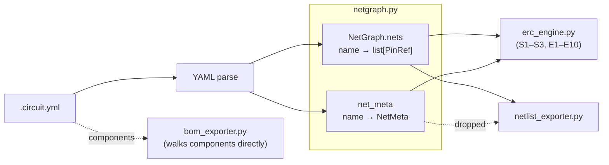
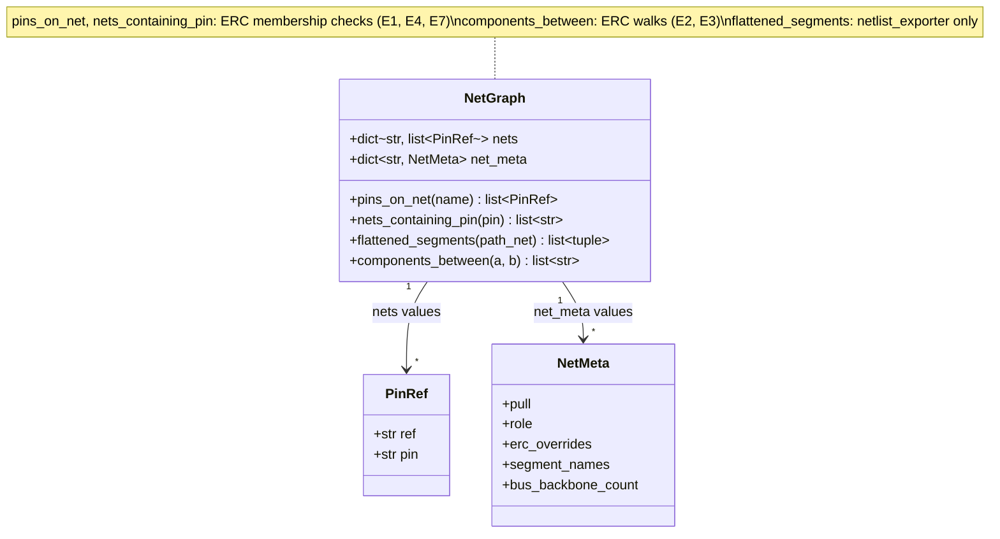

# ERC Engine — topology-only electrical rule check

> Sub-note of [IDEA-001](idea-001-circuit-skill.md). Predecessor references
> (e.g. `scripts/generate-schematic.py`, IDEA-011/018/019/022) resolve via the
> [Provenance anchor map](idea-001-circuit-skill.md#provenance).

The ERC operates on the **parsed YAML net graph** — not on Schemdraw drawing primitives.
This means ERC runs before rendering, fails fast on electrical errors, and is completely
independent of how the SVG looks.

## Pipeline position

ERC sits between schema validation and the layout kernel — see the canonical
pipeline diagram in
[idea-001-circuit-skill.md §Pipeline](idea-001-circuit-skill.md#pipeline) for the
full data flow. That doc is the single source of truth; this section frames only
what ERC's slot in the pipeline implies.

ERC is **strictly pre-layout** and never reads `layout.yml`. Every check in this file
keys on topology (`pins`, `direction`, `type`, `func`, `is_strapping`), not on slot
position, trace length, or any rendered geometry. Two consequences follow:

- **Physical-placement concerns are rubric items, not ERC checks.** "Decoupling cap
  placed far from VCC pin", "ground return path too long", and similar physical-layout
  diagnostics belong in the readability rubric
  ([layout §10](idea-001.layout-engine-concept.md)), not here. If a future check would
  need a coordinate to fire, that is the signal it belongs in the rubric, not the ERC.
- **Error messages cite pins, not wire segments.** An E9 finding points at `J1.VBUS`,
  not at "the horizontal wire segment from x=120 to x=340". The render step may
  decorate its SVG output with ERC hit-points by looking up those pin references
  after the fact; the decoration is pull, not push — the ERC emits no render-specific
  data.

Keeping ERC topology-only is a **layering invariant, not a v0.1 convenience**.
Inverting the dependency (ERC consumes layout output) would entangle the
electrical-safety gate with rendering state, and v0.1 catches every shipped check
without it.

## Configuration

ERC behaviour is configured at three levels, each overriding the one above:

**1. Global defaults** — `erc` key in `meta`, applies to the whole circuit:

```yaml
meta:
  title: ESP32 default build
  target: esp32
  erc:
    E9: warn      # downgrade polarity protection from ERROR to WARNING
    E6: error     # upgrade decoupling cap from WARNING to ERROR
    E3: off       # suppress LED resistor range check entirely
```

Valid values: `error`, `warn`, `off`. Omitting a check key leaves it at its built-in
default severity.

**2. Per-component override** — `erc` key on a component, applies to all nets touching it:

```yaml
components:
  J1:
    type: connectors/usb_c
    label: Power In
    erc:
      E9: off     # USB-C has CC-pin protection; suppress polarity check for this connector
```

**3. Per-net override** — `erc` key on a net, applies to that net only:

```yaml
connections:
  - net: TEST_POINT
    pins: [U1.IO34]
    erc:
      E1: off     # deliberately floating; used only with a scope probe
```

**Auto-activation still applies as the baseline.** Each check's "Active when"
column in the checks table below is authoritative — a check whose activation
predicate is not satisfied by the current circuit is never run, regardless of
configuration. Configuration adjusts severity on checks that *would* run; it
cannot activate a check for a component type that is not present.

### Severity precedence — resolving conflicts

Conflicts resolve along two independent axes. Resolve the cross-component axis
first (if relevant), then feed that result into the specificity axis.

**Axis 1 — specificity (vertical):** most-specific wins. Configuration at a more
specific level overrides the next level up.

| Situation | Effective severity on the net |
|---|---|
| Only `meta.erc` set | Global value |
| Global + per-component set | Per-component value on nets touching that component |
| Global + per-component + per-net set on the same check | Per-net value wins unconditionally |
| Per-net set alone | Per-net value |

**Axis 2 — cross-component (horizontal tie-break):** applies only when a single
net touches two components with conflicting per-component overrides on the same
check. Before axis 1 can pick a per-component value for that net, axis 2 has to
collapse the two component-level claims to one.

| Situation | Effective per-component severity on the net |
|---|---|
| Two components on the same net with conflicting per-component overrides | **Most severe of the two wins** (`error` > `warn` > `off`) |

A per-component `erc:` entry is a claim "this component is safe for check X";
when two components on one net disagree, treating the claim conservatively
(most severe wins) prevents silent disabling via a single component override.
In the ordering `error > warn > off`, `off` is the *least* severe — so a
component claiming `off` always loses to any non-`off` peer, by design. The
intentional escape hatch for an author who really wants the check off on that
net is the **per-net** override on axis 1, which beats both component overrides
by specificity.

**Worked example.** `meta.erc` sets `E9: warn`; `components.J1.erc` sets `E9: off`
(USB-C CC pins); `components.U1.erc` is unset; the VBUS net touches both J1 and U1.
Only J1 has a component-level override, so the per-component rule applies unambiguously
and VBUS inherits `off`. If U1 *also* declared `E9: error` at component level, the two
would conflict on VBUS and most-severe-wins resolves to `error`; suppressing the check
then requires an explicit `connections[VBUS].erc: { E9: off }` per-net override.

## Checks

**Structural checks** — always run; catch malformed YAML before any electrical analysis:

| # | Check | Severity | Logic |
|---|---|---|---|
| S1 | **Unconnected required pin** | ERROR | For each component instantiated in `components:`, every pin whose profile declares `required: true` must appear in at least one net. S1 only evaluates instantiated components — an uninstantiated profile declaring required pins is out of scope (you cannot require pins on a component you didn't place). |
| S2 | **Dangling net** | ERROR | Net has only one endpoint — a wiring typo |
| S3 | **Duplicate net name** | WARNING | Two `net:` entries share a name without explicit merge intent |
| S4 | **Unknown reference** | ERROR | `connections` references a `REF` not declared in `components` |
| S5 | **Unknown pin** | ERROR | `connections` references a `PIN` not in the component's profile |

Schema validation (Phase 1) catches S4 and S5 before the ERC even runs. S1–S3 require
net graph analysis and are the ERC's responsibility.

**S4 and S5 still belong to `erc_engine.py`'s constant table.** Both codes are defined
alongside S1–S3 with their severity, message template, and `id` literal — only the
detection happens upstream. Schema-validation findings are emitted under those codes so
the ERC report renders them under the same severity column and the same catalog-backed
"Why / Senior's tip / Source" block (looked up by `id` from
[rules.json](idea-001.rule-catalog.md)). `validate_catalog.py` therefore requires a
catalog row for every code in the constant table — **S1–S5 + E1–E10 = 15 rows** —
regardless of which pipeline stage physically emits the finding.

**Ordering: S-class errors gate E-class, but within a class the ERC collects all
findings.** The ERC runs every structural check against the whole net graph and
collects every S-class finding before deciding whether to run electrical checks.
If any S-class check produced an ERROR, E-class checks are skipped (the net
graph is too malformed to reason about electrically — a dangling net or duplicate
name makes E-predicates unreliable) and the report contains every S-class
finding with a trailing note that E-class was skipped. If S-class finds only
WARNINGs (currently just S3) the ERC proceeds into E-class. Authors see every
structural bug in one pass rather than fix-one-at-a-time.

**Electrical checks** — run after structural checks pass.

**Columns.** *"Active when"* is the cheap pre-filter that decides whether a check
runs at all on this circuit (e.g. "Any LED in the circuit" means the check is
skipped entirely on a circuit with no LEDs). *"Logic"* is the actual predicate
the check evaluates per candidate net or pin once active. A check whose
activation predicate is not satisfied is never run, regardless of configuration.

| # | Check | Severity | Active when | Logic |
|---|---|---|---|---|
| E1 | **Floating input** | ERROR | Any signal input pin in a net | Net contains a pin whose `type` is `GPIO` with runtime `role: in`, or `type: INPUT_ONLY`; net has no `pull` key and no external pull resistor (see E1 notes). `type: GROUND` and `type: POWER` pins are excluded even though they carry `direction: "in"` — they are supply sinks, not signal inputs. |
| E2 | **LED missing resistor** | ERROR | Any LED in the circuit | LED anode pin sits on a `path:` net; the flattened path from the driving GPIO to the anode contains no resistor segment. LEDs wired on `pins:` or `bus:` nets trigger E2 directly (a non-`path:` topology is itself the error — a current-limiting resistor has no well-defined position on an unordered junction; see [yaml-format §Form 1](idea-001.yaml-format.md#form-1--pins-unordered-set) and [§Form 3](idea-001.yaml-format.md#form-3--bus-shared-backbone-with-taps) for the topology choice). |
| E3 | **LED resistor out of range** | WARNING | Any LED whose path contains a resistor component | Resistor value outside 100 Ω–1 kΩ for the MCU's VCC; calculated as `I = (VCC - v_forward) / R`. E3 runs independently of E2 — if the LED is wired without a resistor, E2 fires and E3 has no resistor to evaluate; E3 never consumes E2's pass/fail result. See E3 note for why "pin at risk" is WARNING and not ERROR. |
| E4 | **INPUT_ONLY pin driven** | ERROR | ESP32 or similar MCU | Membership test: net contains a pin whose profile `type` is `INPUT_ONLY` *and* contains any other pin with `direction: "out"`. Position within the net is not consulted — any output on the same net is a fault. |
| E5 | **Strapping pin without pull** | WARNING | MCU with `is_strapping` pins, on nets containing a switch | Strapping pin is in a net with a switch; net has no `pull: firmware` or `pull: hardware_up`. See E5 note below for why the switch scope. |
| E6 | **Missing decoupling cap** | WARNING | Any IC with a VCC pin | IC's VCC pin net contains no capacitor anywhere on the net (100 nF expected). Topology-only: the check cannot verify the cap sits physically near the IC — per-IC enforcement and proximity to the VCC pin are rubric concerns (see `R-CAP-PROX` / `R-CAP-PER-IC` in [layout §10 readability rubric](idea-001.layout-engine-concept.md); the concrete rule IDs land with the rubric item). One shared bulk cap on a multi-IC VCC rail satisfies E6 for every IC on that rail by design; the rubric is where authors get pushback on under-decoupled rails. |
| E7 | **I2C missing pull-up** | WARNING | Any component with `func: ["I2C_SDA"]` or `["I2C_SCL"]` (membership test on the list) | SDA/SCL net has no resistor to a VCC net |
| E8 | **Current budget exceeded** | WARNING | MCU + any LEDs | Sum of `(VCC - v_forward) / R` across all LED nets exceeds `max_total_current_ma` from MCU profile. **v0.1 scope: LEDs only.** Other GPIO-driven loads (buzzers, relays, logic-level outputs) are not summed; extending E8 to cover them requires per-component current metadata that no non-LED profile declares today. |
| E9 | **Reverse-polarity unprotected** | WARNING (v0.1) → ERROR (post-`diode`) | Any power input connector | Membership test: the net containing the power connector's VBUS/VIN pin contains no diode or P-MOSFET component. "Before reaching the MCU" is not enforced directly — on a `pins:` net "before" is not defined, and E9 would otherwise be unenforceable on the common `pins: [J1.VBUS, U1.VIN]` topology. Authors who want a component positionally between J1.VBUS and U1.VIN promote the net to `path:` form; E9's pass condition is the same (a diode/P-MOSFET is on the net), but the `path:` form also makes the protection element visible in the rendered schematic. |
| E10 | **Pin conflict** | ERROR | Any pin appearing in more than one net | The same physical pin (`REF.PIN`) appears in two or more nets. The fault is the duplicate membership itself, regardless of `func` tagging: distinct funcs (e.g. `I2C_SDA` on one net, `SPI_MOSI` on another) indicate a mux/role conflict; identical funcs (same `I2C_SDA` on two nets) indicate a double-assigned bus. Both are wiring bugs and both fire E10. |

**Notes on specific checks:**

- **E1**: `pull:` is a **net-level** key — legal on all three net forms (`pins`,
  `path`, `bus`), never per-pin. E1's predicate: for each net containing a
  **signal input pin** — defined as a pin whose `type` is `GPIO` with runtime
  `role: in` (carried on the net per components.md §3), or whose `type` is
  `INPUT_ONLY` — require either (a) a `pull:` key on the net itself
  (`firmware` | `hardware_up` | `hardware_down`), or (b) a resistor component
  whose two terminals tie this net to a **power-class or ground-class net**
  (the familiar external pull-up / pull-down). A *power-class net* is any net
  containing at least one pin with `type: POWER`; a *ground-class net* is any
  net containing at least one pin with `type: GROUND`. (These are the only
  net classes E1 needs; the broader classification scheme is not formalised
  because no other check consumes it.)
  Pins with `type: GROUND` or `type: POWER` are **not** signal inputs even
  though their profile `direction` is `"in"` — those declarations mark them as
  supply sinks, and demanding a `pull:` on every GND or VCC net would be
  nonsense.
  The "one terminal on this net, the other on a power/ground-class net" rule
  is **membership-based**, not form-specific: after flattening and net-merging
  the two terminal pins each belong to some net, and E1 checks which nets
  those are — the separate `path: [V33, R2.1, R2.2, GPIO]` pull-up-to-GPIO
  form (R2.1 ∈ V33 via merge, R2.2 ∈ GPIO net) and the in-line `path: [GPIO,
  R.1, R.2, GND]` form (R.1 ∈ GPIO net, R.2 ∈ GND via merge) both satisfy E1
  by the same predicate. No path-walking is required, and the rule applies
  uniformly across `pins:`, `path:`, and `bus:` topologies.
  A missing `pull:` on a net with a signal input
  pin is an ERROR regardless of what the firmware actually does — the YAML is
  the source of truth, not the C++. The rare case of two input pins on one net
  needing different pull semantics is not supported by design; that topology is
  a smell, and the right fix is to split the net. See
  [yaml-format §Form 2](idea-001.yaml-format.md#form-2--path-ordered-sequence) for the three legal `pull:`
  values.

  **Unresolved `role:` on a GPIO pin.** If a net touches a `GPIO`-typed pin and
  no applicable `role:` entry resolves it (the pin falls back to profile
  `direction: "bidir"` — see [yaml-format §role:](idea-001.yaml-format.md#role--per-use-direction-for-gpio-typed-pins)),
  E1 cannot determine whether the pin is a signal input and therefore whether a
  `pull:` is required. In that case E1 downgrades to WARNING on that net and
  emits a "missing role" message naming the unresolved pin, rather than either
  firing a false-positive ERROR or silently passing. E5 uses the same
  downgrade-and-cite behaviour on its direction-dependent predicate.

- **E3**: current is calculated as `I = (VCC - v_forward) / R` where `VCC` comes from
  the MCU profile (`vcc_max`), `v_forward` from the LED profile (default `2.0 V`), and
  `R` from the resistor component's `value` field. The check warns if `I < 1 mA`
  (LED too dim) or `I > max_gpio_current_ma` from the MCU profile (pin at risk).
  Both conditions are WARNING, including pin-at-risk: the resistor `value` is the
  author's stated intent and the inputs (`vcc_max`, `v_forward`) are nominal — a
  margin call against worst-case values would yield false positives. Authors who
  want pin-at-risk to block CI can upgrade E3 via `meta.erc: { E3: error }`.

- **E5**: scoped to nets containing a switch by design. A strapping pin held at a
  fixed level by a peripheral chip's push-pull output has a deterministic boot
  level — the chip drives it, no pull is needed. The boot-time hazard E5 catches
  is the *indeterminate* level created by an open switch with no defined idle
  state. Strapping pins on non-switched nets without a pull are still a smell,
  but catching them robustly requires distinguishing "driven by a known-good
  source" from "floating", which the current profile metadata can't express.
  Broaden when the metadata supports it; until then, accept the false negative.

- **E9**: intended severity is ERROR (a missing protection diode on a barrel jack or
  USB-C power input destroys the MCU on a wiring mistake), but **at v0.1 E9 ships as
  WARNING** because the `diode` category is backlogged (see the `diode` row in
  [components §Backlog](idea-001.components.md)): with no way to semantically
  distinguish a protection diode from any other resistor in `path:`, every USB-C /
  barrel-jack circuit would fail E9 by construction. E9 auto-promotes to ERROR once
  the `diode` category lands. USB-C's CC pins provide some protection in compliant
  cables but not universally; once E9 is ERROR the author can suppress it via
  `meta.erc: { E9: off }` or a per-component override if they have other
  protection in place.

- **E6, E7, E10**: inactive on the current circuit (no ICs other than the MCU, no I2C
  peripherals, no shared bus). They activate automatically when the relevant component
  types appear in `components`.

## Output

```markdown
## ERC Report — ESP32 default build — <DATE>

| Severity | Ref | Pin (Alias) | Check | Message |
|---|---|---|---|---|
| ✅ OK | U1 | IO13, IO12, IO27, IO14, IO21 (BTN_A–SELECT) | E1 Floating input | pull: firmware declared on all button nets |
| ✅ OK | U1 | IO25, IO26, IO5, IO18, IO19 (PWR_LED–SEL_3) | E2 LED resistor | 220 Ω resistor present; I ≈ 5.9 mA per LED |
| ✅ OK | — | — | E8 Current budget | Total LED current ≈ 29.5 mA < 200 mA limit |
| ⚠️ WARNING | U1 | IO0 | E5 Strapping pin | IO0 in a net without explicit pull; add pull: firmware if INPUT_PULLUP is set |
| ⚠️ WARNING | J1 | VBUS | E9 Polarity protection | No diode or P-MOSFET between J1.VBUS and U1.VIN (E9 is WARNING at v0.1 pending the `diode` category; see checks table) |

2 warnings.
```

Each non-OK finding is expanded below the table with the explanation, heuristic, and
source link drawn from the [rule catalog](idea-001.rule-catalog.md), so the report
teaches as well as fails:

```markdown
### ⚠️ J1.VBUS — E9 Polarity protection

**Why.** A reversed power connector without a series diode or P-MOSFET sends negative
voltage into the MCU's supply rails and destroys it instantly. USB-C's CC-pin contract
mitigates this for compliant cables but not universally.

**Senior's tip.** Put a Schottky diode (e.g. 1N5819) in series with VBUS before it
reaches U1.VIN. Dropout is ~0.3 V, acceptable at 5 V input. For lower drop at higher
currents, a P-MOSFET with its gate tied to GND via a pull-down is the next step up.

**Source:** https://www.elektronik-kompendium.de/sites/slt/0201113.htm
```

Written to `docs/builders/wiring/<target>/erc-report.md`, committed alongside the SVG.
CI fails on ERROR-level findings. WARNING-level findings are reported but do not block the
build — they surface in the report for the author to assess.

**Empty-value convention for Ref and Pin (Alias) columns.** When a finding has
no specific ref or pin (E8 current budget is circuit-wide — neither a ref nor a
pin is meaningful), the affected column shows a single em-dash `—`, never an
empty string. The convention applies to both columns independently: a
circuit-wide finding uses `—` in both, a whole-component finding (e.g. S1 on a
component with a required pin that isn't placed) uses `—` only in the pin
column. Renderers must emit the em-dash literally so the table is visually
aligned and diff-friendly.

**Determinism — report is a diffable artifact.** The ERC report is committed
alongside the SVG, so CI (and human review) must be able to treat it as a stable
output. Findings within the table are emitted in fixed order:
**(severity, check-id, ref, pin)** — severity descending (`ERROR` → `WARNING`
→ `OK`), then check id ascending (`E1`, `E2`, …), then ref alphabetical, then
pin in profile-declaration order. Re-running ERC on unchanged inputs produces a
byte-identical report; any diff in the `erc-report.md` is caused by a topology
or configuration change, not by iteration noise.

---

## Net graph data model

Both `erc_engine.py` and `netlist_exporter.py` consume the parsed YAML net graph. To
avoid drift between two independent "flatten the YAML" implementations, a single typed
module owns the representation:

```text
.claude/skills/circuit/netgraph.py
```



The module exposes a `NetGraph` class built from a parsed `.circuit.yml`:

```python
@dataclass(frozen=True)
class PinRef:
    ref: str        # "U1", "R1", "J1"
    pin: str        # "IO13", "1", "VBUS"

class NetGraph:
    # core storage: net name → ordered list of pins (insertion order preserved)
    nets: dict[str, list[PinRef]]

    # parallel metadata map — pull:, role:, erc: overrides, segment_names:
    net_meta: dict[str, NetMeta]

    # adjacency helpers (cached on first call):
    def pins_on_net(name: str) -> list[PinRef]: ...
    def nets_containing_pin(pin: PinRef) -> list[str]: ...
    def flattened_segments(path_net: str) -> list[tuple[PinRef, PinRef]]: ...
    def components_between(a: PinRef, b: PinRef) -> list[str]: ...
```



The `NetGraph` is the only representation ERC sees — parsed from YAML once, consumed
by every check. The netlist exporter consumes the same object and serialises it to
KiCad `.net`. The BOM exporter does not need `NetGraph` — it iterates `components`
directly.

**What lives in `NetGraph` vs. what stays parallel.** `NetGraph.nets` carries only
the flattened topology — net names and pin memberships. For `path:` nets, members
appear in path-walk order with the segment boundaries reconstructable via
`flattened_segments`. For `bus:` nets, members appear with backbone pins first
(in declared order) then taps; `pins_on_net` returns the composed list and the
backbone-vs-tap distinction is surfaced via `net_meta[name].bus_backbone_count`
(the prefix length of `pins_on_net` that belongs to the backbone). No v0.1 check
consumes this distinction — E7 is a membership test — so the count is recorded
but no dedicated helper wraps it. Per-net metadata (`pull:`, `role:`, `erc:`
overrides, `segment_names:`, `bus_backbone_count`) lives in the sibling
`net_meta` map. ERC predicates that read metadata (E1 reads `pull:`) go through
`net_meta`, not through `NetGraph.nets` itself. This keeps the graph shape
minimal and lets the adjacency helpers cache freely without invalidation hooks.

**Helper semantics.**

- `flattened_segments(path_net)` turns a `path:` net into its consecutive pin-pair
  segments in declaration order. **Consumer:** `netlist_exporter.py`, which needs
  segment-level output for KiCad. ERC checks do not call this helper directly.
- `components_between(pin_a, pin_b)` returns the ordered list of component refs
  along the flattened path from `pin_a` to `pin_b`. Raises if the pins are not on
  a `path:` net or are not path-reachable. **Consumers:** E2 (is there a resistor
  between GPIO and LED anode?), E3 (read that resistor's `value`).

## Path-traversal primitives

E2 and E3 are the only v0.1 checks that need to walk a path; every other check is
membership-based and uses `pins_on_net` / `nets_containing_pin`. One primitive
(`components_between`) covers both. Further primitives are added only when a new
check requires them — surfacing more API before a consumer exists invites
speculative design.

**`pins` and `bus` nets are not traversable.** A `pins:` net is an unordered
junction — "between" is not a relation on it. A `bus:` net has backbone + taps
but no directional traversal. Checks that need composed walks (E2, E3) apply
only to `path:` nets by construction, and `components_between` raises early if
mis-applied rather than silently returning a degenerate answer. Checks that must
also cover `pins`/`bus` topologies (e.g. E4 INPUT_ONLY driven, E7 I2C pull-up)
use membership tests (`pins_on_net`, `nets_containing_pin`) instead.
