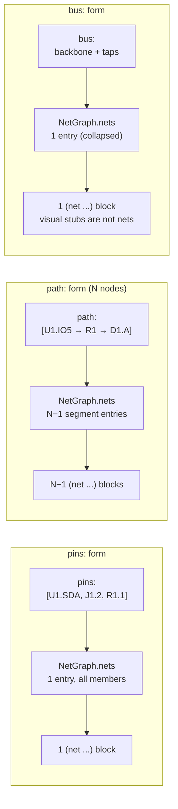

# Exporters — BOM and Netlist

> Sub-note of [IDEA-001](idea-001-circuit-skill.md). Predecessor references
> (e.g. `scripts/generate-schematic.py`, IDEA-011/018/019/022) resolve via the
> [Provenance anchor map](idea-001-circuit-skill.md#provenance).

Both exporters are downstream consumers. The BOM exporter walks `components` directly;
the netlist exporter walks the shared `NetGraph` owned by
[idea-001.erc-engine.md §Net graph data model](idea-001.erc-engine.md). Neither
exporter re-parses YAML and neither re-implements flattening.

**ERC gating.** Exporters run independently of ERC findings. A circuit with ERROR-level
findings still produces a BOM and netlist — these are useful for debugging and the CI
gate fails on the ERC error separately. The exporters never themselves emit ERC
diagnostics.

## BOM Exporter

The BOM exporter iterates the `components` section once and groups instances. No
`NetGraph` consumption — BOM is a counting problem, not a topology problem.

**Grouping key.** Rows are grouped by `(component.type, variant_key(component))`,
where `variant_key` is the per-category projection defined in §"Variant
projection" below. Two `220 Ω` resistors collapse to one row; a `220 Ω` and a
`470 Ω` resistor produce two rows; a green LED and a red LED produce two rows.

**Reference column.** Reference designators within a group are condensed via
run-length encoding over the numeric suffix: `R1, R2, R3, R5` becomes `R1–R3, R5`.
The encoder splits on prefix change (`R…` vs `D…`) and on suffix gaps.
Condensation operates **within** a single group only — gaps caused by another
group's variant do not produce sub-ranges. Example: `D1=green, D2=red, D3=green,
D4=blue` produces three groups (`D1, D3` green; `D2` red; `D4` blue), and the
green group is rendered as `D1, D3` rather than `D1–D3`.

**Row ordering.** Groups are sorted by reference-designator prefix
(alphabetic), then by the numeric suffix of the first member. This makes the
row order stable across runs regardless of YAML map iteration order, so git
diffs stay minimal.

### Variant projection

The "value" column shown to a builder is per-category, because different
component families parameterise on different axes (resistor on `value`, LED on
`color`, IC on nothing). The projector lives next to the BOM exporter as a small
table:

| `category` | Variant key | Source |
|---|---|---|
| `resistor` | `value` (Ω) | `.circuit.yml` `value:` field |
| `capacitor` | `value` (F) + `dielectric` if declared | `.circuit.yml` `value:` and `dielectric:` |
| `led` | `color` (or `default` if omitted) | `.circuit.yml` `color:` field per [components.md "variant selection"](idea-001.components.md) |
| `button`, `jack`, `header` | none | — |
| `ic`, `i2c-sensor` | none (identity is in `type`) | — |

The projector is defined alongside `bom_exporter.py` rather than on the
component profile because it concerns presentation, not electrical semantics —
keeping it out of `components/*.py` matches the "category keys layout, not
semantics" invariant from [components.md §1](idea-001.components.md).

### Outputs

- `bom.md` — Markdown table, embedded in the build guide
- `bom.csv` — machine-readable; becomes the seed for the KiCad BOM when IDEA-011 starts,
  replacing IDEA-018's hand-maintained table

**Markdown form** (one row per group; `Variant` column carries the projected
key, blank for categories with no variant axis):

```markdown
## Bill of Materials — ESP32 default build

| Ref | Component | Variant | Qty |
|---|---|---|---|
| U1 | ESP32 WROOM-32 | | 1 |
| SW1–SW5 | Push-button | | 5 |
| R1–R5 | Resistor | 220 Ω | 5 |
| D1 | LED | green | 1 |
| D2–D4 | LED | red | 3 |
| D5 | LED | blue | 1 |
```

**CSV form** is *un-grouped* — one row per reference designator — so it can
seed KiCad's BOM-import directly. Columns are named to match KiCad's importer
expectations (`Reference`, `Value`, `Footprint`, `Datasheet`); `Type` is kept
for non-KiCad consumers that need the profile path.

```csv
Reference,Type,Value,Footprint,Datasheet,Manufacturer
U1,mcu/esp32_wroom_32,,,https://...,Espressif
R1,passives/resistor,220,,,
D1,passives/led,green,,,
```

`Value` carries the variant projection from the table above (resistor `value`,
LED `color`, etc.); blank for categories with no variant axis. KiCad's BOM
importer reads `Reference, Value, Footprint, Datasheet` and ignores the rest;
`Type` and `Manufacturer` are appended for non-KiCad consumers (e.g. supplier
ordering scripts, the `Type` column lets them resolve the profile path back).

`Footprint` is sourced from `metadata.footprint` on the component profile; it
is blank until [components.md §metadata](idea-001.components.md) gains a
`footprint` field (see the cross-doc dependency note at the foot of this file).

---

## Netlist Exporter

The netlist exporter is a thin projection of `NetGraph` into KiCad `.net` syntax. All
flattening — `pins` membership, `path` segmentation, terminal net-name merging
(`GND`, `VCC`), bus collapse — happens inside `NetGraph` per
[idea-001.erc-engine.md](idea-001.erc-engine.md). The exporter does **not** re-flatten;
it walks `NetGraph.nets` once and emits one `(net ...)` block per entry.

**Net-shape mapping.** What `NetGraph` exposes vs. what the exporter does with it:

| `.circuit.yml` form | `NetGraph.nets` representation | KiCad output |
|---|---|---|
| `pins` | One entry, all pins as members | One `(net ...)` block |
| `path` (N component-nodes) | N−1 segment entries; first carries the declared net name, the rest carry stable auto-generated names (see "Segment naming" below). Segment count follows the node-grouping rule in [idea-001.yaml-format.md §Form 2](idea-001.yaml-format.md#form-2--path-ordered-sequence). | One `(net ...)` block per segment |
| `bus` | **One entry** containing the backbone endpoints and every tap pin as members. The per-tap visual segments the renderer draws are not present in `NetGraph.nets`. | One `(net ...)` block — the whole bus is electrically one net |



**Critical: bus collapses to one electrical net.** A renderer drawing perpendicular
stubs from a backbone is a *visual* convention, not an electrical one. On a real I2C
bus the MCU's `SDA`, the OLED's `SDA`, the BME280's `SDA`, and the pull-up resistor
are all directly connected by wire — KiCad must see one net. `NetGraph` collapses
the bus form to a single membership list; the exporter inherits the collapse for
free. Emitting per-tap segment nets to KiCad would produce a netlist that imports
without errors but is electrically wrong.

**Member emission order.** Within a `(net ...)` block, `(node ...)` entries are
emitted in the member order `NetGraph.nets[name]` exposes, which is:

- `pins` net — declaration order from `.circuit.yml`.
- `path` net (per segment) — the segment's two endpoint pins, in path-walk order.
- `bus` net — backbone pins first (in `backbone:` order), then taps (in `taps:`
  order). Pins added by net merging from a `path:` endpoint are appended after
  the natively-declared members in the order their owning `path:` net appears.

The round-trip test compares pin sets, so ordering does not affect correctness;
fixing the order here matters for human diff review and for the `git diff
--exit-code` staleness guard, both of which are line-oriented.

**Segment naming for `path` nets.** The first segment takes the declared `net` name;
each subsequent segment is named `<net>__<RefA>_<pinA>__<RefB>_<pinB>`
(e.g. `PWR_LED__R1_2__D1_A`). Names are content-addressed by the segment's two endpoint
pins, so inserting a new path entry does not renumber other segments and does not
produce noisy diffs. Integer-suffixed forms (`PWR_LED__1`, `PWR_LED__2`) are explicitly
**not** used — they shift on insertion and break PCB-side symbol-to-net mappings.

The `segment_names:` override on a path net replaces the auto-generated names when
KiCad net names must match a specific convention (e.g. an existing PCB project's
naming). Length requirement, error-reporting behaviour, and the authoritative
segment-count rule all live in
[idea-001.yaml-format.md §Form 2](idea-001.yaml-format.md#form-2--path-ordered-sequence) — this exporter
just consumes the flattened `NetGraph`.

**Net codes.** Net codes are assigned in `NetGraph.nets` insertion order, which is
declaration order in `.circuit.yml`. Stable net codes across runs depend on the YAML
loader preserving map insertion order — a contract pinned by
[idea-001.yaml-format.md §Cross-cutting decisions §1](idea-001.yaml-format.md).

**Net naming.** Net names emitted to KiCad are taken verbatim from
`connections[*].net`. `(node (ref X) (pin Y))` always uses the **physical**
pin identifier from the component profile — KiCad matches pin numbers, not
friendly names. **Aliases are not propagated into the netlist** at all:
`meta.aliases` is a pin-rename for human-facing surfaces (ERC messages, BOM
rows) per [idea-001.components.md §Pin aliases](idea-001.components.md), and
has no role in the KiCad output. A net name that happens to match an alias
value is coincidental and triggers no substitution.

**Metadata is dropped.** `NetMeta` fields (`pull:`, `role:`, `erc:` overrides) have
no KiCad equivalent and are not serialised. KiCad has no concept of "firmware
pull-up"; that information lives in `.circuit.yml` and the ERC report only.

### KiCad format target

The exporter emits the **KiCad 7.x intermediate netlist** S-expression
(`version "E"`) — the format eeschema writes for the legacy import flow. KiCad
7 and 8 both consume it directly; the PCB-side workflow is "Tools → Update PCB
from Netlist". The newer `.kicad_netlist` and date-stamped formats
(`(version 20231120)`) are not targeted at v0.1: they require shipping a KiCad
project file and library, which is out of scope for the docs-as-code pipeline.
Revisit when [IDEA-011](idea-011-pcb-board-design.md) lands and the project
ships a real KiCad library.

The `(components ...)` block carries one entry per `.circuit.yml` component,
emitted in `components:` map order (same `ruamel.yaml` insertion-order contract
that pins net codes — see "Net codes" above). Each entry uses:

- `(value ...)` — the BOM variant projection from §"Variant projection" above
  (`220` for a 220 Ω resistor, `green` for a green LED, blank for categories
  with no variant axis like `mcu` or `pushbutton`). Single source of truth with
  the BOM CSV's `Value` column, row for row.
- `(footprint ...)` — `metadata.footprint`, blank until the field lands on
  component profiles (see "Reduces output quality but does not block" below).
- `(datasheet ...)` — `metadata.datasheet`, omitted entirely when the profile
  declares none (rather than emitted as an empty string — KiCad treats absent
  and empty differently in the import dialog).

The `(libparts ...)` block is omitted since the project ships no KiCad library
file — the PCB designer maps parts to footprints once at import time.

Component identity (the human-readable `metadata.label` like `"ESP32 WROOM-32"`)
is **not** carried in the netlist `(value ...)` field. It would conflict with
the variant-projection contract above (a 220 Ω resistor would be `"Resistor"`
or `"Resistor 220"` instead of `"220"`, breaking BOM-CSV row-for-row parity).
Labels live in the BOM `Component` column where they belong.

`meta.title` from `.circuit.yml` is dropped: the build guide carries the title
in surrounding markdown, and KiCad's title block is conventionally edited from
the PCB side. Round-tripping a markdown title through the netlist would create
two sources of truth for the same string.

The `(date ...)` field is set to the source `.circuit.yml`'s last-modified
date as recorded by `git log -1 --format=%cI -- <path>`, **not** to the build
wall-clock time. Wall-clock dates would change every CI run and trip the
`git diff --exit-code` staleness guard daily; the git-mtime form is
reproducible across machines and only changes when the source actually does.

### Output

The example below shows the output for an ESP32 + LED + bus-form I2C circuit
(MCU + OLED + BME280 sharing `I2C_SDA` with a pull-up). The source
`.circuit.yml` is sketched here so the netlist below stands on its own; it is
a superset of the canonical example in
[idea-001.yaml-format.md §Complete example](idea-001.yaml-format.md), promoted
from `path:` to `bus:` because it has three I2C devices on the data line:

```yaml
components:
  U1:   { type: mcu/esp32_wroom_32 }
  R1:   { type: passives/resistor, value: 220 }
  D1:   { type: passives/led, color: green }
  R2:   { type: passives/resistor, value: 4700 }
  OLED: { type: sensors/ssd1306_128x64_i2c }
  IC1:  { type: sensors/bme280 }
  SW1:  { type: passives/pushbutton }
  J1:   { type: connectors/usb_c }

connections:
  - { net: GND,     pins: [U1.GND, SW1.2, D1.K, J1.GND] }
  - { net: PWR_LED, path: [U1.IO25, R1.1, R1.2, D1.A] }
  - net: I2C_SDA
    bus: true
    backbone: [U1.IO21, OLED.SDA]
    taps: [IC1.SDA, R2.2]
  # … remaining nets omitted
```

Resulting netlist:

```
(export (version "E")
  (design
    (source "esp32.circuit.yml")
    (date "2026-04-24")
    (tool "circuit-skill 0.4"))
  (components
    (comp (ref U1) (value "") (footprint "") (datasheet "https://www.espressif.com/.../esp32-wroom-32_datasheet.pdf"))
    (comp (ref R1) (value "220") (footprint ""))
    (comp (ref D1) (value "green") (footprint ""))
    ...)
  (nets
    (net (code 1) (name "GND")
      (node (ref U1) (pin GND))
      (node (ref SW1) (pin 2))
      (node (ref D1) (pin K))
      (node (ref J1) (pin GND)))
    (net (code 2) (name "PWR_LED")
      (node (ref U1) (pin IO25))
      (node (ref R1) (pin 1)))
    (net (code 3) (name "PWR_LED__R1_2__D1_A")
      (node (ref R1) (pin 2))
      (node (ref D1) (pin A)))
    (net (code 4) (name "I2C_SDA")
      (node (ref U1) (pin IO21))
      (node (ref OLED) (pin SDA))
      (node (ref IC1) (pin SDA))
      (node (ref R2) (pin 2)))
    ...))
```

Written to `docs/builders/wiring/<target>/main-circuit.net`. This is the direct
bridge to [IDEA-011](idea-011-pcb-board-design.md).

### Round-trip test

A round-trip test guards against the bus-collapse and segment-naming bugs that
would silently produce a KiCad-importable but electrically wrong netlist:

1. Parse `.circuit.yml` → `NetGraph`.
2. Run `netlist_exporter` → `.net` file.
3. Parse the `.net` file with a minimal hand-rolled S-expression reader
   (~15 lines: tokenise on parens / whitespace / quoted strings, recursive
   descent into nested lists). KiCad's `.net` grammar is a tiny subset of
   S-expressions and does not justify a third-party dep like `sexpdata` or
   the heavier `kiutils`; `tests/` stays zero-dep.
4. Reconstruct `{net_name: set(PinRef)}` from the parsed netlist.
5. Compare against the same projection of the original `NetGraph`. Mismatch
   fails the test.

The test ships with each fixture circuit in `tests/` — at minimum the two
day-one targets (ESP32, nRF52840) and a dedicated bus-collapse fixture
(`tests/fixtures/bme280_i2c.circuit.yml`, the same shape sketched in §Output
above: MCU + OLED + BME280 sharing `I2C_SDA` with a pull-up). The bus fixture
is introduced here — it is the first circuit that exercises bus collapse and
backs the "Add a BME280 sensor" acceptance scenario in
[idea-001.skill-packaging.md §Evaluations](idea-001.skill-packaging.md#evaluations-acceptance-tests).

---

## Cross-doc dependencies

### Blocks Phase 4 ship

1. **YAML loader pin** — resolved in
   [idea-001.yaml-format.md §Cross-cutting decisions §1](idea-001.yaml-format.md)
   as `ruamel.yaml` round-trip mode. Must ship before this exporter: without a
   loader that preserves map insertion order, netlist net codes are not stable
   across machines and the staleness guard fires non-deterministically.
2. **`segment_names` length check** — resolved in
   [idea-001.yaml-format.md §Form 2](idea-001.yaml-format.md#form-2--path-ordered-sequence) as a
   validator-time error citing expected vs. actual count and the
   auto-generated names. Must ship before this exporter: a silent-truncation
   `segment_names` produces nets named after the wrong pins, breaking
   PCB-side symbol mapping with no error reported.

### Reduces output quality but does not block

1. **`metadata.footprint` field on component profiles** — components.md does
   not yet declare it. Until added, the BOM CSV ships a blank `Footprint`
   column and KiCad's auto-import skips footprint assignment. One line per
   profile + one schema entry.
2. **`role:` net-level key in net names** — the shape is resolved in
   [idea-001.yaml-format.md §Net-level attributes](idea-001.yaml-format.md)
   (scalar or `REF.PIN`-keyed map). The exporter doesn't read `role:` (it's
   `NetMeta`, dropped on the floor), but the *netlist net name* may want to
   reflect direction in future (`I2C_SDA_OUT` vs `I2C_SDA_IN`). Out of scope
   for v0.1 — flagged so this doc does not need a follow-up edit when the
   enhancement lands.

### Resolved

- ~~Segment-naming scheme propagated to yaml-format.md~~ — done 2026-04-24;
  yaml-format.md §Form 2 now uses content-addressed names matching this file.
