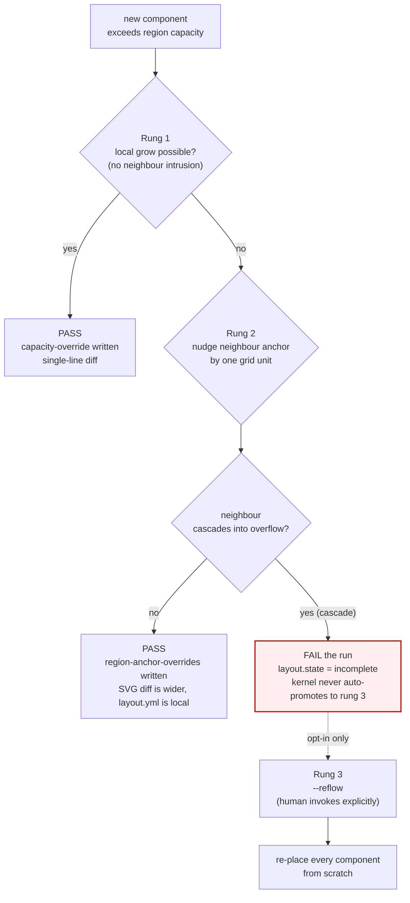
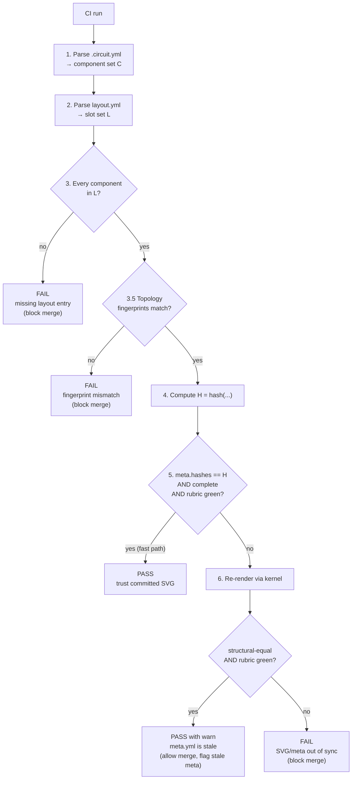
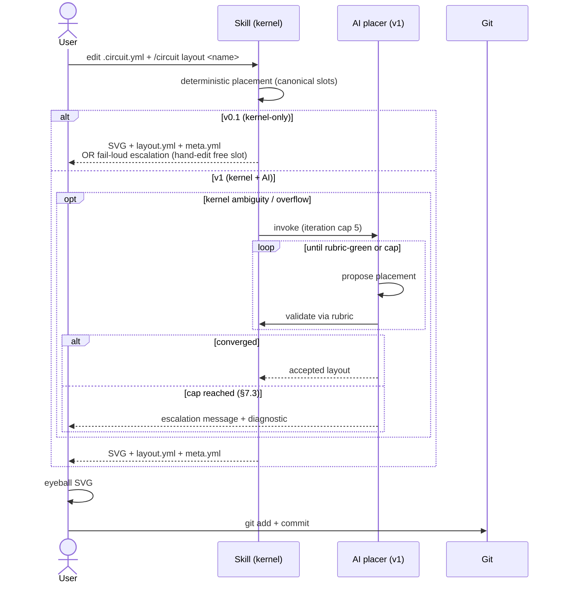
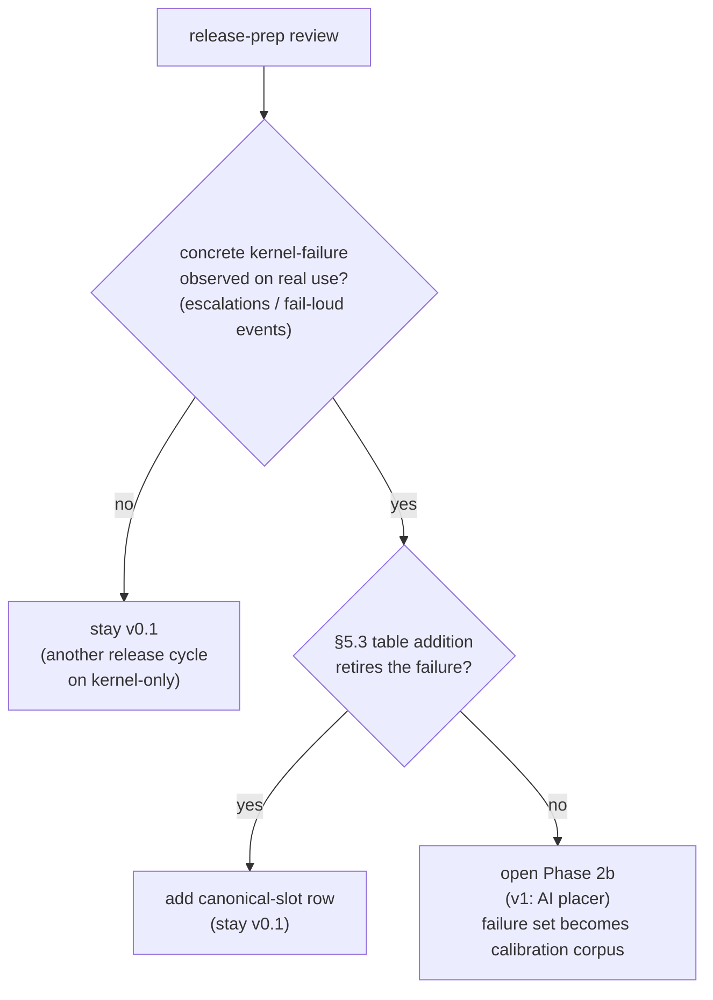

# Layout Engine — Concept

> Sub-note of [IDEA-001](idea-001-circuit-skill.md). Predecessor references
> (e.g. `scripts/generate-schematic.py`, `data/config.json`, IDEA-011/018/019/022)
> resolve via the [Provenance anchor map](idea-001-circuit-skill.md#provenance).

Authoritative design statement for the Circuit-Skill layout engine. This document
is the source of truth for Phase 2 implementation. The companion
[idea-001.layout-engine-discussion.md](idea-001.layout-engine-discussion.md)
captures the exploration, alternatives, and rationale that led here — read it for
the "why," read this document for the "what."

---

## 1. Goal

Turn a declarative circuit topology (`.circuit.yml`) into a committed SVG
schematic whose layout is:

- **Stable** under incremental edits — adding one LED changes one line in
  `layout.yml`. The SVG diff is usually localised too, but §8.3 rung 2 is
  an explicit exception: a region-anchor nudge shifts every coordinate in
  the nudged region, so end-to-end single-line stability is a layout.yml
  property, not an SVG property.
- **Readable** — no overlaps, no unavoidable wire crossings, labels fit, signal
  flows left→right.
- **Reproducible** — committed artifacts (SVG + `layout.yml` + `meta.yml`) fully
  determine the rendered output; CI re-renders deterministically without AI.
- **Cheap to edit** — the common-case contributor change (add/remove one
  component) needs no AI call at all.

---

## 2. Non-goals

Named explicitly to stop scope creep:

- Multi-page schematics.
- Sub-circuit zoom or hierarchical sheets.
- Theming, dark mode, colour palettes beyond the current black-on-white style.
- i18n of labels.
- Accessibility metadata beyond what Schemdraw emits by default.
- Pixel-perfect publication-grade typesetting (that is KiCad / LaTeX territory,
  tracked under IDEA-011).
- Diagonal routing. All wires are orthogonal.
- Automatic crossing-avoidance heuristics. Crossings are reported; resolution is
  either topology restructuring or explicit rubric waiver.
- Multi-MCU auto-placement. The first declared IC anchors the origin; a second
  IC needs an explicit slot.
- **General-net routing.** Every net in v1 must be in `pins`, `path`, or
  `bus` form (the three cases that route trivially by construction). The
  kernel rejects topologies that require routing a free-form multi-pin
  net. A circuit that cannot be expressed as the three canonical forms is
  a topology problem: restructure it, or graduate to KiCad (IDEA-011).
  This is by far the biggest scope reduction vs. the discussion doc and
  is what keeps the router implementable.

---

## 3. Architecture

Three strictly separated layers. Each layer has one authoritative input file and
one output contract. No layer reaches past its neighbour.

```
┌──────────────────────────┐     ┌──────────────────────────┐     ┌──────────────────────┐
│ Topology                 │ ──▶ │ Layout                   │ ──▶ │ Render               │
│ data/<name>.circuit.yml  │     │ data/<name>.layout.yml   │     │ <name>.svg           │
│ components + nets        │     │ component → slot map     │     │ <name>.meta.yml      │
└──────────────────────────┘     └──────────────────────────┘     └──────────────────────┘
       authored                    placer output              deterministic pure function
   (human, YAML editor)           (kernel ± AI,             (kernel only, no AI, no network)
                                   authoring-time)
```

- **Topology** is the human-edited source: components, nets, pin assignments.
  No geometric claims.
- **Layout** is a component→slot dictionary, written by the **placer** at
  authoring time and committed. It carries all geometric decisions.
- **Render** is a pure function of `(topology, layout, renderer version)` → SVG.
  CI runs this step and only this step.

This separation is load-bearing for the CI-safety property: AI runs only in the
placer, only at authoring time, and its output is frozen as data.

---

## 4. Slots are the single positioning primitive

**Raw `{x, y}` coordinates are not used in `layout.yml`.** Every component
position is expressed as a slot — a named region plus an index inside that
region. This is a change from the early Phase-1 prototype described in the
discussion doc; it supersedes the `layout: { x: 4.5, y: 2.0 }` pattern.

Rationale: slots decouple components from their neighbours. Adding, removing,
or re-ordering components produces semantic diffs (`right-column row 5 added`)
rather than geometric churn across every sibling.

### 4.1 The slot vocabulary (v1)

Nine canonical slots, grouped by use.

**Anchor slot (exactly one per circuit):**

| Name | Where | Capacity |
|---|---|---|
| `mcu-center` | Drawing origin | 1 MCU / primary IC |

**Column/row regions (grow by adding rows/cols):**

| Name | Where | Orientation | Typical occupants |
|---|---|---|---|
| `left-column` | Left of MCU | Rows top-to-bottom | Peripherals with left-pin connections |
| `right-column` | Right of MCU | Rows top-to-bottom | LEDs, buttons grouped to right pins |
| `top-row` | Above MCU | Cols left-to-right | VCC rail, OLED/header strips |
| `bottom-row` | Below MCU | Cols left-to-right | GND rail, audio jacks |

**Path slots (generated from path-form nets):**

| Name | Where | Orientation | Content |
|---|---|---|---|
| `path-of-<COMPONENT.PIN>` (short) or `path-of-<COMPONENT.PIN>.<NET>` (qualified) | Extends outward from the named pin, e.g. `path-of-U1.3V3`. The kernel picks the short form when the pin anchors exactly one `path:` net, and the qualified form when the pin anchors multiple distinct path nets (e.g. a VCC pin feeding two independent decoupling chains). The choice is deterministic: short when unambiguous, qualified otherwise | Inherits pin side (left/right/top/bottom) | Inline chain from a `path:` net |

**Bus slots (generated from bus-form nets):**

| Name | Where | Fractional | Content |
|---|---|---|---|
| `bus-<name>` | Between declared backbone endpoints | 0.0 – 1.0 along backbone | Dot junction + perpendicular stub |

**Symbol slots (power/ground terminals):**

| Name | Where | Content |
|---|---|---|
| `pin-symbol-<pin>` | At the pin anchor itself | `elm.Ground` or `elm.Label` for VCC |

**Free slot (escape hatch, discouraged):**

| Name | Where | Use when |
|---|---|---|
| `free` | Raw grid coordinate `{gx, gy}` in integer grid units | Kernel cannot place in any canonical slot AND AI cannot resolve within iteration cap |

The `free` slot is the only place raw coordinates appear. Using it requires
either a rubric waiver (see §10) or acceptance that the circuit has outgrown
the auto pipeline (graduate to KiCad per IDEA-011).


### 4.2 Slot composition rules

- A slot reference is `{ region: <name>, row?: int, col?: int, position?: float,
  step?: int, attached-to?: <component-ref>, attach-step?: int,
  label?: <direction>, label-budget?: int }`. `label-budget` overrides the
  per-region default defined in §6.1 and is only meaningful when `label`
  is present. `attach-step` is only meaningful when `attached-to` is
  present (§4.2, attachment rules below).
- The index field required per region type (applies to anchor
  placements; attachments inherit per the `attached-to` rule below):
  - `left-column` / `right-column` require `row`.
  - `top-row` / `bottom-row` require `col`.
  - `bus-<name>` requires `position` (0.0 – 1.0 along backbone). Positions
    are snapped to sixteenths (1/16 resolution) for stable float-equality
    comparison. Two taps that snap to the same step collide and escalate
    directly to §7 (AI placer, in v1) or to a hand-edited `free` slot in
    v0.1. The §8.3 overflow ladder does **not** apply: rung 1 ("local
    grow") has no meaning for a finite-endpoint backbone at 1/16
    resolution, and rung 2 (shifting the backbone's anchor) does not
    resolve the collision — it only translates it. A bus saturated at its
    resolution is a topology problem, not an overflow problem.
  - `path-of-<pin>` requires `step` (integer index in the path chain).
  - `mcu-center`, `pin-symbol-<pin>` take no index.
  - `free` requires `{ gx, gy }` integer grid coordinates.
- `attached-to` lets a second component share the slot index of another
  (e.g. a current-limiting resistor stacked with its LED). The anchor
  component owns the row/col; the attached component draws **one grid cell
  toward the wire-path connection point** — i.e. between the anchor and the
  pin/net-endpoint it shares a net with. For a `right-column` LED with an
  `attached-to` resistor, the resistor occupies the cell one unit to the
  left of the LED (toward the MCU). It inherits its label-direction default
  from the anchor.
- **Attached components must omit the anchor's index fields.** A
  placement carrying `attached-to` MUST NOT set `row`, `col`,
  `position`, or `step` — these are inherited from the anchor, and
  duplicating them risks drift if the anchor later moves. The kernel
  rejects a placement that supplies both `attached-to` and any index
  field with `reason: attach-index-redundant`. Only `region`,
  `attached-to`, optional `attach-step` (§ multiple attachments below),
  optional `via-net` (§ direction disambiguation below), and the label
  fields are legal on an attachment.
- **Multiple `attached-to` components on the same anchor.** Up to two
  attached components per anchor are supported; each declares an integer
  `attach-step` (1, 2, …) giving its distance in grid cells from the anchor
  along the "toward the connection point" direction. `attach-step: 1` is the
  cell adjacent to the anchor; `attach-step: 2` is the cell one further
  toward the connection. **Omission is only legal when the component is the
  sole attachment on its anchor** — in that case `attach-step` defaults to
  1. As soon as a second component attaches to the same anchor, *both*
  components must declare explicit `attach-step` values; the kernel rejects
  a layout where two attachments share an anchor and either one omits the
  field, with `reason: attach-step-ambiguous`. A third component on the
  same anchor is rejected with `reason: attach-chain-too-long` and the
  author is directed to §7 (AI escalation in v1) or a topology restructure.
  Two components declaring the *same* `attach-step` on the same anchor
  also fail, with `reason: attach-step-collision`. The cap is deliberate:
  a longer stack is a readability failure the slot system will not paper
  over. `attach-step` values must also be **contiguous starting at 1**:
  a two-component attachment set uses `{1, 2}`, never `{1, 3}` (an
  empty cell between two attachments is a readability defect, not a
  layout choice). A non-contiguous set is rejected with `reason:
  attach-step-non-contiguous`.
- **Direction disambiguation across nets.** A single attachment's
  direction is unambiguous: it's toward the non-anchor endpoint of the
  one net the attachment shares with the anchor. Multi-attach becomes
  ambiguous when two attachments share **different** nets with the
  anchor — e.g. a series resistor on the anode-to-MCU net and a TVS
  diode on the cathode-to-GND net, both hanging off one LED: they
  point in opposite directions. Each such attachment must declare
  `via-net: <net-name>` in `layout.yml`; the kernel derives direction
  from that named net's non-anchor endpoint and places the attachment
  `attach-step` cells along it. When all attachments share the same
  net with the anchor (the common LED + series-resistor case),
  `via-net` may be omitted and the shared net is inferred. Omitting
  `via-net` when multiple nets qualify is rejected with `reason:
  attach-via-net-ambiguous`. Declaring a `via-net` that the anchor
  does not share is rejected with `reason: attach-via-net-unknown`.
- `label` declares label direction; see §6.
- Gaps are legal. `right-column` with occupants at rows `{0, 2, 3}` is valid;
  the kernel does not compact.
- Regions have a configurable capacity (default: 12 rows per column, 16 cols
  per row). Exceeding capacity triggers the overflow ladder (§8.3).

### 4.3 Example `layout.yml`

Assumes a topology with two distinct 3.3 V nets: `V33`, the board-level
3.3 V bus rail declared as a `bus:` net (so `bus-V33` is a valid slot
region), and `3V3`, a short `path:` net from U1's on-chip LDO output pin
to its local decoupling capacitor `C1`. The two nets exist because the
LDO output is decoupled at the pin before it joins the board-level rail
— a common MCU topology. Attached components (`R1`, `R2`) omit an
explicit `label` field; they inherit label direction from their anchor
(`LED1`, `LED2`) per §4.2. The `topology-fingerprint` field required on
every placement by §8.4 is elided below for readability — the kernel
writes it automatically on every run.

```yaml
schema: layout/v1
placements:
  U1:   { region: mcu-center }
  C1:   { region: path-of-U1.3V3, step: 0 }
  LED1: { region: right-column, row: 0, label: right }
  R1:   { region: right-column, attached-to: LED1 }
  LED2: { region: right-column, row: 1, label: right }
  R2:   { region: right-column, attached-to: LED2 }
  BME:  { region: left-column,  row: 0, label: left }
  C2:   { region: bus-V33, position: 0.3 }
  OLED: { region: top-row,      col: 0, label: above }
capacity-overrides:
  right-column: { rows: 18 }
```

---

## 5. The deterministic kernel

The kernel is the core of the engine. It runs with or without AI, online or
offline, with or without an API key. Every contributor can invoke it.

### 5.1 Kernel responsibilities

1. Parse `.circuit.yml` and `layout.yml`.
2. Diff component sets (kept / removed / new).
3. For each new component, attempt deterministic placement (§5.2).
4. Detect collisions, overlaps, capacity overflow, and wire crossings.
5. Run the Manhattan router on final placements.
6. Emit SVG, `layout.yml` (updated), and `meta.yml` (rubric + provenance).
7. Never call out to a network or an LLM.

### 5.2 The deterministic placement rule

Given a new component `X` of category `T` with connections `C`:

```
1. Look up the canonical slot for (T, C):
     LED with anode to MCU pin P and cathode to GND
       → region = side-column(P), row = next-free
     Resistor in same path as LED X
       → region = same as X, attached-to = X, label = right
     Capacitor in path net starting at pin P
       → region = path-of-P, step = path index
     Ground symbol for pin P
       → region = pin-symbol-P
     Bus tap on backbone B
       → region = bus-B, position = evenly-spaced

   where side-column(P) maps pin P's side field to a region:
     left   → left-column     right  → right-column
     top    → top-row         bottom → bottom-row

2. If the canonical slot is free AND the adjacent slots have label room,
   place deterministically. No AI call.

3. Otherwise (canonical slot occupied, label would collide, or component has
   no canonical rule), flag the component as ambiguous and escalate to §7.
```

**This is the kernel/AI boundary.** The kernel decides "unambiguous"
mechanically: canonical slot exists, canonical slot is free, label fits.
Anything else is ambiguity.

This rule is load-bearing: if the canonical-slot table covers ~80% of the
common cases (MCU + passives + LEDs + buttons + one I2C sensor + one bus),
the cheap-incremental promise holds. Coverage is measured by walking the
current shipped circuits against the table (see §17.2 for the 2026-04-24
baseline) and by running the integration fixture in §14.2.

### 5.3 The canonical-slot table

A data table shipped with the kernel, keyed by `(category, connection shape)`.
Initial entries:

| Category | Connection shape | Canonical slot |
|---|---|---|
| `led` | anode → MCU pin P, cathode → GND | `side-column(P)`, row = next-free |
| `resistor` | in-path with LED X | same slot as X, `attached-to: X` |
| `button` | one side → MCU pin P, other → GND | `side-column(P)`, row = next-free |
| `resistor` | on a path whose endpoints are a power/bus net and an MCU pin or another bus (pull-up or pull-down) | requires **path-form declaration in topology**; otherwise escalate. If terminating at an MCU pin: `path-of-<COMPONENT.PIN>`, step = 0. If terminating at a bus: `bus-<name>`, position = next-free. Label direction is inherited from path direction per §6 (not set by this row) |
| `capacitor` | VCC to GND near IC | `bus-V33` or `bus-GND`, position = adjacent to IC (requires V33/GND declared as a `bus` net in topology; otherwise escalate) |
| `i2c-sensor` | SDA/SCL/VCC/GND | `left-column` or `right-column` by dominant pin side. Ties (equal pin counts each side) → side containing the pin declared **first in topology** wins; this is author-controllable and not dependent on MCU-specific pin numbering |
| `header` / `jack` | multi-pin, edge-of-board | `top-row` or `bottom-row` |
| `power-symbol` | at a pin | `pin-symbol-<pin>` |
| `ground-terminal` | any non-pin GND connection (LED cathode, button other-side, capacitor terminal inside a column/row slot) | render `elm.Ground` at the component's near edge within its own slot. No wire is routed to any MCU GND pin. MCU GND pins get their own `pin-symbol-<pin>` per the `power-symbol` rule; all ground symbols alias to the global GND net by construction. This eliminates cross-MCU GND routing (§17.3) |
| `no-connect` | unused pin, no net | `pin-symbol-<pin>` (renders `elm.NoConnect`); no column/row slot consumed |
| `ic` (secondary) | multi-pin, general | **no canonical slot — always escalate** |

Unknown categories always escalate. The table is extensible; a PR adding a new
category also adds its canonical rule.

---

## 6. Labels are a slot property

Label placement is *not* a post-render patch. It is declared inside the slot
and participates in collision detection.

- Every placement has an optional `label: { above | below | left | right }`.
- If omitted, the kernel picks a default per category. **Path elements** (any
  component inside a `path:` net) always inherit path direction — the
  category default applies only when the component is not on a path:
  - LED (off-path) → right
  - resistor (off-path) → above
  - capacitor (off-path) → above
  - bus tap → above
- Label bounding boxes count in overlap detection. A placement where the
  component fits but its label collides with a neighbour is treated as the
  canonical slot being **unavailable**, triggering escalation.

### 6.1 Label budget per region

The `labels_fit` rubric check (§10) compares each label's bounding box
against its slot's **label budget** — the grid distance a label may
extend in its declared direction before it is considered out of bounds.
Budgets are defined per region:

| Region | Default budget (grid units, in label direction) |
|---|---|
| `left-column` row | 3 units to the left of the component |
| `right-column` row | 3 units to the right of the component |
| `top-row` col | 2 units above the component |
| `bottom-row` col | 2 units below the component |
| `path-of-<pin>` step | 1 unit perpendicular to path direction |
| `bus-<name>` tap | 1 unit perpendicular to backbone in declared label direction |
| `pin-symbol-<pin>` | no label budget (symbol carries no label) |
| `free` | 1 unit in declared direction |

The per-slot `label-budget` field (§4.2) overrides the default for
**any** slot type, not only `free`. It takes precedence over both the
region default in the table above and the orthogonal-direction
fallback below, and is the author's escape hatch when a specific
label needs more (or less) room than its region grants by default.

The budget shrinks dynamically if an occupied neighbour in the label
direction is closer than the default: effective budget = `min(default,
distance-to-nearest-occupant)`. A label whose bounding box exceeds its
effective budget trips `labels_fit = false`; the canonical slot is
treated as **unavailable** and placement escalates.

**Orthogonal label directions.** The budgets above assume the label
direction matches the region's natural outward direction (left-column
→ left, top-row → above, etc.). When the author overrides to an
orthogonal direction (e.g. `label: above` on a `right-column`
placement), the budget falls back to **1 grid unit** in the declared
direction. This keeps orthogonal labels legal but conservative — they
work for short text and escalate to `labels_fit = false` as soon as
they crowd a neighbour. Long labels that need more room should either
keep the natural direction or raise the limit via the per-slot
`label-budget` override described above.

This directly addresses the TASK-239 pain: the original problem was labels
colliding with adjacent rows, not element bodies.

---

## 7. AI placer (authoring-time only)

Invoked **only** when the kernel flags ambiguity or overflow. Never on happy
paths.

### 7.1 Input to the AI

- The topology (`.circuit.yml`).
- The current `layout.yml` (frozen components + their slots).
- The ambiguity queue: list of components the kernel could not place, with
  reason codes (`canonical-slot-occupied`, `label-collision`,
  `no-canonical-rule`, `capacity-overflow`, `bus-tap-collision`,
  `attach-step-ambiguous`, `attach-step-collision`,
  `attach-step-non-contiguous`, `attach-chain-too-long`,
  `attach-via-net-ambiguous`, `attach-via-net-unknown`,
  `attach-index-redundant`).
- The region capacity map.
- The slot vocabulary.

### 7.2 Output from the AI

A slot assignment for each ambiguous component. The AI **cannot** reassign
frozen components; the kernel rejects any output that tries. The AI output is
grid-discrete (slots only, no raw coordinates in canonical-path output).

### 7.3 Convergence contract

- Iteration cap: **5 turns** (provisional). The cap's purpose is to bound
  cost and guarantee termination, not to hit a measured sweet spot. The
  v1 PR re-calibrates against v0.1's accumulated kernel-failure set
  (§17.1) as follows: run the AI placer at caps of 3, 5, and 8 over each
  recorded failure case, and pick the smallest cap under which ≥ 90 % of
  cases converge to rubric-green. The remaining ≤ 10 % are the §7.3
  failure-mode path (exit non-zero, human intervenes). AI-convergence
  fixtures are derived from the same v0.1 failure set per the
  grow-reactively policy (§14.2); convergence cases are not speculated
  upfront — §14.2 fixtures test kernel determinism, not AI convergence,
  and adding speculative AI fixtures before v0.1 produces real failures
  would be building against guesses.
- Success: kernel re-runs with the AI's placements, rubric passes. "Rubric
  passes" for convergence means all **structural** checks are at their zero
  threshold (overlaps = 0, wire_crossings = 0 unless explicitly waived,
  labels_fit = true). Numeric checks (`min_label_distance`, `density`) are
  recorded in `meta.yml` as diagnostic values only (§10); they do not
  force additional iterations. Whether they become convergence triggers
  in v1 is decided when v1 is specified, against the then-actual fixture
  bank.
- Failure (iteration 6): the placer **stops with exit code non-zero**,
  `meta.yml.layout.state = incomplete`, and a human-readable report names the
  components the AI could not place. The human options are:
  1. Restructure the topology (usually what's needed).
  2. Hand-edit `layout.yml` to move a component to the `free` slot with a
     rubric waiver.
  3. Raise the region capacity.
  4. Conclude the circuit has outgrown auto-layout and graduate to KiCad.

There is no silent fallback and no partial write. Either the placer converges
or the author intervenes.

### 7.4 What the AI is not asked to do

- Route wires. Routing is the kernel's deterministic Manhattan router (§9).
- Pick fonts, colours, or stylistic concerns.
- Move frozen components.
- Emit raw coordinates except through the explicit `free` slot.

---

## 8. Incremental stability

The placer is incremental by default. The procedure, given an edited
`.circuit.yml`:

### 8.1 Pre-run diff

```
kept     = components in both old circuit and current layout.yml
removed  = components in layout.yml but not in current circuit
new      = components in current circuit but not in layout.yml

freeze(kept)       — slots are non-negotiable
drop(removed)      — remove layout.yml entries
queue(new)         — send through §5.2 deterministic rule, then §7 if needed
```

### 8.2 Post-run write

`layout.yml` is rewritten as `kept ∪ newly-placed`, keys sorted
alphabetically for deterministic diffs.

### 8.3 Overflow response ladder

When a new component exceeds the capacity of its canonical region:

1. **Local grow.** Extend the region capacity by one unit. No existing
   placement moves. Capacity override is written into `layout.yml`.
2. **Neighbour nudge.** If growing would intrude into an adjacent region,
   shift that neighbour's anchor by one grid unit. Slot indices of kept
   components in the nudged neighbour do not change, but their *absolute*
   coordinates do — so the rendered SVG (and the sidecar hash) diffs across
   the neighbour's bounding box. The `layout.yml` diff stays localised (one
   anchor line plus the new entry); the SVG diff does not. **Only rung 1
   (local grow) guarantees a single-line diff end-to-end.**

   The nudged anchor is persisted as a `region-anchor-overrides` block in
   `layout.yml`, parallel to `capacity-overrides`:

   ```yaml
   region-anchor-overrides:
     right-column: { dx: 1, dy: 0 }   # integer grid units, relative to default anchor
   ```

   Without this, a re-run against unchanged topology would default-place the
   region and produce different output. Rung 2 is stateful by construction.

   **Rung 2 does not cascade.** If the nudged neighbour itself overflows as a
   consequence of the shift, the kernel **fails the run** with
   `layout.state = incomplete`, names the cascading neighbour in its
   report, and instructs the human to either restructure the topology or
   re-run with `--reflow`. The kernel never triggers rung 3 automatically
   — rung 3 is opt-in only. This prevents the nudge from propagating
   across the layout in a single placer run.

3. **Explicit reflow.** `/circuit layout --reflow` discards `layout.yml` and
   re-runs the placer for every component. Opt-in only; never triggered
   automatically.

The ladder is tried rung-by-rung, lowest first.



### 8.4 Topology-fingerprint — auto-invalidation on drift

Identity alone is not enough to decide whether a frozen slot is still
valid. A kept component can change its pin assignment, be connected to a
different net, or have its role in a path swapped — all without a new
component ID. A warning-only mechanism is insufficient: a warning the
author overlooks is indistinguishable from silent layout corruption.

The kernel therefore persists a **topology-fingerprint** on every
placement in `layout.yml`:

```yaml
placements:
  LED1:
    region: right-column
    row: 0
    label: right
    topology-fingerprint: sha1:9a4f…
```

The fingerprint is a short hash of a **canonical form** of the tuple
`(category, pin assignments, connection shape, canonical-slot-rule
ID)`, drawn from the topology at placement time. It is mechanical —
the kernel computes it, never the human. **SHA1 is used for its short
hex prefix and universal library support; the property needed is
collision resistance for change detection, not cryptographic
security.** Any fixed-output hash with low collision probability is
equivalent; the choice is deliberate but not load-bearing.

**Canonical form — what counts, what doesn't.** Normalization is load-
bearing: without it, cosmetic `.circuit.yml` edits (re-indenting, key
reordering, comment changes) would auto-invalidate placements for no
semantic reason. The rules:

- `category` is lowercased.
- `pin assignments` is a list of `(role, pin, net)` triples, sorted
  lexicographically by `role`, with ties broken by `pin` then `net`.
  Swapping the source-order of two role keys (e.g. `anode:` before vs.
  after `cathode:` in the YAML) produces the same sorted list and does
  **not** change the hash. Renaming the pin (`D25` → `D26`) or the net
  (`SIG_A` → `AUDIO_IN`) **does** change the hash, because slot
  placement depends on both (`side-column(P)` in §5.3 uses the pin;
  the net determines the shared-endpoint direction for `attached-to`).
- `connection shape` is the shape identifier from §5.3's lookup table
  (an enum: `led-anode-pin-cathode-gnd`, `resistor-in-path`, etc.),
  not the free-text row label. Two topologies matching the same row
  hash identically.
- `canonical-slot-rule ID` is the integer rule ID per §5.3.

Whitespace, YAML comments, alias or reference names, and key-
declaration order are stripped before canonicalization and do not
contribute to the hash. This is what makes the §8.4 example ("LED1 re-
placed: pin assignment changed from D25 to D26") a legitimate
fingerprint change: the `pin` field of a `(role, pin, net)` triple
changed, which is a semantic topology change, not a cosmetic one.

**Rule IDs are maintainer-managed.** Each row in §5.3 carries an
explicit integer ID checked into the kernel's rule table. A doc-only or
wording edit to a rule keeps its ID stable; any change that alters
placement behaviour (slot, row/col math, label default) bumps the ID.
This prevents both silent mass-invalidation on cosmetic table revisions
and silent acceptance of stale fingerprints after a behavioural fix.
Rule-ID bumps ship in the same PR as the behavioural change and are
reviewable as a single line-diff.

**Cascade consequence.** A rule-ID bump invalidates the fingerprints of
every placement using that rule across every downstream `layout.yml`
simultaneously. CI (§12 step 3.5) on unchanged topologies will fail
until each author re-runs `/circuit layout` and commits the refreshed
fingerprints. This is a deliberate maintainer-burden cliff: it
guarantees no stale fingerprints survive a behavioural kernel change,
at the cost of one sweeping follow-up commit per affected circuit.
Rule-ID bumps should therefore be batched where possible and announced
in the PR description so downstream authors know to expect the
fingerprint refresh.

On each placer run, the pre-run diff (§8.1) recomputes every kept
component's current fingerprint and compares. Three outcomes:

- **Match.** Slot is valid. Freeze as before.
- **Mismatch.** Slot is auto-invalidated. The component is re-queued
  into `new` and goes through §5.2 deterministic placement (or §7 AI
  escalation) as if it had just been added. The old slot entry is
  dropped from `layout.yml`.
- **Fingerprint field absent** (migrating from a pre-fingerprint
  `layout.yml`). Treat as mismatch on first run; the next commit writes
  fingerprints into every placement.

Auto-invalidation is the point: no warnings to read, no explicit
`--reflow` needed, no mismatched-but-frozen state possible. The
`meta.yml` provenance block still records `auto-invalidations` so the
diff surfaces in review ("LED1 re-placed: pin assignment changed from
D25 to D26"), but the action happens without the author doing anything
extra.

---

## 9. Manhattan router

All wires are orthogonal line segments. The router is a kernel responsibility;
the AI does not route.

- **Input:** final placements + net list.
- **Algorithm:** per net, L-shaped or Z-shaped path between pins. An L-path
  has two candidate orientations — horizontal-then-vertical (H→V) and
  vertical-then-horizontal (V→H). A Z-path adds a perpendicular middle
  segment: horizontal-Z (H/V/H) breaks at some grid-row `y_mid`, and
  vertical-Z (V/H/V) breaks at some grid-column `x_mid`. The break
  coordinate is enumerated deterministically — midpoint between the two
  endpoints first, then ±1 grid unit alternating outward (midpoint, +1,
  −1, +2, −2, …), capped at the axis-aligned bounding box of the two
  endpoints. The router tries candidates in this fixed order: L H→V, L
  V→H, then H-Z break positions in the enumeration above, then V-Z
  break positions in the same enumeration. If a candidate overlaps an
  existing path or crosses a component bounding box, the router
  discards it and tries the next. If every enumerated candidate fails,
  the router records a `wire_crossing` in `meta.yml`, which the rubric
  (§10) then fails unless explicitly waived. The enumeration is fully
  determined by the endpoint coordinates, so two runs of the router on
  the same input produce the same output.
- **Crossings are reported, not resolved.** A non-zero crossing count fails
  the rubric unless explicitly waived in `meta.yml.reviewed`.
- **Bus stubs** drop perpendicular from the bus backbone; no routing choice.
- **Path-form chains** are rendered in declared order along the inherited pin
  direction; no routing choice.

Routing is intentionally simple. Improving it is possible in later versions,
but the v1 engine treats non-trivial crossings as a topology problem, not a
router problem.

---

## 10. The readability rubric

The rubric is evaluated by the kernel and recorded in `meta.yml`. A
layout that passes all blocking structural checks is accepted as
"readable"; numeric checks are recorded as **diagnostic metadata only**
in v0.1, with no blocking threshold.

| Check | Kind | Threshold | Computed by |
|---|---|---|---|
| `overlaps` | structural (blocking) | 0 | Bbox intersection test over components + labels |
| `wire_crossings` | structural (blocking) | 0 (or waived) | Manhattan router output |
| `labels_fit` | structural (blocking) | All label bboxes inside their slot's label budget | Per-slot rule |
| `min_label_distance` | numeric (advisory) | Recorded, no threshold | Nearest-neighbour distance on label bboxes |
| `density` | numeric (advisory) | Recorded, no threshold | Grid-cell histogram of component + label bboxes |

**Deferred from v1: signal-flow verification.** An earlier draft included a
`signal_flow_ok` check ("inputs on left, outputs on right, GND at bottom,
VCC at top"). Implementing it requires net-direction metadata (which net
is an input vs an output) that the v1 topology does not carry. The check
returns in a later version once the YAML format is extended. In the
meantime, left/right signal flow is enforced indirectly by slot-side
assignment, which depends on per-pin side metadata owned by the
component library (see [idea-001.components.md](idea-001.components.md));
a component profile that tags pins poorly will let layout flow wrong
without the rubric flagging it.

**Blocking vs. advisory.** Rubric failure blocks the placer from
emitting `layout.state = complete` — but only for the blocking set.
The blocking set is the three structural checks `overlaps`,
`labels_fit`, and `wire_crossings` (the last ships structural-zero-
or-waive from day one because the router produces the crossing count
natively). The numeric checks (`min_label_distance`, `density`) are
recorded in `meta.yml` as **diagnostic values for reviewers** — they
have no threshold and no promotion path in v0.1. Promoting either to
blocking requires a fixture bank large enough to calibrate against,
which the grow-reactively fixture policy (§14.2) does not guarantee
on a two-circuit project. That promotion — including the
calibration methodology — is deferred to v1-if-triggered (§17.1)
and will be specified there against the then-actual fixture bank,
not here against guesses. A failed rubric in `meta.yml` can still be
committed — but only by adding a `reviewed.waivers` list naming the
specific failing checks and why. Waivers are reviewable in PR diffs.

---

## 11. Sidecar `meta.yml`

Written by the placer, consumed by CI. Never hand-edited except for the
optional `reviewed` block.

```yaml
schema: circuit-meta/v1
sources:
  circuit: data/esp32.circuit.yml
  layout:  data/esp32.layout.yml
hashes:
  circuit:  sha256:abc123…
  layout:   sha256:def456…
  render-inputs:
    python:     "3.11.7"
    schemdraw:  "0.19"
    matplotlib: "3.9.0"
    font:       "DejaVu Sans 11"
    skill:      "circuit-skill@0.3.0"
layout:
  state:  complete        # complete | incomplete
  placed: 23
  total:  23
rubric:
  overlaps:       0
  wire_crossings: 0
  labels_fit:     true
  min_label_distance: 0.6   # ≥ 0.5 threshold — pass
  density:            0.42  # ≤ 0.5 threshold — pass
provenance:
  generated_at: 2026-04-24T10:15:00Z
  tool:         /circuit layout
  iterations:   2
  ai_invoked:   false
reviewed:
  by:   tobias
  date: 2026-04-24
  note: accepted for pedal v0.5
  waivers: []
```

Each entry in `reviewed.waivers` is a map with `check` (the rubric
field name as it appears in the `rubric:` block), `count` (the numeric
or boolean value being waived, copied from `rubric`), and `reason` (a
short human-authored justification). Example of a populated list:

```yaml
reviewed:
  by:   tobias
  date: 2026-04-24
  note: accepted for pedal v0.5
  waivers:
    - check:  wire_crossings
      count:  1
      reason: "I2C bus crosses MCU block; accepted until the router supports under-MCU tunnelling (§17.3)"
```

A waiver is valid only for the exact `(check, count)` pair recorded.
If a later kernel run produces a different count for the same check,
the waiver no longer applies and the rubric fails again — the author
must re-review, update the `count`, and reaffirm the `reason`.

The `render-inputs` block covers the hash-precision gap flagged in the
discussion. Any change in the renderer stack that affects SVG output must be
reflected in one of these fields, or the hash-fast-path is unsafe.

**Cross-platform caveat.** The project is developed on both Windows 11 and
Ubuntu (see [CLAUDE.md](../../../../CLAUDE.md)). Font availability,
matplotlib backend selection, and text-metric rounding differ between
OSes. The hash above records *intent*, not platform ground-truth. Until
Phase 2 bundles a font with the skill and pins the matplotlib backend,
the hash-fast-path (CI step 5) is **advisory**: on hash-mismatch the
fallback (step 6) re-renders and compares structurally, which is the
authoritative check. Two consequences:

- A PR authored on one OS and CI-validated on another will often fall
  through to the re-render path even when nothing semantic changed.
- `meta.yml` hash refresh is not required for a green build — it is a
  nice-to-have that makes future fast-path hits possible.
- Among the `render-inputs` fields, only `skill` (e.g.
  `circuit-skill@0.3.0`) is expected to be OS-invariant. Python,
  schemdraw, matplotlib, and font versions are naturally OS-specific.
  Skill-version mismatch is therefore the only *hard* fast-path
  invalidator — it means the kernel itself changed, and re-rendering is
  the only correct answer. The other fields mismatching merely hint at
  an OS boundary and get resolved by the structural re-render path.
- The `skill` value written to `meta.yml` is the **repo-pinned** skill
  reference (the version declared in `.vibe/config.toml` or an
  equivalent manifest that ships with the repo), not whatever version
  the committer happens to have installed locally. Reading the
  committer's local install would invalidate the fast path on every PR
  whose author updated their machine — the fast path is meant to
  depend on the versions the repo and CI have agreed on, not on
  per-contributor environment drift.

The fast path is kept in v0.1 despite the mixed-OS caveat because
single-OS contributors still hit it on intra-OS PRs (the majority case
for solo-maintainer work), and because the fall-through cost is bounded
— the re-render path is structurally authoritative. It is not
load-bearing: the CI contract is correct even if the fast path never
hits. Bundling a font and pinning the matplotlib backend in a later
phase promotes the fast path from nice-to-have to near-always-hits.

---

## 12. CI contract

CI runs the kernel only. It never runs AI, never needs network, never needs an
API key.

```
1. Parse .circuit.yml        → component set C
2. Parse layout.yml          → slot set L
3. If any component in C has no entry in L:
     FAIL: "components [X, Y] have no layout entry.
            Run /circuit layout locally and commit layout.yml."
     (This is the hard gate. CI does NOT place components.)

3.5. For each kept component, recompute the topology-fingerprint (§8.4)
     from the current .circuit.yml and compare against the fingerprint
     stored in layout.yml. If any mismatch:
       FAIL: "component X's topology changed since the last layout run
              (fingerprint mismatch). Run /circuit layout locally and
              commit the refreshed layout.yml."
     This catches pin-assignment and connection-shape drift that step 3
     cannot see, and names the cause clearly rather than surfacing it
     only via the step-6 structural diff.

4. Compute H = hash(circuit.yml, layout.yml, render-inputs)
5. If meta.hashes == H AND meta.layout.state == complete AND rubric passes:
     PASS (fast path: trust committed SVG, do not re-render).
6. Else:
     re-render from sources using the kernel.
     If structural-equal(rendered_svg, committed_svg) AND rubric passes:
       PASS but warn: "meta.yml is stale, commit refreshed meta."
     Else:
       FAIL: "SVG/meta out of sync; run /circuit layout and commit."
```

**Structural equality** compares SVG element types, `data-ref` attributes
on each element, and parent-child relationships — not raw path coordinates
or style strings. This mirrors the Phase-1 acceptance contract in
[idea-001-circuit-skill.md](idea-001-circuit-skill.md) and is robust to
the float-geometry and font-metric instability that makes byte-compare
unreliable across platforms and library patch versions.

Incomplete layouts cannot merge. Rubric failures cannot merge without a
committed waiver.



---

## 13. Contributor workflow

One canonical path. No alternatives advertised in quick-start.

```
1. Edit data/<name>.circuit.yml       (add LED, change resistor value, …)
2. Run: /circuit layout <name>
        → kernel attempts deterministic placement
        → on ambiguity, AI placer is invoked (iteration cap 5)
        → SVG, layout.yml, meta.yml are regenerated
3. Eyeball the SVG. If acceptable:
        → git add data/<name>.circuit.yml data/<name>.layout.yml \
                  docs/builders/wiring/<name>/*.svg \
                  docs/builders/wiring/<name>/*.meta.yml
        → commit.
4. If not acceptable:
        → either edit circuit.yml to change topology, or
        → run: /circuit layout <name> --reflow   (discard layout, re-place all)
```



Contributors without an API key can still run step 2 in kernel-only mode
(`--no-ai`). They get deterministic placements for unambiguous cases and an
explicit failure report for the rest, pointing them at canonical-rule gaps or
suggesting topology adjustments.

**The constraint this imposes, by version.** CI blocks incomplete layouts
(§12 step 3) in both v0.1 and v1.

- *In v0.1 there is no AI layer at all.* Every contributor — maintainer
  or not — runs the kernel only. Any ambiguity the canonical-slot table
  cannot resolve requires a hand-edited `free` slot in `layout.yml` (with
  the waiver dance of §10), or a topology restructure. API-key access
  confers no advantage because there is nothing to invoke.
- *In v1, the AI placer is added.* A contributor without an API key can
  still merge changes that resolve through the canonical-slot table, but
  non-canonical changes (a new component category, a layout that hits
  overflow, a circuit the kernel flags ambiguous) need a contributor with
  API access to complete the placer pass before merge. This is the
  documented kernel/AI cost split, not a bug — kernel-only contributors
  cover the canonical-shape majority; the AI placer is the expert assist
  for non-canonical edges.

A `CONTRIBUTING.md` note will make the active constraint (per shipped
version) explicit so non-maintainer PRs are not surprised by it.

No pre-commit auto-regeneration. The skill invocation is explicit; drift is
caught by CI step 3 or 6.

---

## 14. Testing strategy

Kernel correctness decides whether the whole design holds together, so test
coverage is load-bearing.

### 14.1 Host unit tests (per CLAUDE.md testing policy)

- Slot resolution: `(category, connection shape) → canonical slot` table
  exhaustively tested.
- Bbox collision detection: property tests with random placements.
- Manhattan router: snapshot tests per canonical topology shape.
- Diff engine: kept/removed/new set computation.
- Overflow ladder: each rung covered by a fixture.

### 14.2 Fixtures — one integration case plus one diagnostic, grow reactively

The regression suite ships with **two** hand-authored fixtures. Each is a
`(circuit.yml, layout.yml, expected.svg, expected.meta.yml)` tuple; the
test harness re-runs the kernel and diffs outputs structurally.

| Fixture | Shape | What it tests |
|---|---|---|
| `full-pedal` | Both shipped pedal circuits (ESP32 and nRF52840) rendered from the real `data/*.circuit.yml` files. Runs as **two fixture instances** with independent `expected.svg` / `expected.meta.yml` per MCU | End-to-end integration on both real-world targets. Already exercises every canonical pattern the kernel claims to support across both MCU pinouts (different GND/power-pin counts, different no-connect distributions per §17.2). |
| `diagnostic-overflow` | A circuit with intentionally too many components for one region | The failure-reporting path: kernel must raise the overflow ladder, emit `layout.state = incomplete`, and name the components that could not be placed. |

**Why not more.** An earlier draft planned six per-shape fixtures
(`01-minimal`, `02-mcu-leds`, `03-buttons`, `04-i2c-sensor`, etc.).
Those were cut for two reasons: (a) the `full-pedal` fixture already
contains every shape the per-shape fixtures would cover, so the
coverage is duplicative; and (b) isolation — the actual job of "which
part broke when the fixture fails?" — is better served by the §14.1
unit tests, which point at the exact function rather than at a
multi-element SVG.

**Grow the bank reactively.** A bug that is hard to diagnose on the
full-pedal fixture earns itself a minimal-reproducer fixture at the
moment the bug is investigated — not speculatively upfront. New
fixtures are a cost (hand-authoring `expected.svg`, eyeballing every
kernel-change diff across all of them); add them only when a concrete
incident motivates the investment.

**Day-one coverage of failure paths — what to expect.** On day one,
only two reason codes are exercised end-to-end: the happy path via
`full-pedal` and `capacity-overflow` via `diagnostic-overflow`. Every
other reason code from §7.1 (`canonical-slot-occupied`,
`label-collision`, `no-canonical-rule`, `bus-tap-collision`,
`attach-step-ambiguous`, `attach-step-collision`,
`attach-step-non-contiguous`, `attach-chain-too-long`,
`attach-via-net-ambiguous`, `attach-via-net-unknown`,
`attach-index-redundant`) has a unit test on the function that raises
it (§14.1), but no fixture that runs the full placer against a circuit
which triggers it.

**What this means in practice.** When the kernel breaks, the first
symptom is almost always `full-pedal`'s structural diff failing.
`full-pedal` has roughly 20 components per MCU, so one dense diff
rarely points at the exact rule that regressed — bisection via
minimal reproducers does. Expect the first grow-reactively session
to produce **two or three** fixtures in one sitting, not one:
isolating which rule broke naturally generates several candidate
minimal reproducers, and each is cheap to keep once you've already
hand-authored its `expected.*`. Naming this up front keeps a future
maintainer from thinking the policy has failed the first time it
fires — adding several fixtures at once is the policy working, not a
symptom that the fixture bank was under-scoped.

### 14.3 Visual regression

Fixture SVGs are **structurally** compared in tests (element types,
`data-ref` attributes, parent-child relationships), using the same
equality definition as the CI contract in §12. Byte comparison is
intentionally avoided — Schemdraw output drifts across library patch
versions and font metrics even when nothing semantic changed. A
second-pass PNG render is eyeballed in PR review when a fixture changes:
structural equality does not catch every readability regression.

---

## 15. Schema versioning

All three written files carry a schema version in their top-level `schema`
key.

- `schema: layout/v1`
- `schema: circuit-meta/v1`

A kernel release that changes slot names, rubric thresholds, or sidecar fields
bumps the major version and ships a migration script:
`/circuit migrate --from v1 --to v2`. CI refuses to load files with unknown
schema versions.

**v0.1 → v1 transition without a schema bump.** The v0.1 rubric ships with
only the structural fields (§10, §17.1); v1 adds the numeric fields
(`min_label_distance`, `density`). This is handled within a single
`circuit-meta/v1` schema by making every rubric field optional from day
one: v0.1 emits the structural subset, v1 emits the full set, and the
schema accepts either. No migration script is required for the
v0.1→v1 transition. Schema-major bumps are reserved for changes that
are genuinely incompatible (slot-vocabulary renames, field-type changes,
required-field additions).

**Loader requirement — preserved map order.** Several canonical rules
depend on declaration order in `.circuit.yml` — most visibly the
i2c-sensor side tie-break in §5.3 ("pin declared first in topology
wins"), and in principle any future rule that uses "first-declared"
as a deterministic selector. The kernel's YAML loader must therefore
preserve map insertion order. PyYAML ≥ 5.1 preserves order when
loading into standard dicts on CPython 3.7+ but requires explicit
loader configuration on older runtimes; `ruamel.yaml` preserves order
by default. The kernel pins a loader that guarantees this property
and the fixture suite includes a test that asserts it — reorder-
sensitive behaviour is a kernel bug, not a YAML-library quirk to
debug downstream.

---

## 16. Relationship to the current `generate-schematic.py`

This engine replaces `generate-schematic.py` in Phase 2.

**What the current script does well** (keep): Schemdraw rendering of the
three connection forms (pins / path / bus); declared-order pin layout on the
MCU block; pre-commit staleness check.

**What the current script cannot do** (the engine gap list):

- Place a component added by a contributor who does not know Schemdraw.
- Keep existing components stable when a new one is added (every invocation
  re-runs the whole placement).
- Report why a layout looks cramped (no rubric).
- Survive multi-element pin rows without hand-tuned `pinspacing` (TASK-239
  lesson).
- Offer a CI contract tighter than "the SVG must match the last commit."

### 16.1 Cutover

The kernel replaces `generate-schematic.py` in a single PR. No
parallel-run period, no `--legacy` flag, no phased release train. When
the kernel renders both existing circuits at the "readable, not pretty"
bar (§16.2), the cutover PR deletes the old generator, retargets the
CI staleness guard at the kernel output, **and removes the existing
pre-commit staleness hook**. Per §13, there is no pre-commit
auto-regeneration post-cutover; staleness is CI-only from this point.
Git history is the rollback path.

The **`full-pedal` fixture (§14.2) is created inside this same PR**:
the cutover translates `data/config.json` into the two
`data/*.circuit.yml` files, runs the placer to produce matching
`layout.yml` pairs, commits the resulting SVG / `meta.yml` as the
fixture's `expected.*` artifacts, and wires the harness to diff
against them. Without this ordering the fixture has no source to
read — the integration suite in §14.2 cannot exist before cutover.

### 16.2 `layout.yml` bootstrapping — AI-authored topology, kernel-generated layout

The workflow assumption (see idea-001-circuit-skill.md) is that Claude,
driven by the skill, authors `.circuit.yml` topology in collaboration with
the human. Layout is the kernel's job, not the author's. That determines
how `layout.yml` is bootstrapped:

- **Not** by mechanical translation of current Schemdraw coordinates.
  The current generator's geometry is ad-hoc and does not map cleanly to
  slots.
- **Instead**, the placer runs on the current `circuit.yml` (once
  translated from `config.json`) and generates `layout.yml` from scratch
  against the slot vocabulary. Whatever it produces is the new canonical
  layout, evaluated against the rubric (§10).
- Consequence: the shipped ESP32 and nRF52840 SVGs will look **different**
  after the cutover — same electrical content, same readability bar, but
  different geometric identity from today's TASK-239 output. This is
  accepted up-front so the cutover PR review is not surprised.

If the kernel-generated layout is unacceptable on either existing
circuit, the fix is table entries or capacity tuning, not
hand-editing `layout.yml` to match the legacy look.

Phase-2 acceptance is: both existing circuits render at the
"readable, not pretty" bar of TASK-239's third-attempt output,
measured by the rubric passing green on both.

---

## 17. Staging and risks

### 17.1 Staging: v0.1 kernel-only → v1 with AI placer

The AI placer is the central bet of this design — layout is genuinely
hard, and the project's thesis is that AI-in-the-loop is what makes a
bespoke kernel converge to useful output. That bet deserves to be
validated incrementally rather than built all at once.

**v0.1 — kernel-only.** Ships the deterministic kernel (§5), slot
vocabulary (§4), incremental placer with topology-fingerprint
auto-invalidation (§8), overlap detection, a collapsed rubric (the
three structural checks `overlaps`, `labels_fit`, and
`wire_crossings`), sidecar `meta.yml`, structural CI diff, the cutover
(§16.1), and both existing circuits rendering at rubric-green.
`wire_crossings` ships blocking from day one because the router
produces the crossing count natively — no calibration is needed. The
numeric checks (`min_label_distance`, `density`) are recorded in
`meta.yml` from v0.1 but are advisory, per §10. No AI. No convergence
loop. No AI-specific reason codes. Escalation on ambiguity is "fail
loudly; human picks a `free` slot by hand in `layout.yml`."

The purpose of v0.1 is to prove the slot abstraction, the kernel, and
the CI contract on real circuits — the load-bearing parts of the design
that AI cannot save if they are wrong.

**Trigger for v1.** v1 is not an automatic follow-on release. It is
gated on **concrete kernel-failure modes accumulating on real use** —
fail-loud `no-canonical-rule` (or other §7.1 reason-code) escalations
on circuits whose category looks routine, where a §5.3 table addition
cannot retire the escalation. Until that signal arrives, the kernel-
only pipeline runs across however many release cycles elapse. The
§17.2 coverage result (100% deterministic coverage on both shipped
circuits with one trivial table addition) is the empirical basis for
treating v1 as contingent on usage signal, not as a predetermined
follow-on.



**v1 — AI placer added (when triggered).** The AI layer (§7) is added
when v0.1 has accumulated concrete kernel-failure modes on real
circuits — those become the calibration corpus for the AI placer's
convergence loop. This avoids building an AI loop against guesses
about what the kernel cannot do; instead it is built against a
concrete failure set. The v1 PR specifies model, context budget,
per-run token cap, and cost accounting — none of which are fixed
here, because they should be chosen against the actual failure set,
not predicted. v1 keeps the kernel-only fallback (`--no-ai`) for
contributors without API access (§13).

This build order keeps the AI bet intact while deferring the hard
investment (AI convergence, iteration contract, cost budget) until
the cheaper investment (kernel, slots, CI) has proven the foundation
on real circuits.

### 17.2 Coverage validation (automated, 2026-04-24)

Run of the §5.3 canonical-slot table against the current ESP32 and
nRF52840 topologies (via [scripts/generate-schematic.py](../../../../scripts/generate-schematic.py)
and [data/config.json](../../../../data/config.json)). The table below
is a manual walk — a point-in-time snapshot. No automated coverage
tool ships; re-walk by hand when rules or circuits change.

**Drift guard.** Re-walking this table is a release-prep checklist
item: any release whose diff touches [data/config.json](../../../../data/config.json)
(or the future `data/*.circuit.yml`) and adds or modifies a
component-category or connection-shape must re-run this walk before
tag. In v1, the kernel also records every AI-escalation in
`meta.yml.provenance.escalations` (counted alongside
`ai_invoked: true`); a non-zero escalation count on a circuit that
was previously all-deterministic is the empirical cue that a new
§5.3 row may be warranted. In v0.1 the empirical cue is the fail-loud events themselves: any
`/circuit layout` run that exits non-zero with `no-canonical-rule`
(or any other reason code in the §7.1 set) on a component whose
category *looks* like it should be routine has outrun the table. The
author's workaround is a hand-authored `free`-slot entry with a
waiver (§10); the follow-up is to re-walk this section and decide
whether a new §5.3 row retires that escalation path for good.

| Shape | ESP32 | nRF52840 | §5.3 match |
|---|---|---|---|
| LED (resistor → LED → GND) | 5 pairs = 10 comps | 5 pairs = 10 comps | direct (led + attached resistor) |
| Button + pull-up (3V3) + switch (GND) | 5 pairs = 10 comps | 5 pairs = 10 comps | two-rule composition; label-collision risk (TASK-239) is a rubric / pinspacing case, not AI |
| GND pin | 2 | 1 | pin-symbol |
| Power pin (VIN/3.3V/VBAT/VBUS) | 2 | 3 | pin-symbol |
| No-connect marker (NC/FLASH/SPEC) | 16 | 14 | covered by the `no-connect` row in §5.3 (added as a direct result of this walk — originally missing from a draft of the table) |

**Result.** The deterministic kernel achieves **100% coverage on both
existing circuits with zero AI invocations**, once the no-connect rule
surfaced by this walk was folded into §5.3. The button-with-pull-up composition
is handled by two existing rules; its residual risk (TASK-239 cramped
rows) is a rubric / pinspacing calibration task, not an AI ambiguity.

This result does **not** retire the AI bet — it confirms that v0.1
kernel-only is trivially feasible, and isolates the AI layer's
justification to **categories the kernel does not yet have a §5.3
row for** (audio jacks, pots, regulators, transistors, encoders, and
other shapes makers reach for — see
[components.md backlog](idea-001.components.md#backlog--requires-a-new-53-row-first)).
Per §17.1, the AI placer is built after those shapes actually start
showing up in real circuits, not speculatively.

### 17.3 Remaining risks

**Plan B if future circuits outrun both kernel and AI.** Fall back to
the `netlistsvg`-subprocess path surveyed in the discussion doc: accept
the digital-block-diagram aesthetic in exchange for mature auto-layout
(ELK) and drop the bespoke kernel. The SKiDL netlist exporter surveyed
alongside is orthogonal and stays regardless.

**Sub-problems to watch as circuits evolve.**

- *Canonical-slot table growth.* §5.3 is v1-minimum-plus-one. Every new
  category the project adopts (audio jack, pot, I2C sensor, DAC chip,
  multi-element filter) is a new row — or an AI escalation. Track this
  explicitly so the kernel/AI ratio is visible over time.
- *Composite-shape rules.* The button-with-pull-up case works via two
  rules but requires the kernel to understand composition (two rules
  targeting the same pin). Document this as a first-class pattern so
  future composites (e.g. LED + pull-down, capacitor + resistor RC
  pair on one pin) follow the same recipe rather than needing new
  slot types.
- *Cross-MCU wire routing.* A net from `right-column` row 5 to
  `left-column` row 2 has to cross the MCU block. The v0.1 Manhattan
  router (§9) has no special case and will flag every such crossing
  as a `wire_crossing` rubric failure. **The common GND case is
  handled by construction** via the `ground-terminal` rule in §5.3:
  every non-pin GND connection renders a local `elm.Ground` within
  its own slot, and MCU GND pins render their own ground symbols, so
  the GND net never routes across the MCU block. That removes the
  dominant source of routine waivers on the shipped circuits.
  Non-ground cross-MCU nets still exist (e.g. an I2C bus touching
  sensors on both sides) and remain a v0.1 waiver case; mitigation
  is either topology restructuring or explicit rubric waiver. A later
  router iteration with under-MCU tunnelling or side-rail buses is
  the proper fix; design the router's escalation hook so this can be
  added without a schema bump.

---

## 18. Out of scope for this concept

Explicitly *not* resolved here, deferred:

- Manual escape hatches (draw.io, Inkscape, SVG hand-editing). The
  discussion doc's analysis stands: **do not build.** Graduate to KiCad
  (IDEA-011) when the auto pipeline is genuinely insufficient.
- Netlist export (tracked in [idea-001.exporters.md](idea-001.exporters.md)).
- Component-library authoring (tracked in
  [idea-001.components.md](idea-001.components.md)).
- ERC rules (tracked in [idea-001.erc-engine.md](idea-001.erc-engine.md)).
- Skill packaging and distribution (tracked in
  [idea-001.skill-packaging.md](idea-001.skill-packaging.md)).
- YAML schema details beyond layout (tracked in
  [idea-001.yaml-format.md](idea-001.yaml-format.md)).

This document owns placement, slot vocabulary, router, rubric, sidecar,
and CI contract. Nothing else.

---

## 19. Audience and scope

This skill is built for the **maker community**, not for this project alone.
The pedal's two circuits are the bootstrap test cases that exercise every
canonical pattern (MCU + passives + LEDs + buttons + power); they are the
proof, not the ceiling. The audience is anyone authoring a maker-scale
circuit — Arduino-class projects, ESP32/nRF52 prototypes, sensor breakouts,
small-board hobbyist work — who wants declarative topology, automatic ERC,
a BOM, and a KiCad on-ramp without learning Schemdraw or KiCad first.

That framing decides the scope:

- **Slot vocabulary breadth** — the §5.3 table is sized for the categories
  makers reach for routinely (MCUs, LEDs, buttons, passives, I2C sensors,
  jacks, headers), with a documented growth path for new categories
  (regulators, pots, transistors, encoders — see
  [components.md backlog](idea-001.components.md#backlog--requires-a-new-53-row-first)).
  Adding a row is a one-PR change; the kernel does not need a redesign per
  category.
- **Skill packaging as a portable artifact** —
  [Phase 7 in idea-001-circuit-skill.md](idea-001-circuit-skill.md#phase-7--standalone-repository-extraction)
  extracts the skill into its own repository so other projects can install
  it as a dependency. The path-agnostic script contract
  ([skill-packaging §Portability](idea-001.skill-packaging.md#portability-contract))
  is the load-bearing piece that makes this trivial.
- **AI vs kernel split as a cost lever for the audience** — kernel-only mode
  (`--no-ai`) is a first-class path so contributors without API keys can
  still author and review circuits. The AI placer is the expert assist for
  topologies the kernel can't resolve, not the default cost.

The §17 staging gate (v0.1 kernel-only → v1 if real failures accumulate) is
how this scope is delivered incrementally: prove the kernel + slots + CI
contract on real circuits first, then add AI only against a concrete
failure set. That's a build-order decision, not a hedge against project
size.
