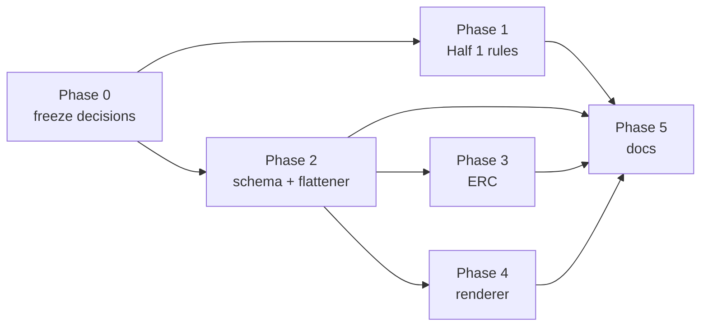

## Archive Reason

2026-05-14 — Converted to EPIC-014 (circuit library and renderer v2).
Implementation plan absorbed verbatim; tasks TASK-111..TASK-119
execute Half 1 and Half 2.

## Motivation

Tutorial step 3 (TASK-094, EPIC-012) wanted to demonstrate an RC
filter as a *repeated sub-block* — two copies of the same
"resistor + capacitor to ground" pattern, side by side, with the
placer treating them as identical sub-systems. The v0.1 layout
kernel rejects this: it only has canonical rules for R+LED (status
indicator) and R+pull-up (button pull). A standalone resistor
without an LED or pull-up is `no-canonical-rule` and aborts under
`--no-ai`.

The tutorial falls back to *three* R+LED status indicators instead,
which exercises the "repeated sub-block" pedagogy correctly but
misses the broader point: real-world circuits routinely repeat RC
filter sections, decoupling capacitor pairs, voltage-divider
networks. Those are the next layer of "repeated sub-blocks" the
user expects after they understand the LED-bank case.

## Two halves of the fix

Both halves are independent and can land in either order; they
multiply each other.

### Half 1 — kernel canonical rules for the common non-LED groupings

Today's rule table (`src/circuitsmith/layout/`) recognises:

- `R + LED` → right-column stack, R attached-to LED.
- `R + pull-up to VCC` → on-path inline with button.

The minimal additions to cover the textbook patterns:

- `R + C (low-pass)` — RC pair where the cap goes to GND and the
  output is taken at the R-C junction. Place vertically with the
  cap below the R.
- `R + C (high-pass)` — RC pair where the cap is in series and the
  R goes to GND. Mirror of low-pass.
- `C + C (decoupling pair)` — two caps in parallel from one rail
  to GND, sometimes seen as `100 nF || 10 µF`. Stack tightly with
  shared GND.
- `R + R (voltage divider)` — two Rs in series between a rail and
  GND with a tap. Place vertically; the tap label is the net name.

Each rule needs a topology-fingerprint match in the kernel and a
slot assignment for the constituent components.

### Half 2 — `.circuit.yml` sub-block syntax

Today the user must repeat the pattern by hand:

```yaml
R3a: { type: passives/resistor, value: 10000 }
C3a: { type: passives/capacitor, value: 100n }
R3b: { type: passives/resistor, value: 10000 }
C3b: { type: passives/capacitor, value: 100n }
```

That works but doesn't *say* "these two pairs are the same
sub-block." A first-class form:

```yaml
sub-blocks:
  rc_lowpass:
    components:
      R: { type: passives/resistor, value: 10000 }
      C: { type: passives/capacitor, value: 100n }
    connections:
      - net: filtered
        path: [R.1, R.2, C.1]
      - net: GND
        pins: [C.2]
    inputs: [R.1]
    outputs: [R.2]

instances:
  FILT_A: { sub-block: rc_lowpass }
  FILT_B: { sub-block: rc_lowpass }

connections:
  - net: SIGNAL_A
    path: [U1.D2, FILT_A.input]
  - net: SIGNAL_B
    path: [U1.D4, FILT_B.input]
```

The instance names (`FILT_A`, `FILT_B`) become the placer's
slot-assignment unit; the kernel knows each instance is one
sub-block and can stack them in the right-column region the same
way it stacks LED branches today.

### Coexistence with today's flat form

The flat-YAML form keeps working unchanged. Sub-block syntax is
opt-in; existing tutorial fixtures and gallery YAML continue to
parse and render as today. The kernel's pattern-match path
(R-attached-to-LED → status indicator) and the explicit sub-block
path coexist — pattern-match is the fallback when no `sub-blocks:`
declaration is present.

## Implications for ERC and renderer

Closing this idea introduces new error / warning classes the ERC
engine must learn, plus a rendering decision for hierarchical
instances. Naming them up front so the implementer doesn't discover
them mid-task.

### ERC

- **Sub-block port not wired.** A sub-block declares ports; if an
  instance leaves any of them floating with no top-level
  `connections` entry, that's an error.
- **Sub-block declared but never instantiated.** Warning — the YAML
  parses, but the user almost certainly meant to use it.
- **Refdes collision after flatten.** The flattener mints globally
  unique refdes for each instance's components (see open questions
  for the proposed scheme); a collision is a flattener bug or a
  user-supplied refdes override that breaks invariants. Error.
- **Instance port double-driven.** Two top-level `connections`
  entries assign different nets to the same `<instance>.<port>`.
  Error.

Concrete rule IDs (`E16`, `E17`, …) get assigned when the work
lands, in line with the existing rule catalogue's numbering.

### Renderer

A sub-block instance can render two ways:

- **Inline box.** Constituent components draw in their slot region
  with a labelled rectangle around them (`FILT_A: rc_lowpass`). Fits
  the v0.1 single-page renderer's mental model; works well for small
  sub-blocks.
- **Hierarchical port symbol.** The instance draws as a single
  rectangle with named ports on a top-level page; constituents
  render on a dedicated sub-page. Required once instance count or
  constituent count exceeds what fits on the main page.

The choice interacts with [[idea-009-active-device-profiles-and-multi-page-renderer]]
— the multi-page renderer makes the hierarchical-port form viable.
v1 of this idea ships the inline-box form; the hierarchical form is
gated on IDEA-009.

## Implementation plan

A future epic that closes this idea breaks into five phases plus a
prep phase. Phases 1 and 2 can land in either order — Half 1 rules
are standalone and Half 2 schema doesn't require them — but the
value of Half 2 is gated on Half 1 (an instance with no canonical
rule for its constituents still aborts under `--no-canonical-rule`).
Sequencing Half 1 first gives every intermediate state a working
pipeline.

### Phase 0 — Freeze open questions (< 1h)

Before the epic opens, decide every entry in *Open questions* below.
The proposed answers there are defaults to confirm or override. Once
frozen, the answers become epic-body decisions, not mid-task ADRs.

### Phase 1 — Half 1: kernel canonical rules (~8–12h)

Four rules under [`src/circuitsmith/layout/`](../../../src/circuitsmith/layout/),
each a separate task. Independent of one another; can be parallelised
across sessions.

- **R + C low-pass.** Topology fingerprint: R two-terminal, C
  two-terminal, C.GND, R.out == C.in. Slot assignment: R top, C
  below R, output tap at the R–C junction. Golden fixtures for
  single-instance and pair.
- **R + C high-pass.** Mirror of low-pass: R.GND, C in series.
- **C + C decoupling pair.** Two caps in parallel, both .VCC and
  .GND. Stacked tightly, shared GND rail.
- **R + R voltage divider with discriminator.** Pattern-match
  fingerprint plus the *Open questions* discriminator (tap-net-name
  regex OR `role: divider` annotation). Without a hint, the kernel
  emits a low-confidence warning and falls back to flat placement
  rather than picking the divider topology silently. Golden fixture
  pair: confirmed-divider (with hint) + ambiguous-RR (without hint,
  warning expected).

Acceptance for Phase 1:

- Tutorial step 3 alternate version using flat YAML with the new
  rules renders correctly (without sub-block syntax yet).
- ERC catalogue gains the divider-ambiguity warning.
- No regression on existing R+LED / R+pull-up fixtures.

### Phase 2 — Half 2: schema + flattener (~8–12h)

Two large tasks plus a fixture matrix. Touches
[`src/circuitsmith/schema/`](../../../src/circuitsmith/schema/) (see
`co-schema` reminder) and
[`src/circuitsmith/netgraph.py`](../../../src/circuitsmith/netgraph.py)
(see `co-netgraph` reminder).

- **Schema extension.** Add top-level `sub-blocks:` (definitions)
  and `instances:` (instantiations) to the JSON Schema. Sub-block
  body has `components:`, `ports:` (named map per *Open questions*),
  and `connections:` (reusing the top-level grammar). Schema rejects
  sub-block definitions whose `components.*.type` references another
  sub-block name (nested sub-blocks disallowed in v1).
- **Netgraph flattener.** Walk `instances:`, expand each into
  constituent components with refdes minted as `<local>_<instance>`.
  Walk sub-block-internal `connections:`, scope nets to the
  instance, prefix with the instance name to mint global names.
  Wire `<instance>.<port>` references via the sub-block's `ports:`
  map. Cross-instance net collisions caught here, surfaced to ERC.
- **Flattener fixture matrix.** Single-instance, multi-instance (RC
  pair), multi-instance with shared output net, empty sub-block
  (should reject), sub-block with unconnected port (consumed by
  Phase 3 ERC).

Acceptance for Phase 2:

- Multi-instance RC pair YAML round-trips through netgraph → flat
  netlist → BOM → KiCad netlist.
- BOM groups by component class (`R_FILT_A`, `R_FILT_B` are siblings
  in BOM ordering).
- Existing flat-form fixtures still pass (the coexistence guarantee
  from *Coexistence with today's flat form* above).

### Phase 3 — ERC additions (~4–8h)

Four rules in
[`src/circuitsmith/erc_engine.py`](../../../src/circuitsmith/erc_engine.py)
(see `co-erc-engine` reminder). Each task: rule code, rule catalogue
entry, error-message text, golden failing fixture, golden negative
fixture.

- **Sub-block port not wired.** An instance leaves a declared port
  floating with no top-level `connections` entry. Error.
- **Sub-block declared but never instantiated.** YAML parses but the
  user almost certainly meant to use it. Warning.
- **Refdes collision after flatten.** Internal invariant — should
  only fire from a flattener bug or a user-supplied refdes override
  that breaks uniqueness. Error.
- **Instance port double-driven.** Two top-level `connections`
  entries assign different nets to the same `<instance>.<port>`.
  Error.

Rule IDs are minted from the existing catalogue numbering when the
work lands.

### Phase 4 — Renderer: inline-box mode (~4–6h)

Two tasks in [`src/circuitsmith/render/`](../../../src/circuitsmith/render/)
and [`src/circuitsmith/renderer.py`](../../../src/circuitsmith/renderer.py).
The hierarchical-port render mode is deferred to IDEA-009 per
*Implications for ERC and renderer* above.

- **Inline-box render path.** Constituent components draw in their
  slot region as today. A labelled rectangle wraps the bounding box
  of each instance's constituents; label is
  `<instance>: <sub-block-name>` (e.g. `FILT_A: rc_lowpass`).
- **Golden SVG fixtures.** Single-instance + multi-instance pair,
  committed under `tests/fixtures/`. Visual diff CI catches drift.

Acceptance for Phase 4:

- Multi-instance RC pair renders with two labelled boxes side by
  side, slot-aligned with the rest of the schematic.
- `--rule-trace` output names the sub-block path:
  `placed FILT_A.R via rule rc-lowpass`.

### Phase 5 — Tutorial + docs (~3–6h)

Three tasks, the closing salvo of the epic.

- **Tutorial step 3 rewrite** — replaces the LED-bank fallback
  workaround with the intended RC-pair example using sub-block
  syntax. Golden SVG diff regenerated.
- **Renderer chapter doc update** — covers inline-box mode and
  cross-references the future hierarchical-port mode gated on
  IDEA-009.
- **Schema doc update** — describes the `sub-blocks:` / `instances:`
  / `ports:` grammar with end-to-end YAML examples.

Acceptance for Phase 5:

- Tutorial step 3 re-rendered SVG diffs cleanly against the new
  golden.
- The `scripts/check_gallery_regression.py` gate passes.
- The epic closes; the idea file moves to closed/.

### Dependency graph



### Effort summary

| Phase | Estimate |
|-------|---------:|
| Phase 0 | < 1h |
| Phase 1 | 8–12h |
| Phase 2 | 8–12h |
| Phase 3 | 4–8h |
| Phase 4 | 4–6h |
| Phase 5 | 3–6h |
| **Total** | **~27–44h** |

Epic-sized; smaller than EPIC-012 (10 tasks, ~22h actual).

### Out of scope

- **Hierarchical-port render mode.** Gated on IDEA-009's multi-page
  renderer. Land together with that work.
- **Nested sub-blocks.** Schema rejects them in v1; a future
  iteration can flatten recursively without breaking v1 fixtures.
- **Sub-block parameterisation.** No `rc_lowpass(R=10k, C=100n)`
  template instantiation in the proposed syntax. Each instance
  reuses the sub-block's declared component values verbatim. A
  future extension if the maker workflow demands it.
- **Migration tooling for existing flat-form YAML.** No breaking
  change to the existing schema, so no migration script needed.

## Open questions

- **Refdes flattening for BOM / KiCad netlist.** A sub-block
  instance's constituent components need globally unique refdes
  downstream. Proposed scheme: `<local-refdes>_<instance>` (e.g.
  `R_FILT_A`, `C_FILT_A`). Mirrors how hierarchical schematic tools
  flatten and groups RC sections together intuitively in the BOM.
  The alternative `<instance>_<local>` scatters the BOM by instance
  rather than by component class — explicitly rejected.
- **Port-naming convention for instance references.** The example
  shorthand `FILT_A.input` is fragile once a sub-block has more than
  one input. Proposed schema: named ports as a map —
  `ports: { signal_in: R.1, signal_out: R.2, gnd: C.2 }` —
  referenced as `FILT_A.signal_in`. The `inputs:` / `outputs:`
  pin-alias form should be deprecated before it ships; one syntactic
  form, not two.
- **Sub-block-internal `connections` grammar.** Proposed: reuse the
  top-level `connections` grammar verbatim — same `path:` / `pins:`
  / `net:` keys, same net-name semantics. Sub-block nets are local;
  the flattener prefixes them with the instance name to mint global
  names. No second mini-schema.
- **Voltage-divider rule discriminator (Half 1).** Pattern-matching
  R+R between a rail and GND as a divider is fragile — it looks
  identical to a series-resistor on a current path with an
  incidental node label. Proposed discriminator: require either an
  explicit hint net-name on the tap
  (`/^(V?REF|SENSE|ADC|DIV|TAP)/i`) **or** a `role: divider`
  annotation on one of the resistors. Otherwise the kernel emits a
  low-confidence warning and falls back to flat placement rather
  than picking the divider topology silently.
- **Nested sub-blocks.** v1 disallows; the schema rejects a
  sub-block definition whose `components:` table references another
  sub-block. A future iteration can flatten recursively without
  breaking v1 fixtures. The error message names the offending nested
  reference so the user knows where the restriction bites.
- **Renderer mode default.** v1 ships the inline-box form (see
  *Implications for ERC and renderer* above). The hierarchical-port
  form is gated on IDEA-009's multi-page renderer and lands together
  with that work.

## Cross-references

- [TASK-094](../tasks/closed/task-094-tutorial-steps-1-3-minimal-and-fan-out.md)
  — the task whose fallback path filed this idea. Its closure
  references this file as the source of the missing capability.
- [ADR-0001](../adr/0001-slots-not-coordinates.md) — the slot
  vocabulary kernel canonical rules write into. Half 1 extends this
  vocabulary; Half 2 doesn't change it but feeds new compositions
  into it.
- [IDEA-009](idea-009-active-device-profiles-and-multi-page-renderer.md)
  — multi-page renderer support; gates the hierarchical-port render
  mode for sub-block instances.
- [`src/circuitsmith/layout/`](../../../src/circuitsmith/layout/) —
  the directory where Half 1's rule additions land.
