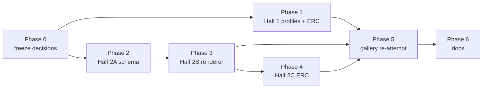

## Archive Reason

2026-05-14 — Converted to EPIC-014 (circuit library and renderer v2).
Implementation plan absorbed verbatim; tasks TASK-120..TASK-127
execute the profile and multi-page work, TASK-128..TASK-132 execute
the gallery re-attempts that close the original blocked tasks.

## Motivation

EPIC-012's example gallery shipped four entries that the v0.1
pipeline cannot render:

- **TASK-097** common-emitter amplifier — needs a `bjt_npn`
  component profile and analog signal-path layout rules.
- **TASK-098** 555 monostable timer — needs a `ic/555` profile
  with the pin/role conventions matching standard 555 schematics.
- **TASK-099** op-amp non-inverting buffer — needs an
  `ic/opamp_dual_supply` profile with `V+`, `V-`, `OUT`, and dual
  power rails.
- **TASK-100** multi-page split — needs a renderer page-break
  path the v0.1 codebase does not yet expose. Even with the
  profiles above, this task needs renderer work to span pages.

Each of those tasks closed with a `blocked-on-component-profile`
outcome and a pointer to this idea. The gallery's `circuit.yml`
files are not committed because authoring them against
non-existent profiles would produce S5 errors at schema time and
mislead future contributors about what the library supports.

## Two unrelated capabilities packaged together

This idea bundles two capabilities that fell out of EPIC-012's
gallery, but they are **not halves of one fix**. Half 1 unblocks
three of the four blocked tasks (TASK-097/098/099); Half 2 unblocks
only TASK-100. The two halves share no schema, no code path, and
no test fixtures — the only thing they share is the parent epic
they fell out of. The bundle is provisional; see *Open questions*
for whether to split into IDEA-009a/009b before the epic opens.

Both halves can land in either order. Half 1 is the higher-payoff
work (3× the unblocks) and the obvious sequencing if the bundle
stays together.

### Half 1 — active-device component profiles

Three profiles unblock the active-device gallery entries. Files
are new — neither `actives.py` nor `ics.py` exists in
[`src/circuitsmith/components/`](../../../src/circuitsmith/components/)
today. Convention follows the `co-schema` invariants: every pin
declares `side` / `type` / `direction`; profile dicts are
auto-discovered by [`schema/registry.py`](../../../src/circuitsmith/schema/registry.py)
on the next `validate()` call (no manual schema edit).

- **`bjt_npn`** (and `bjt_pnp`) — three terminals named `B` / `C` /
  `E` matching the standard schematic-symbol convention. Direction
  sensitivity (CE amp vs CC follower vs CB amp) is annotated with
  a per-pin `role:` field — `pins.B.role: "base"`, `pins.C.role:
  "collector"`, `pins.E.role: "emitter"` — mirroring the existing
  `func:` convention on MCU pins. Layout rules consume the role,
  not a separate metadata table; see *Open questions* for the
  rejection of the redundant `metadata.bjt_terminals` shape from
  the original draft.
  Lands in a new `components/actives.py`.
- **`ic/555`** — eight pins. Per [ADR-0010](../adr/0010-mcu-profile-is-dev-board-shape.md),
  IC profiles follow the silkscreen-pin convention; the 555 is a
  through-hole DIP-8 with numbered pins, so dict keys are
  `"1".."8"` and the silicon names live in `alt:` (e.g.
  `pins["1"].alt: ["GND"]`, `pins["2"].alt: ["TRIG"]`). The
  renderer reads `display_label` for the printed pin label.
  `metadata.symbol: "Ic"` for Schemdraw's generic IC element.
  Lands in a new `components/ics.py`.
- **`ic/opamp_dual_supply`** — five pins (`IN+`, `IN-`, `OUT`,
  `V+`, `V-`). Pin keys are the symbolic names directly (no DIP
  number aliasing — op-amp schematic symbols don't show pin
  numbers). Power pins on top/bottom; signal pins on left
  (`IN+/IN-`) and right (`OUT`). `metadata.symbol: "Opamp"` for
  Schemdraw's triangle element. Lands alongside `ic/555` in
  `components/ics.py`.

Each profile adds a row to [.claude/skills/circuit/docs/components.md](../../../.claude/skills/circuit/docs/components.md);
the `passives.py` and `mcus.py` tables are the precedent. A new
`actives.py` table and a new `ics.py` table with op-amp/555-class
ICs (distinct from MCUs) are added.

### Half 2 — multi-page renderer support

TASK-100 explicitly stresses the renderer's page-break path. v0.1
ships single-page rendering only — there's no exposed mechanism to
split a circuit across multiple sheets, no `page` slot vocabulary,
no inter-sheet net-label connector. The CLI's `--out` flag (see
[`renderer.py:676`](../../../src/circuitsmith/renderer.py)) takes a
single output path.

What lands here:

- **Page partition in `.layout.yml`.** A top-level `pages:` block
  declares named pages and assigns components to them; pages are
  region partitions, orthogonal to the existing region/slot
  vocabulary established in [ADR-0001](../adr/0001-slots-not-coordinates.md).
  Components without an explicit page assignment default to page
  `p1`. The minimal shape:

  ```yaml
  pages:
    - name: p1
      title: Input stage
    - name: p2
      title: Output stage
  placements:
    Q1: { region: right-column, slot: 0, page: p1, ... }
    Q2: { region: right-column, slot: 0, page: p2, ... }
  ```

- **Cross-page net labels — no new YAML.** When a net has pins on
  multiple pages, the renderer automatically emits an off-sheet
  reference label on each page (`SIGNAL ▶ p2`, `SIGNAL ◀ p1`). The
  user does not declare cross-page nets explicitly; the netgraph
  flattener detects multi-page membership from the pin list and the
  page assignments. The label glyph is a Schemdraw arrow with the
  net name and target page; renderer details land with Phase 3.
- **CLI: auto-suffixed multi-output.** `--out main.svg` produces
  `main-p1.svg`, `main-p2.svg`, … one file per page. Single-page
  circuits keep the v0.1 behaviour and emit `main.svg` (no `-p1`
  suffix). The `--out-layout` and `--out-meta` flags continue to
  emit single sidecar files per circuit, not per page (the layout
  and meta describe the whole circuit, not one sheet).
- **Schemdraw multi-figure.** Schemdraw's `Drawing` is one figure;
  multi-page output is achieved by constructing one `Drawing` per
  page and serialising each independently. There is no built-in
  Schemdraw page-break primitive to plumb through; the work is in
  CircuitSmith's renderer driving the multi-`Drawing` loop and
  reconciling cross-page labels by net name.

### Coexistence with today's single-page renderer

The single-page render path keeps working unchanged. A `.layout.yml`
without a `pages:` block renders as today (one SVG, no `-p1`
suffix). The `pages:` block is opt-in; existing tutorial fixtures
and gallery YAML continue to parse and render byte-identical. The
cross-page label path is dead code unless `pages:` is present and
populated by ≥ 2 pages with shared nets.

## Implications for ERC and renderer

Closing this idea introduces new error / warning classes the ERC
engine must learn, plus rendering decisions for active-device
symbols and multi-page output. Naming them up front so the
implementer doesn't discover them mid-task.

### ERC — Half 1 (active devices)

- **BJT pin-role unset.** A `bjt_npn` / `bjt_pnp` instance with no
  `role:` annotation on its three terminals can't be placed by the
  direction-sensitive layout rules. Error.
- **Op-amp power-pin floating.** `ic/opamp_dual_supply` instance
  where `V+` or `V-` has no `connections:` entry. Error — analog
  ICs do not have safe floating-power-pin defaults the way some
  digital ICs do.
- **555 pin-naming drift.** A `.circuit.yml` connections entry
  references `U1.GND` (silicon name) instead of `U1.1` (silkscreen
  pin number) on a `ic/555` instance. Warning, with a suggestion
  to use the alias from `pins["1"].alt`. The renderer accepts
  either form (renders the same), but warning catches the
  inconsistency before it spreads.

### ERC — Half 2 (multi-page)

- **Page declared but empty.** A `pages:` entry with no components
  assigned to it. Warning — the YAML parses, but the user almost
  certainly meant to populate it.
- **Page referenced but undeclared.** A placement carries
  `page: p3` but `pages:` only declares `p1` / `p2`. Error.
- **Cross-page net invisible on one side.** A net whose pins
  appear on multiple pages but whose label would render
  off-canvas (bounding-box overflow) on at least one of them.
  Error — the label is the only thing keeping the cross-page
  reference traceable.
- **Excessive cross-page net count.** Heuristic warning — if more
  than ~6 nets cross any single page boundary, the page split is
  probably in the wrong place (or the circuit is genuinely too
  dense for 2 pages and wants 3). Warning, not error; the user
  decides.

Concrete rule IDs (`E18`, `E19`, …) get assigned when the work
lands, in line with the existing rule catalogue's numbering and
its precedent in [IDEA-008](idea-008-first-class-sub-blocks-and-non-led-kernel-rules.md)
*Implications for ERC and renderer*.

### Renderer

- **Active-device symbols.** Schemdraw ships native `Bjt`,
  `BjtPnp`, `Opamp`, and `Ic` (generic block) elements; the
  renderer dispatches on `metadata.symbol` the same way it does
  today for `Speaker` (the piezo override). No new render-engine
  primitive — the work is the dispatch table entry plus
  per-element pin-anchor mapping.
- **Multi-page driver.** One `Drawing` per page; the renderer
  walks `pages:` in declaration order, builds each page's
  `Drawing` from the placements that target it, then serialises
  each to its `-p<n>.svg` file.
- **Cross-page label rendering.** After all per-page Drawings are
  populated, the renderer makes a second pass: for every net with
  pins on ≥ 2 pages, emit an off-sheet reference glyph at each
  page's net-attachment point. The glyph carries the net name and
  the comma-separated list of *other* pages the net touches.

## Implementation plan

A future epic that closes this idea breaks into six phases plus a
prep phase. Half 1 (Phase 1) and Half 2 (Phases 2–4) are entirely
independent — the dependency graph below is two parallel lanes
that converge only at Phase 5 (gallery re-attempt). If the bundle
splits into IDEA-009a/009b per the *Open questions*, each idea
keeps its own subset of phases without restructuring.

### Phase 0 — Freeze open questions (< 1h)

Before the epic opens, decide every entry in *Open questions* below.
The proposed answers there are defaults to confirm or override. Once
frozen, the answers become epic-body decisions, not mid-task ADRs.
The first decision — split-or-bundle — gates the rest.

### Phase 1 — Half 1: active-device profiles (~10–16h)

Three profile tasks plus an ERC task; the three profile tasks are
independent and can be parallelised across sessions.

- **`bjt_npn` + `bjt_pnp` profile.** New
  [`src/circuitsmith/components/actives.py`](../../../src/circuitsmith/components/)
  file. Pin keys `B` / `C` / `E` with `role:` annotations.
  Schemdraw `Bjt` / `BjtPnp` element dispatch via
  `metadata.symbol`. Golden SVG fixture under `tests/fixtures/`.
- **`ic/555` profile.** New
  [`src/circuitsmith/components/ics.py`](../../../src/circuitsmith/components/)
  file. Pin keys `"1".."8"` per ADR-0010, silicon names in `alt:`.
  `metadata.symbol: "Ic"`. Golden fixture for a minimal 555
  monostable.
- **`ic/opamp_dual_supply` profile.** Same `ics.py` file. Symbolic
  pin keys (`IN+`, `IN-`, `OUT`, `V+`, `V-`). `metadata.symbol:
  "Opamp"`. Golden fixture for a non-inverting buffer.
- **Active-device ERC rules** in
  [`src/circuitsmith/erc_engine.py`](../../../src/circuitsmith/erc_engine.py)
  (see `co-erc-engine` reminder): BJT pin-role-unset, op-amp
  power-pin-floating, 555 pin-naming-drift. Each task: rule code,
  rule catalogue entry, error-message text, golden failing
  fixture, golden negative fixture.

Acceptance for Phase 1:

- TASK-097/098/099 `circuit.yml` fixtures parse and validate
  without S5 errors.
- The component-skill docs gain rows for the three new profiles.
- ERC catalogue gains the three new rules.
- No regression on existing day-one fixtures.

### Phase 2 — Half 2A: page schema + slot vocabulary (~4–6h)

One schema task plus one layout-engine task.

- **Schema extension.** Add top-level `pages:` block (declarations)
  and per-placement `page:` field to
  [`src/circuitsmith/schema/layout.schema.json`](../../../src/circuitsmith/schema/)
  (see `co-schema` reminder). Schema rejects a placement whose
  `page:` value is not declared in `pages:`. Schema rejects a
  `pages:` block with duplicate names.
- **Layout-engine page propagation.** Kernel and validator carry
  the page assignment through `Placement` (see
  [`src/circuitsmith/layout/kernel.py`](../../../src/circuitsmith/layout/kernel.py))
  without trying to use it for layout decisions — page is purely a
  rendering concern; slot assignment happens within a page's
  region/slot vocabulary as today.

Acceptance for Phase 2:

- A `.layout.yml` with a `pages:` block round-trips through
  validation and the kernel without behaviour change to
  single-page circuits.
- Existing fixtures with no `pages:` block continue to validate
  and render byte-identical.

### Phase 3 — Half 2B: renderer multi-page output (~10–16h)

The largest single phase. Two tasks plus a fixture matrix.

- **Multi-page render driver.** One `Drawing` per declared page;
  walk pages in declaration order, populate each from its
  placements, serialise to `<stem>-p<n>.svg`. CLI `--out`
  semantics: single-page circuits keep `<stem>.svg` (no suffix);
  multi-page circuits emit one file per page. Single sidecar
  `.layout.yml` and `.meta.yml` per circuit.
- **Cross-page net labels.** Second pass after per-page Drawings
  populated. For every net with pins on ≥ 2 pages, emit an
  off-sheet reference glyph at each page's net-attachment point,
  carrying the net name and the list of other pages the net
  touches. Glyph is a Schemdraw arrow primitive plus a text
  annotation; renderer is responsible for sensible placement
  along the page boundary.
- **Render fixture matrix.** Single-page (no regression),
  two-page minimal (one cross-page net), three-page with shared
  rail across all pages, two-page with no cross-page nets
  (independent subsystems).

Acceptance for Phase 3:

- Two-page golden fixture renders byte-identical across runs.
- A user can trace any cross-page net by following the arrow
  glyph to the named page.
- Single-page fixtures emit `<stem>.svg` (not `<stem>-p1.svg`).

### Phase 4 — Half 2C: cross-page ERC (~4–6h)

Four rules in
[`src/circuitsmith/erc_engine.py`](../../../src/circuitsmith/erc_engine.py).
Each task: rule code, rule catalogue entry, error-message text,
golden failing fixture, golden negative fixture.

- **Page declared but empty.** Warning.
- **Page referenced but undeclared.** Error.
- **Cross-page net invisible on one side.** Error.
- **Excessive cross-page net count.** Warning, threshold ~6.

### Phase 5 — Gallery re-attempt (~4–8h)

Four new tasks that reference and supersede the closed ones. Use
`/ts-task-new`, not `/ts-task-reopen` — the closed tasks are
historical artefacts of the gallery's first pass with their own
"blocked-on" outcomes; the re-attempt is a distinct unit of work
that consumes the new capabilities. Each new task body opens with
"Supersedes: TASK-NNN".

- **Common-emitter amplifier (re-attempt of TASK-097).** Authors
  the `circuit.yml` against the new `bjt_npn` profile. Single
  page.
- **555 monostable (re-attempt of TASK-098).** Authors against
  the new `ic/555` profile. Single page.
- **Op-amp non-inverting buffer (re-attempt of TASK-099).**
  Authors against the new `ic/opamp_dual_supply` profile. Single
  page.
- **Multi-page split (re-attempt of TASK-100).** Picks one of the
  candidate shapes from the closed task body (multi-section audio
  chain is the natural fit if Half 1 is also done — input buffer,
  gain stage, tone control, output buffer). Authors with the
  `pages:` block.

Acceptance for Phase 5:

- All four new tasks close with their `circuit.yml` and rendered
  artefacts committed under `docs/users/examples/`.
- The gallery index entries (originally written under TASK-093)
  no longer carry "blocked-on" notes.
- The original closed TASK-097/098/099/100 files retain their
  outcome history — the re-attempt tasks supersede them in
  capability, not in history.

### Phase 6 — Tutorial + docs (~3–5h)

Two tasks, the closing salvo of the epic.

- **Component-skill docs update** ([.claude/skills/circuit/docs/components.md](../../../.claude/skills/circuit/docs/components.md))
  — adds the `actives.py` table and the `ics.py` table; documents
  the BJT `role:` convention and the 555 silkscreen-pin / `alt:`
  convention.
- **Renderer-skill docs update** — touches both
  [.claude/skills/circuit/docs/index.md](../../../.claude/skills/circuit/docs/index.md)
  and [.claude/skills/circuit/docs/layout.md](../../../.claude/skills/circuit/docs/layout.md).
  Covers the `pages:` block, the `<stem>-p<n>.svg` output
  convention, and the cross-page label glyph. Cross-references
  IDEA-008's hierarchical-port render mode (which gates on this
  idea's multi-page work).

Acceptance for Phase 6:

- The epic closes; the idea file moves to closed/.
- IDEA-008's "Renderer mode default" open question now resolves
  in favour of the hierarchical-port form being implementable.

### Dependency graph



### Effort summary

| Phase | Estimate |
|-------|---------:|
| Phase 0 | < 1h |
| Phase 1 | 10–16h |
| Phase 2 | 4–6h |
| Phase 3 | 10–16h |
| Phase 4 | 4–6h |
| Phase 5 | 4–8h |
| Phase 6 | 3–5h |
| **Total** | **~36–58h** |

Larger than IDEA-008 (~27–44h) and EPIC-012 (10 tasks, ~22h
actual) — the multi-page renderer (Phase 3) is the dominant
contributor.

### Out of scope

- **Hierarchical-port render mode for sub-block instances.** This
  belongs to [IDEA-008](idea-008-first-class-sub-blocks-and-non-led-kernel-rules.md)
  Phase 4; this idea's multi-page renderer is a *prerequisite*
  for it but doesn't ship the sub-block-aware variant.
- **Single-supply op-amp profile.** v1 ships
  `ic/opamp_dual_supply` only; single-supply (rail-to-GND) op-amp
  topologies are common but require a different power-pin ERC
  rule and a different default biasing convention. Future
  iteration if the gallery wants a rail-to-rail example.
- **JFET / MOSFET / Darlington profiles.** Half 1 covers BJTs
  only; FETs are a future iteration with their own pin-naming
  conventions (`G` / `D` / `S`) and ERC rules (gate-source
  voltage limits, body-diode considerations).
- **Page-break heuristics in the kernel.** This idea exposes
  `pages:` as user-authored placement metadata; the kernel does
  not auto-partition a circuit into pages. Auto-partitioning is
  a future research idea, not a v1 deliverable.
- **PDF / multi-page-PDF output.** SVG-per-page only. PDF
  bundling is a downstream packaging concern, not a renderer
  concern.

## Open questions

All entries below are **Decided** (2026-05-14, EPIC-014 / TASK-110).
The proposed defaults were confirmed verbatim (with bundle-vs-split
overridden to *bundled* by EPIC-014's existence) and recorded in the
[epic body's "Frozen decisions" section](../../tasks/active/epic-014-circuit-library-and-renderer-v2.md#frozen-decisions-task-110).
This section is kept for traceability; downstream implementation
tasks consume the epic body, not these entries.

- **Bundle vs split into IDEA-009a / IDEA-009b.** The two halves
  are independent in code, schema, fixtures, and acceptance.
  Proposed default: **split**. IDEA-009a (active-device profiles)
  becomes a small epic that ships in days; IDEA-009b (multi-page
  renderer) becomes a larger epic that follows. Splitting
  preserves the option to ship Half 1's payoff without waiting on
  Half 2's larger investment, and aligns with the EPIC-012
  precedent of one epic per cohesive theme. The downside is two
  ideas to track instead of one; minor.
- **BJT terminal-role encoding.** The original draft proposed
  `metadata.bjt_terminals: {base: B, collector: C, emitter: E}`
  — a redundant map (the pin keys are already `B/C/E`). Proposed:
  use a per-pin `role:` field on each terminal (`pins.B.role:
  "base"`), mirroring the existing `func:` convention on MCU
  pins. One syntactic form for "what is this pin for", not two.
  Layout rules read `pin.role` directly.
- **555 pin keys: silkscreen numbers vs silicon names.** Per
  [ADR-0010](../adr/0010-mcu-profile-is-dev-board-shape.md) the
  precedent for IC profiles is silkscreen-pin keys with silicon
  names in `alt:`. Proposed: 555 follows ADR-0010 — pin keys
  `"1".."8"`, `alt:` carries `["GND"]`, `["TRIG"]`, etc.
  Connections may reference either form (`U1.1` or `U1.GND`); the
  renderer prints the silicon name via `display_label`.
- **Op-amp pin keys: silkscreen vs symbolic.** Op-amp schematic
  symbols (the triangle) don't show pin numbers — every textbook
  draws `IN+` / `IN-` / `OUT` directly. Proposed: op-amp profile
  is symbolic-key — pin keys are `"IN+"`, `"IN-"`, `"OUT"`, `"V+"`,
  `"V-"`. ADR-0010's silkscreen rule applies to packaged ICs
  whose schematic symbol includes pin numbers; op-amp symbols
  don't, so the rule doesn't bite. The 555 vs op-amp split is
  asymmetric on purpose: 555 is symbol-shown-with-pin-numbers,
  op-amp is symbol-shown-without.
- **Cross-page label glyph: arrow vs hatched-tag.** Proposed:
  Schemdraw arrow with text annotation (`SIGNAL ▶ p2`). Arrows
  are unambiguous about *direction* (which way the net continues)
  in a way hatched off-page tags are not, and they degrade well
  in monochrome SVG. The downside is arrows take more horizontal
  space than tags; if a layout is dense the renderer may need to
  shorten the arrow tail.
- **CLI shape for multi-page output.** Proposed: `--out
  main.svg` auto-suffixes to `main-p1.svg`, `main-p2.svg`, …
  Single-page output keeps `main.svg` (no suffix), preserving
  v0.1 behaviour. Rejected alternative: repeat `--out` per page
  (`--out p1.svg --out p2.svg`) — fragile under page-count
  changes (renaming a page or adding one breaks invocations) and
  doesn't compose with shell globbing.
- **Cross-page nets: detection vs declaration.** Proposed:
  detection — the netgraph flattener inspects each net's pin list
  and the placements' `page:` assignments; any net touching ≥ 2
  pages gets cross-page labels automatically. The user does not
  declare cross-page nets in YAML. Rejected alternative:
  user-authored `cross-page-nets: [SIGNAL, GND]` block — error-
  prone (the user has to keep the list in sync with the actual
  net topology) and doesn't add information the flattener can't
  derive.

## Cross-references

- [TASK-097](../tasks/closed/task-097-example-common-emitter-amplifier.md),
  [TASK-098](../tasks/closed/task-098-example-555-monostable.md),
  [TASK-099](../tasks/closed/task-099-example-opamp-non-inverting-buffer.md),
  [TASK-100](../tasks/closed/task-100-example-multi-page-split.md)
  — the gallery tasks that closed with the
  blocked-on-this-idea outcome. Their re-attempts are scoped
  under Phase 5.
- [IDEA-008](idea-008-first-class-sub-blocks-and-non-led-kernel-rules.md)
  — first-class sub-blocks and non-LED kernel rules. IDEA-008's
  Phase 4 (renderer inline-box mode) ships independently;
  IDEA-008's *hierarchical-port* render mode is gated on this
  idea's Half 2 (multi-page renderer) and lands together with
  it.
- [ADR-0001](../adr/0001-slots-not-coordinates.md) — the slot
  vocabulary. Half 2 adds `pages:` as a *partition* of the slot
  vocabulary, not a replacement; per-page region/slot assignment
  works as today.
- [ADR-0010](../adr/0010-mcu-profile-is-dev-board-shape.md) —
  silkscreen-pin convention for IC profiles. 555 follows it
  (silkscreen pin numbers); op-amp does not (symbolic schematic
  symbol).
- [`src/circuitsmith/components/`](../../../src/circuitsmith/components/)
  — Half 1's new `actives.py` and `ics.py` files land here.
- [`src/circuitsmith/schema/`](../../../src/circuitsmith/schema/)
  (`co-schema` reminder) — Half 2's `pages:` schema extension.
- [`src/circuitsmith/renderer.py`](../../../src/circuitsmith/renderer.py)
  — Half 2's multi-page driver. The `--out` flag handling at
  line 676 is the entry point for the auto-suffix logic.
- [`src/circuitsmith/erc_engine.py`](../../../src/circuitsmith/erc_engine.py)
  (`co-erc-engine` reminder) — Phase 1 (active-device rules) and
  Phase 4 (cross-page rules) both land here.
- [`src/circuitsmith/netgraph.py`](../../../src/circuitsmith/netgraph.py)
  (`co-netgraph` reminder) — cross-page net detection runs in
  the flattener.
- [.claude/skills/circuit/docs/components.md](../../../.claude/skills/circuit/docs/components.md)
  — Phase 6 docs updates for the new profiles.
