# Epics

_Auto-generated by `housekeep.py`. Do not edit manually._

**Overall:** 🔵 **active** — ███████░░░ 81/109 (74%) across 14 groups — 28 open · 0 active · 0 paused · 81 closed

## Index

| Epic | Title | Status | Open | Active | Paused | Closed | Done |
|------|-------|--------|-----:|-------:|-------:|-------:|------|
| [EPIC-001](#epic-001-circuit-skill--component-library-and-schema) | Circuit Skill — Component Library and Schema | 🟢 closed | 0 | 0 | 0 | 7 | ██████████ 100% |
| [EPIC-002](#epic-002-circuit-skill--renderer-and-layout-engine) | Circuit Skill — Renderer and Layout Engine | 🟢 closed | 0 | 0 | 0 | 17 | ██████████ 100% |
| [EPIC-003](#epic-003-circuit-skill--erc-engine-and-rule-catalog) | Circuit Skill — ERC Engine and Rule Catalog | 🟢 closed | 0 | 0 | 0 | 9 | ██████████ 100% |
| [EPIC-004](#epic-004-circuit-skill--bom-and-netlist-exporters) | Circuit Skill — BOM and Netlist Exporters | 🟢 closed | 0 | 0 | 0 | 6 | ██████████ 100% |
| [EPIC-005](#epic-005-circuit-skill--markdown-block-integration) | Circuit Skill — Markdown Block Integration | 🟢 closed | 0 | 0 | 0 | 3 | ██████████ 100% |
| [EPIC-006](#epic-006-circuit-skill--skill-packaging-and-pypi-publication) | Circuit Skill — Skill Packaging and PyPI Publication | 🔵 **active** | 1 | 0 | 0 | 9 | █████████░ 90% |
| [EPIC-007](#epic-007-project-bootstrap--python-project-config-and-ci) | Project Bootstrap — Python Project Config and CI | 🟢 closed | 0 | 0 | 0 | 4 | ██████████ 100% |
| [EPIC-008](#epic-008-architecture-fitness-functions-and-governance) | Architecture Fitness Functions and Governance | 🟢 closed | 0 | 0 | 0 | 8 | ██████████ 100% |
| [EPIC-009](#epic-009-developer-documentation-and-governance-scaffolding) | Developer Documentation and Governance Scaffolding | 🟢 closed | 0 | 0 | 0 | 12 | ██████████ 100% |
| [EPIC-010](#epic-010-consolidate-skill-resident-python-into-circuitsmith-package) | Consolidate skill-resident Python into circuitsmith package | 🟢 closed | 0 | 0 | 0 | 4 | ██████████ 100% |
| [EPIC-011](#epic-011-test-plan-and-coverage-matrix) | Test Plan and Coverage Matrix | ⚪ _open_ | 9 | 0 | 0 | 0 | ░░░░░░░░░░ 0% |
| [EPIC-012](#epic-012-tutorial-and-example-gallery) | Tutorial and Example Gallery | ⚪ _open_ | 10 | 0 | 0 | 0 | ░░░░░░░░░░ 0% |
| [EPIC-013](#epic-013-post-epic-006-documentation-audit-and-rewrite) | Post-EPIC-006 Documentation Audit and Rewrite | ⚪ _open_ | 8 | 0 | 0 | 0 | ░░░░░░░░░░ 0% |
| [—](#unassigned) | _(no epic)_ | 🟢 closed | 0 | 0 | 0 | 2 | ██████████ 100% |

---

## EPIC-001: Circuit Skill — Component Library and Schema

[↑ back to top](#index)

**Status:** 🟢 closed — ██████████ 7/7 (100%)

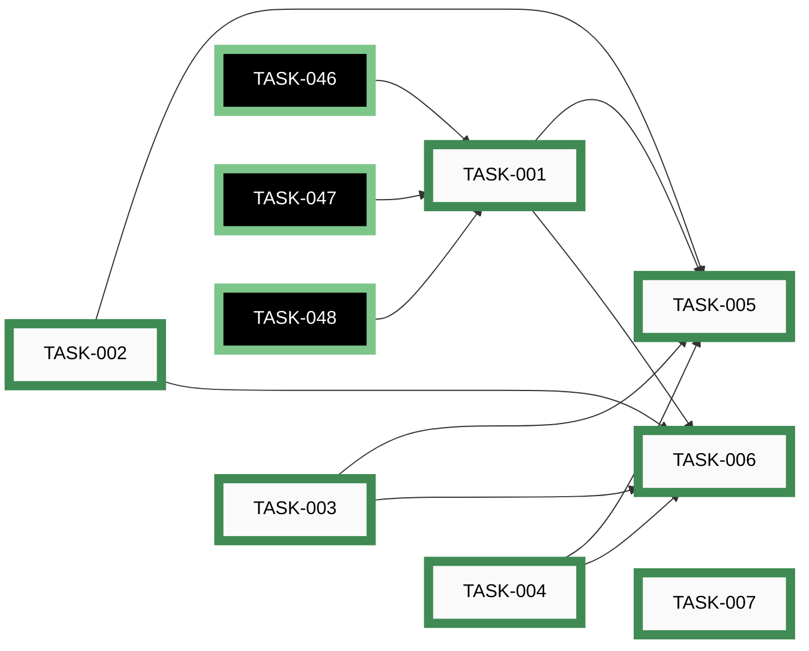

| Order | ID | Title | Status | Effort |
|-------|----|-------|--------|--------|
| 1 | ~~[TASK-001](closed/task-001-extract-mcu-board-profiles.md)~~ | ~~Extract ESP32 and nRF52840 board profiles into components/mcus.py~~ | 🟢 closed | Medium (2-8h) |
| 2 | ~~[TASK-002](closed/task-002-write-passives-component-library.md)~~ | ~~Write components/passives.py~~ | 🟢 closed | Medium (2-8h) |
| 3 | ~~[TASK-003](closed/task-003-write-connectors-component-library.md)~~ | ~~Write components/connectors.py~~ | 🟢 closed | Medium (2-8h) |
| 4 | ~~[TASK-004](closed/task-004-write-sensors-component-library.md)~~ | ~~Write components/sensors.py~~ | 🟢 closed | Small (&lt;2h) |
| 5 | ~~[TASK-005](closed/task-005-write-circuit-json-schema.md)~~ | ~~Write schema/circuit.schema.json~~ | 🟢 closed | Medium (2-8h) |
| 6 | ~~[TASK-006](closed/task-006-refactor-generate-schematic-to-use-library.md)~~ | ~~Refactor scripts/generate-schematic.py to import from components/~~ | 🟢 closed | Medium (2-8h) |
| 7 | ~~[TASK-007](closed/task-007-skill-scaffold-license-changelog-docs.md)~~ | ~~Skill scaffolding — LICENSE, CHANGELOG, docs/index, docs/components~~ | 🟢 closed | Small (&lt;2h) |

## EPIC-002: Circuit Skill — Renderer and Layout Engine

[↑ back to top](#index)

**Status:** 🟢 closed — @branch: release/epic-002-circuit-renderer-layout — ██████████ 17/17 (100%)

```mermaid
graph LR
    TASK_008["TASK-008"]:::closed
    TASK_009["TASK-009"]:::closed
    TASK_010["TASK-010"]:::closed
    TASK_011["TASK-011"]:::closed
    TASK_012["TASK-012"]:::closed
    TASK_013["TASK-013"]:::closed
    TASK_014["TASK-014"]:::closed
    TASK_015["TASK-015"]:::closed
    TASK_016["TASK-016"]:::closed
    TASK_017["TASK-017"]:::closed
    TASK_018["TASK-018"]:::closed
    TASK_019["TASK-019"]:::closed
    TASK_020["TASK-020"]:::closed
    TASK_021["TASK-021"]:::closed
    TASK_057["TASK-057"]:::closed
    TASK_058["TASK-058"]:::closed
    TASK_059["TASK-059"]:::closed
    TASK_005["TASK-005"]:::closedExt
    TASK_005 --> TASK_008
    TASK_008 --> TASK_009
    TASK_009 --> TASK_010
    TASK_010 --> TASK_011
    TASK_011 --> TASK_012
    TASK_008 --> TASK_012
    TASK_009 --> TASK_013
    TASK_005 --> TASK_014
    TASK_012 --> TASK_014
    TASK_013 --> TASK_014
    TASK_014 --> TASK_015
    TASK_012 --> TASK_016
    TASK_015 --> TASK_016
    TASK_015 --> TASK_017
    TASK_017 --> TASK_018
    TASK_017 --> TASK_019
    TASK_017 --> TASK_020
    TASK_057 --> TASK_020
    TASK_017 --> TASK_021
    TASK_018 --> TASK_021
    TASK_019 --> TASK_021
    TASK_020 --> TASK_021
    TASK_011 --> TASK_057
    TASK_012 --> TASK_057
    TASK_013 --> TASK_057
    TASK_057 --> TASK_058
    TASK_058 --> TASK_059
    click TASK_008 "closed/task-008-implement-netgraph-data-model.md"
    click TASK_009 "closed/task-009-implement-layout-kernel-canonical-slots.md"
    click TASK_010 "closed/task-010-implement-manhattan-router.md"
    click TASK_011 "closed/task-011-implement-v01-structural-rubric.md"
    click TASK_012 "closed/task-012-implement-renderer.md"
    click TASK_013 "closed/task-013-write-layout-json-schema.md"
    click TASK_014 "closed/task-014-author-circuit-yml-and-layout-yml-pairs.md"
    click TASK_015 "closed/task-015-cutover-pr-retire-old-generator.md"
    click TASK_016 "closed/task-016-write-renderer-and-layout-docs.md"
    click TASK_017 "closed/task-017-implement-ai-placer-convergence-loop.md"
    click TASK_018 "closed/task-018-add-no-ai-fallback-flag.md"
    click TASK_019 "closed/task-019-extend-rubric-with-numeric-checks.md"
    click TASK_020 "closed/task-020-extend-meta-yml-provenance.md"
    click TASK_021 "closed/task-021-update-layout-docs-for-ai-placer.md"
    click TASK_057 "closed/task-057-emit-v01-escalations-to-meta-yml.md"
    click TASK_058 "closed/task-058-implement-check-phase2b-trigger.md"
    click TASK_059 "closed/task-059-wire-phase2b-gate-into-release-script.md"
    click TASK_005 "closed/task-005-write-circuit-json-schema.md"
    classDef open    fill:#FAFAFA,stroke:#555,stroke-width:8px,color:#000
    classDef active  fill:#FAFAFA,stroke:#1A6FA8,stroke-width:8px,color:#000
    classDef closed  fill:#FAFAFA,stroke:#3F8B53,stroke-width:8px,color:#000
    classDef paused  fill:#FAFAFA,stroke:#B07810,stroke-width:8px,color:#000
    classDef openExt    fill:#000,stroke:#888,stroke-width:8px,color:#FFF
    classDef activeExt  fill:#000,stroke:#3FA9F5,stroke-width:8px,color:#FFF
    classDef closedExt  fill:#000,stroke:#7CC68A,stroke-width:8px,color:#FFF
    classDef pausedExt  fill:#000,stroke:#F0B030,stroke-width:8px,color:#FFF
```

| Order | ID | Title | Status | Effort |
|-------|----|-------|--------|--------|
| 1 | ~~[TASK-008](closed/task-008-implement-netgraph-data-model.md)~~ | ~~Implement netgraph.py — shared NetGraph data model~~ | 🟢 closed | Medium (2-8h) |
| 2 | ~~[TASK-009](closed/task-009-implement-layout-kernel-canonical-slots.md)~~ | ~~Implement layout_engine/kernel.py — deterministic placer~~ | 🟢 closed | Large (8-24h) |
| 3 | ~~[TASK-010](closed/task-010-implement-manhattan-router.md)~~ | ~~Implement layout_engine/router.py — Manhattan router~~ | 🟢 closed | Medium (2-8h) |
| 4 | ~~[TASK-011](closed/task-011-implement-v01-structural-rubric.md)~~ | ~~Implement v0.1 structural rubric (overlaps, labels_fit, wire_crossings)~~ | 🟢 closed | Medium (2-8h) |
| 5 | ~~[TASK-012](closed/task-012-implement-renderer.md)~~ | ~~Implement renderer.py — YAML to SVG via Schemdraw~~ | 🟢 closed | Large (8-24h) |
| 6 | ~~[TASK-013](closed/task-013-write-layout-json-schema.md)~~ | ~~Write schema/layout.schema.json~~ | 🟢 closed | Small (&lt;2h) |
| 7 | ~~[TASK-014](closed/task-014-author-circuit-yml-and-layout-yml-pairs.md)~~ | ~~Author esp32 and nrf52840 .circuit.yml + .layout.yml pairs~~ | 🟢 closed | Medium (2-8h) |
| 8 | ~~[TASK-015](closed/task-015-cutover-pr-retire-old-generator.md)~~ | ~~Cutover PR — commit full-pedal fixture, retire old generator, retarget CI~~ | 🟢 closed | Medium (2-8h) |
| 9 | ~~[TASK-016](closed/task-016-write-renderer-and-layout-docs.md)~~ | ~~Write docs/circuit-yaml.md and docs/layout.md~~ | 🟢 closed | Medium (2-8h) |
| 10 | ~~[TASK-017](closed/task-017-implement-ai-placer-convergence-loop.md)~~ | ~~Implement layout_engine/ai_placer.py — convergence loop and reason codes~~ | 🟢 closed | Large (8-24h) |
| 11 | ~~[TASK-018](closed/task-018-add-no-ai-fallback-flag.md)~~ | ~~Add --no-ai fallback flag to layout.py~~ | 🟢 closed | Small (&lt;2h) |
| 12 | ~~[TASK-019](closed/task-019-extend-rubric-with-numeric-checks.md)~~ | ~~Extend rubric with numeric checks promoted from advisory~~ | 🟢 closed | Medium (2-8h) |
| 13 | ~~[TASK-020](closed/task-020-extend-meta-yml-provenance.md)~~ | ~~Extend meta.yml.provenance with ai_invoked and escalations~~ | 🟢 closed | Small (&lt;2h) |
| 14 | ~~[TASK-021](closed/task-021-update-layout-docs-for-ai-placer.md)~~ | ~~Update docs/layout.md with AI-placer invocation and cost notes~~ | 🟢 closed | Small (&lt;2h) |
| 15 | ~~[TASK-057](closed/task-057-emit-v01-escalations-to-meta-yml.md)~~ | ~~Emit v0.1 kernel fail-loud events to meta.yml.provenance.escalations~~ | 🟢 closed | Small (&lt;2h) |
| 16 | ~~[TASK-058](closed/task-058-implement-check-phase2b-trigger.md)~~ | ~~Implement scripts/check_phase2b_trigger.py~~ | 🟢 closed | Small (&lt;2h) |
| 17 | ~~[TASK-059](closed/task-059-wire-phase2b-gate-into-release-script.md)~~ | ~~Wire Phase 2b gate into release_snapshot.py with CS_PHASE2B_BYPASS~~ | 🟢 closed | Small (&lt;2h) |

## EPIC-003: Circuit Skill — ERC Engine and Rule Catalog

[↑ back to top](#index)

**Status:** 🟢 closed — ██████████ 9/9 (100%)

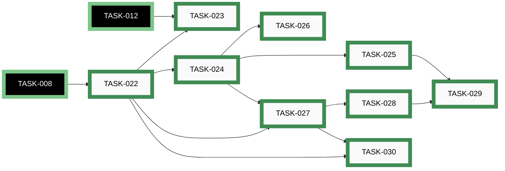

| Order | ID | Title | Status | Effort |
|-------|----|-------|--------|--------|
| 1 | ~~[TASK-022](closed/task-022-implement-erc-engine.md)~~ | ~~Implement erc_engine.py with structural S1–S3 and electrical E1–E10~~ | 🟢 closed | Large (8-24h) |
| 2 | ~~[TASK-023](closed/task-023-integrate-erc-into-renderer-pipeline.md)~~ | ~~Integrate ERC into renderer pipeline (post-schema, pre-drawing)~~ | 🟢 closed | Small (&lt;2h) |
| 3 | ~~[TASK-024](closed/task-024-seed-rule-catalog-rules-json.md)~~ | ~~Seed knowledge/rules.json with 15 entries (S1–S5 + E1–E10)~~ | 🟢 closed | Medium (2-8h) |
| 4 | ~~[TASK-025](closed/task-025-write-validate-catalog-script.md)~~ | ~~Write knowledge/validate_catalog.py~~ | 🟢 closed | Small (&lt;2h) |
| 5 | ~~[TASK-026](closed/task-026-write-knowledge-backlog.md)~~ | ~~Write knowledge/BACKLOG.md — remaining educational rules~~ | 🟢 closed | Small (&lt;2h) |
| 6 | ~~[TASK-027](closed/task-027-wire-catalog-into-erc-report.md)~~ | ~~Wire catalog into ERC report writer~~ | 🟢 closed | Medium (2-8h) |
| 7 | ~~[TASK-028](closed/task-028-write-erc-report-and-document-e9.md)~~ | ~~Write erc-report.md for each target; document E9 WARNING rationale~~ | 🟢 closed | Small (&lt;2h) |
| 8 | ~~[TASK-029](closed/task-029-extend-ci-staleness-and-erc-gate.md)~~ | ~~Extend CI — staleness guard for erc-report; ERROR-level gate; catalog validation~~ | 🟢 closed | Small (&lt;2h) |
| 9 | ~~[TASK-030](closed/task-030-write-erc-checks-reference-doc.md)~~ | ~~Write docs/erc-checks.md~~ | 🟢 closed | Medium (2-8h) |

## EPIC-004: Circuit Skill — BOM and Netlist Exporters

[↑ back to top](#index)

**Status:** 🟢 closed — @branch: release/epic-004-circuit-exporters — ██████████ 6/6 (100%)

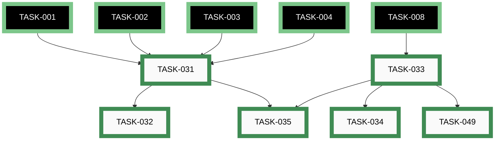

| Order | ID | Title | Status | Effort |
|-------|----|-------|--------|--------|
| 1 | ~~[TASK-031](closed/task-031-implement-bom-exporter.md)~~ | ~~Implement bom_exporter.py — Markdown and CSV~~ | 🟢 closed | Medium (2-8h) |
| 2 | ~~[TASK-032](closed/task-032-embed-bom-table-in-build-guide.md)~~ | ~~Embed BOM table in build guide~~ | 🟢 closed | Small (&lt;2h) |
| 3 | ~~[TASK-033](closed/task-033-implement-netlist-exporter.md)~~ | ~~Implement netlist_exporter.py — flatten NetGraph to KiCad .net~~ | 🟢 closed | Medium (2-8h) |
| 4 | ~~[TASK-034](closed/task-034-kicad-netlist-import-spot-check.md)~~ | ~~Spot-check main-circuit.net imports into KiCad without errors~~ | 🟢 closed | XS (&lt;30m) |
| 5 | ~~[TASK-035](closed/task-035-extend-ci-and-docs-for-exporters.md)~~ | ~~Extend CI staleness guard for bom + netlist; update docs/index.md~~ | 🟢 closed | Small (&lt;2h) |
| 6 | ~~[TASK-049](closed/task-049-kicad-netlist-structural-test.md)~~ | ~~Structural test for KiCad netlist output (S-expression grammar)~~ | 🟢 closed | Medium (2-8h) |

## EPIC-005: Circuit Skill — Markdown Block Integration

[↑ back to top](#index)

**Status:** 🟢 closed — ██████████ 3/3 (100%)

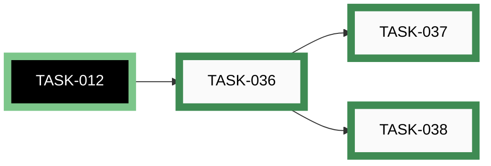

| Order | ID | Title | Status | Effort |
|-------|----|-------|--------|--------|
| 1 | ~~[TASK-036](closed/task-036-implement-markdown-block-rewrite.md)~~ | ~~Implement Markdown ```circuit block rewrite (workflow or superfences formatter)~~ | 🟢 closed | Medium (2-8h) |
| 2 | ~~[TASK-037](closed/task-037-implement-show-source-flag.md)~~ | ~~Implement show_source flag for Markdown blocks~~ | 🟢 closed | Small (&lt;2h) |
| 3 | ~~[TASK-038](closed/task-038-update-pre-commit-hook-for-circuit-yml.md)~~ | ~~Update pre-commit hook to trigger on .circuit.yml changes~~ | 🟢 closed | Small (&lt;2h) |

## EPIC-006: Circuit Skill — Skill Packaging and PyPI Publication

[↑ back to top](#index)

**Status:** 🔵 **active** — █████████░ 9/10 (90%)

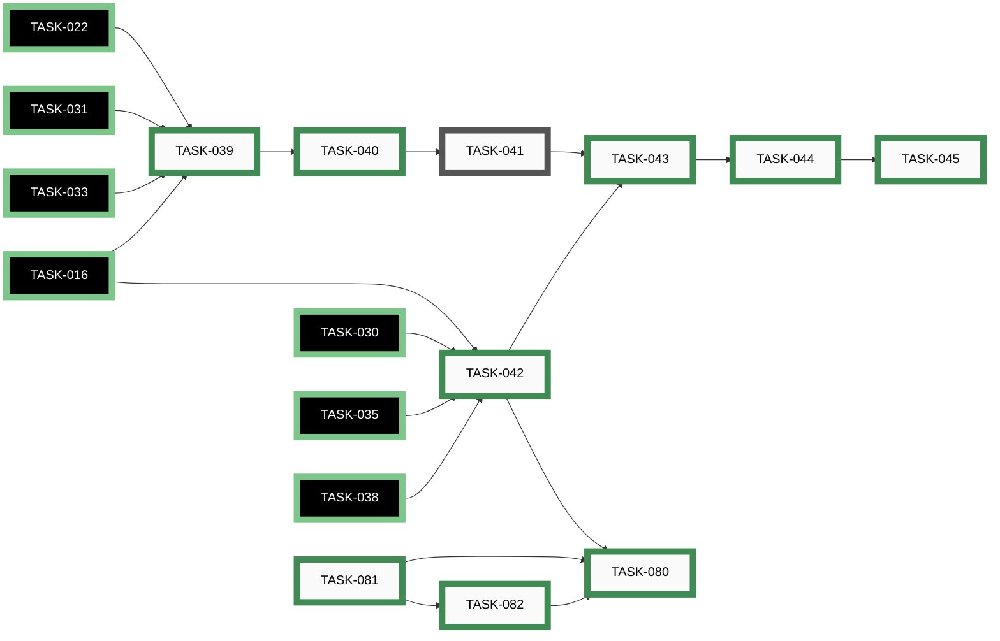

| Order | ID | Title | Status | Effort |
|-------|----|-------|--------|--------|
| 13 | [TASK-041](open/task-041-run-five-acceptance-tests.md) | Run the five Phase 6 acceptance tests | ⚪ _open_ | Large (8-24h) |
| 1 | ~~[TASK-039](closed/task-039-write-skill-md-system-prompt.md)~~ | ~~Write .claude/skills/circuit/SKILL.md with full system prompt~~ | 🟢 closed | Medium (2-8h) |
| 2 | ~~[TASK-040](closed/task-040-register-skill-in-vibe-config.md)~~ | ~~Register circuit skill in .vibe/config.toml enabled_skills~~ | 🟢 closed | XS (&lt;30m) |
| 4 | ~~[TASK-042](closed/task-042-finalise-skill-docs.md)~~ | ~~Finalise all .claude/skills/circuit/docs/ files~~ | 🟢 closed | Medium (2-8h) |
| 5 | ~~[TASK-043](closed/task-043-create-standalone-circuit-skill-repo.md)~~ | ~~Create circuit-skill standalone GitHub repository~~ | 🟢 closed | Small (&lt;2h) |
| 6 | ~~[TASK-044](closed/task-044-extract-skill-commit-history.md)~~ | ~~Extract skill commit history via git subtree split; push as main~~ | 🟢 closed | Medium (2-8h) |
| 7 | ~~[TASK-045](closed/task-045-replace-skill-dir-with-pinned-copy.md)~~ | ~~Replace skill dir with pinned copy; update doc links; write RELEASING.md and README~~ | 🟢 closed | Medium (2-8h) |
| 8 | ~~[TASK-080](closed/task-080-publish-circuitsmith-to-pypi.md)~~ | ~~Publish circuitsmith package to PyPI (first real 0.1.0)~~ | 🟢 closed | Medium (2-8h) |
| 10 | ~~[TASK-081](closed/task-081-author-release-workflow-scaffolding.md)~~ | ~~Author release workflow scaffolding (RELEASING.md + release.yml + version lockstep)~~ | 🟢 closed | Medium (2-8h) |
| 11 | ~~[TASK-082](closed/task-082-author-release-skill.md)~~ | ~~Author /release skill and register in .vibe/config.toml~~ | 🟢 closed | Medium (2-8h) |

## EPIC-007: Project Bootstrap — Python Project Config and CI

[↑ back to top](#index)

**Status:** 🟢 closed — ██████████ 4/4 (100%)

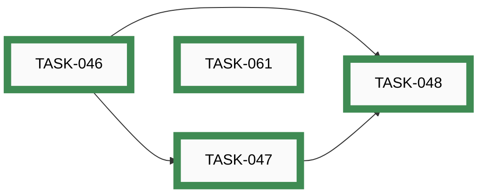

| Order | ID | Title | Status | Effort |
|-------|----|-------|--------|--------|
| 1 | ~~[TASK-046](closed/task-046-add-pyproject-and-dev-requirements.md)~~ | ~~Add pyproject.toml and requirements-dev.txt~~ | 🟢 closed | Small (&lt;2h) |
| 2 | ~~[TASK-047](closed/task-047-configure-pytest.md)~~ | ~~Configure pytest (testpaths, discovery, coverage thresholds)~~ | 🟢 closed | XS (&lt;30m) |
| 3 | ~~[TASK-048](closed/task-048-add-minimal-ci-workflow.md)~~ | ~~Add minimal GitHub Actions CI workflow~~ | 🟢 closed | Small (&lt;2h) |
| 4 | ~~[TASK-061](closed/task-061-adopt-python-linter-formatter.md)~~ | ~~Adopt a Python linter/formatter and wire it into /commit + pre-commit hook~~ | 🟢 closed | Medium (2-8h) |

## EPIC-008: Architecture Fitness Functions and Governance

[↑ back to top](#index)

**Status:** 🟢 closed — ██████████ 8/8 (100%)

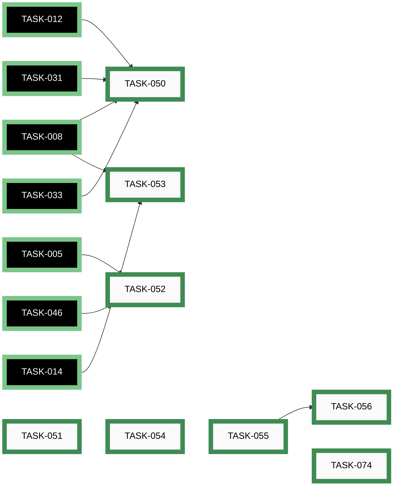

| Order | ID | Title | Status | Effort |
|-------|----|-------|--------|--------|
| 1 | ~~[TASK-054](closed/task-054-seed-adr-folder.md)~~ | ~~Seed docs/developers/adr/ with foundational decisions from the IDEA-001 dossier~~ | 🟢 closed | Medium (2-8h) |
| 2 | ~~[TASK-051](closed/task-051-portability-lint.md)~~ | ~~Portability lint for .claude/skills/circuit/~~ | 🟢 closed | Small (&lt;2h) |
| 3 | ~~[TASK-055](closed/task-055-code-owner-skills-hook.md)~~ | ~~Code-owner skills registry and PreToolUse hook~~ | 🟢 closed | Medium (2-8h) |
| 4 | ~~[TASK-056](closed/task-056-author-initial-code-owner-skills.md)~~ | ~~Author the first three code-owner skills (co-netgraph, co-schema, co-erc-engine)~~ | 🟢 closed | Medium (2-8h) |
| 5 | ~~[TASK-050](closed/task-050-boundary-import-contract-test.md)~~ | ~~Boundary-import contract test for circuit-skill modules~~ | 🟢 closed | Small (&lt;2h) |
| 6 | ~~[TASK-052](closed/task-052-schema-validation-pre-commit.md)~~ | ~~Schema-validation pre-commit hook for .circuit.yml~~ | 🟢 closed | Small (&lt;2h) |
| 7 | ~~[TASK-053](closed/task-053-netgraph-golden-hash-contract-test.md)~~ | ~~NetGraph golden-hash CI contract test~~ | 🟢 closed | Small (&lt;2h) |
| 8 | ~~[TASK-074](closed/task-074-personal-data-leak-check-in-security-review-hook.md)~~ | ~~Extend security-review hook to detect personal-contact-info leaks~~ | 🟢 closed | Small (&lt;2h) |

## EPIC-009: Developer Documentation and Governance Scaffolding

[↑ back to top](#index)

**Status:** 🟢 closed — ██████████ 12/12 (100%)

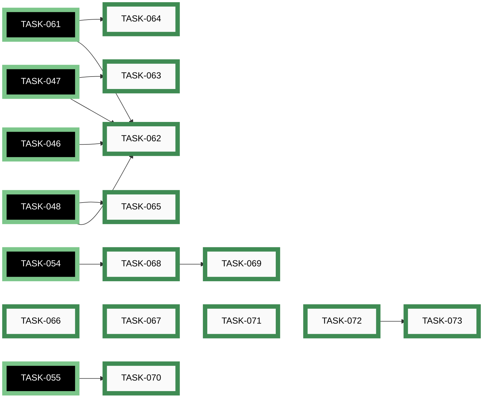

| Order | ID | Title | Status | Effort |
|-------|----|-------|--------|--------|
| 1 | ~~[TASK-062](closed/task-062-author-development-setup-doc.md)~~ | ~~Author docs/developers/DEVELOPMENT_SETUP.md as the canonical first-time-setup entry point~~ | 🟢 closed | Small (&lt;2h) |
| 2 | ~~[TASK-063](closed/task-063-author-testing-doc.md)~~ | ~~Author docs/developers/TESTING.md describing test layers, conventions, and fixture layout~~ | 🟢 closed | Medium (2-8h) |
| 3 | ~~[TASK-064](closed/task-064-author-coding-standards-doc.md)~~ | ~~Author docs/developers/CODING_STANDARDS.md (naming, formatting, comment policy, type hints)~~ | 🟢 closed | Small (&lt;2h) |
| 4 | ~~[TASK-065](closed/task-065-author-ci-pipeline-doc.md)~~ | ~~Author docs/developers/CI_PIPELINE.md inventorying CI jobs and gate semantics~~ | 🟢 closed | Small (&lt;2h) |
| 5 | ~~[TASK-066](closed/task-066-author-task-system-doc.md)~~ | ~~Author docs/developers/TASK_SYSTEM.md describing the IDEA/EPIC/TASK workflow and /ts-* skills~~ | 🟢 closed | Small (&lt;2h) |
| 6 | ~~[TASK-067](closed/task-067-author-code-of-conduct.md)~~ | ~~Adopt and commit docs/developers/CODE_OF_CONDUCT.md (short custom CoC mirroring AwesomeStudioPedal)~~ | 🟢 closed | Small (&lt;2h) |
| 7 | ~~[TASK-068](closed/task-068-author-architecture-doc.md)~~ | ~~Author docs/developers/ARCHITECTURE.md as the explicit top-down architecture page~~ | 🟢 closed | Medium (2-8h) |
| 8 | ~~[TASK-069](closed/task-069-author-mermaid-style-guide.md)~~ | ~~Author docs/developers/MERMAID_STYLE_GUIDE.md (diagram types, palette, edge conventions)~~ | 🟢 closed | Small (&lt;2h) |
| 9 | ~~[TASK-070](closed/task-070-author-security-review-doc.md)~~ | ~~Author docs/developers/SECURITY_REVIEW.md (script usage + reviewer checklist)~~ | 🟢 closed | Medium (2-8h) |
| 10 | ~~[TASK-071](closed/task-071-author-commit-policy-doc.md)~~ | ~~Author docs/developers/COMMIT_POLICY.md (pathspec rationale, race story, bypass policy)~~ | 🟢 closed | Medium (2-8h) |
| 11 | ~~[TASK-072](closed/task-072-author-branch-protection-doc.md)~~ | ~~Author docs/developers/BRANCH_PROTECTION_CONCEPT.md documenting the protection ruleset~~ | 🟢 closed | Small (&lt;2h) |
| 12 | ~~[TASK-073](closed/task-073-apply-branch-protection.md)~~ | ~~Apply GitHub branch protection on main per BRANCH_PROTECTION_CONCEPT.md~~ | 🟢 closed | Small (&lt;2h) |

## EPIC-010: Consolidate skill-resident Python into circuitsmith package

[↑ back to top](#index)

**Status:** 🟢 closed — ██████████ 4/4 (100%)

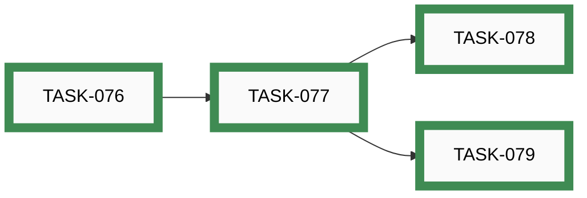

| Order | ID | Title | Status | Effort |
|-------|----|-------|--------|--------|
| 1 | ~~[TASK-076](closed/task-076-write-adr-0012-supersede-adr-0007.md)~~ | ~~Write ADR-0012 (library as installable package) superseding ADR-0007~~ | 🟢 closed | Medium (2-8h) |
| 2 | ~~[TASK-077](closed/task-077-atomic-relocation-to-src-circuitsmith.md)~~ | ~~Atomic relocation of circuit package to src/circuitsmith/~~ | 🟢 closed | Large (8-24h) |
| 3 | ~~[TASK-078](closed/task-078-update-agent-facing-surface.md)~~ | ~~Update agent-facing surface for circuitsmith package rename~~ | 🟢 closed | Small (&lt;2h) |
| 4 | ~~[TASK-079](closed/task-079-repo-docs-sweep-and-changelog.md)~~ | ~~Repo docs sweep and CHANGELOG bullet for circuitsmith refactor~~ | 🟢 closed | Small (&lt;2h) |

## EPIC-011: Test Plan and Coverage Matrix

[↑ back to top](#index)

**Status:** ⚪ _open_ — ░░░░░░░░░░ 0/9 (0%)

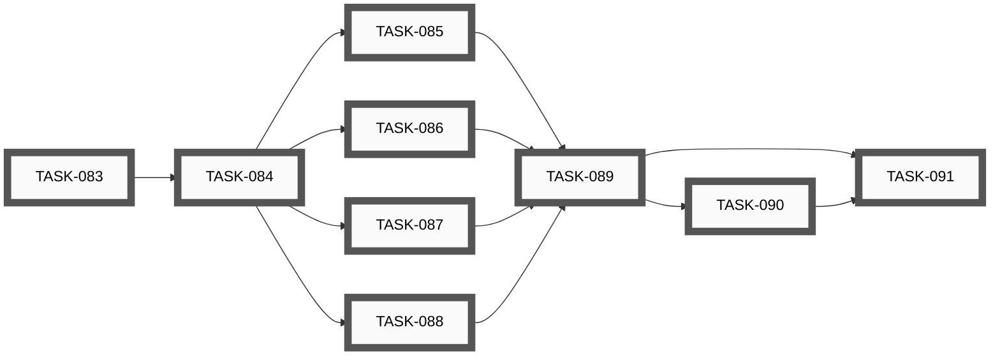

| Order | ID | Title | Status | Effort |
|-------|----|-------|--------|--------|
| 1 | [TASK-083](open/task-083-scaffold-testing-docs-directory.md) | Scaffold docs/developers/testing/ directory and top-level index | ⚪ _open_ | Small (&lt;2h) |
| 2 | [TASK-084](open/task-084-inventory-existing-test-surface.md) | Inventory the existing test surface and tag every test by subsystem and layer | ⚪ _open_ | Small (&lt;2h) |
| 3 | [TASK-085](open/task-085-document-schema-and-netgraph-test-plan.md) | Author the schema and netgraph subsystem test plans | ⚪ _open_ | Medium (2-8h) |
| 4 | [TASK-086](open/task-086-document-layout-and-router-test-plan.md) | Author the layout-kernel and Manhattan-router subsystem test plans | ⚪ _open_ | Medium (2-8h) |
| 5 | [TASK-087](open/task-087-document-renderer-and-erc-test-plan.md) | Author the renderer and ERC-engine subsystem test plans | ⚪ _open_ | Medium (2-8h) |
| 6 | [TASK-088](open/task-088-document-exporters-orchestration-ci-test-plan.md) | Author the exporters, skill-orchestration, and CI-gates subsystem test plans | ⚪ _open_ | Medium (2-8h) |
| 7 | [TASK-089](open/task-089-write-top-level-coverage-matrix.md) | Write the top-level coverage matrix with the PR-time/nightly/release axis | ⚪ _open_ | Medium (2-8h) |
| 8 | [TASK-090](open/task-090-file-followup-tasks-for-coverage-gaps.md) | File concrete follow-up tasks for every coverage gap exposed by the plan | ⚪ _open_ | Small (&lt;2h) |
| 9 | [TASK-091](open/task-091-ci-staleness-check-for-test-plan.md) | Add a CI staleness check that flags tests not referenced in the plan | ⚪ _open_ | Medium (2-8h) |

## EPIC-012: Tutorial and Example Gallery

[↑ back to top](#index)

**Status:** ⚪ _open_ — ░░░░░░░░░░ 0/10 (0%)

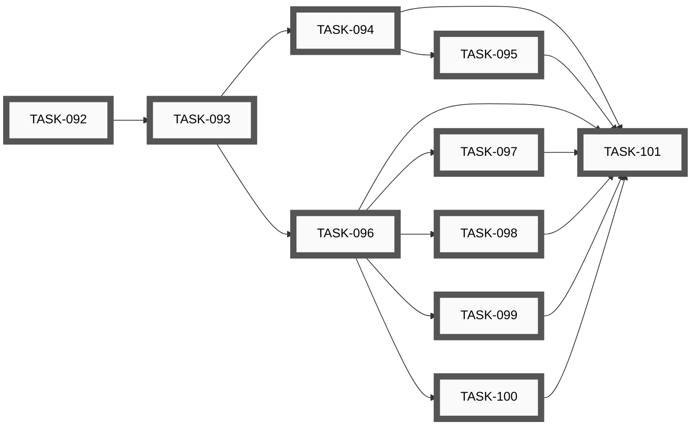

| Order | ID | Title | Status | Effort |
|-------|----|-------|--------|--------|
| 1 | [TASK-092](open/task-092-decide-docs-users-structure.md) | Decide docs/users/ structure and update README pointer | ⚪ _open_ | Small (&lt;2h) |
| 2 | [TASK-093](open/task-093-scaffold-tutorial-and-examples-directories.md) | Scaffold docs/users/tutorial/ and docs/users/examples/ with indexes | ⚪ _open_ | Small (&lt;2h) |
| 3 | [TASK-094](open/task-094-tutorial-steps-1-3-minimal-and-fan-out.md) | Tutorial — steps 1-3 (minimal circuit, fan-out, sub-blocks) | ⚪ _open_ | Medium (2-8h) |
| 4 | [TASK-095](open/task-095-tutorial-steps-4-6-erc-bom-iteration.md) | Tutorial — steps 4-6 (ERC fix, BOM export, layout iteration) | ⚪ _open_ | Medium (2-8h) |
| 5 | [TASK-096](open/task-096-example-voltage-divider.md) | Example gallery — voltage divider | ⚪ _open_ | Small (&lt;2h) |
| 6 | [TASK-097](open/task-097-example-common-emitter-amplifier.md) | Example gallery — common-emitter amplifier | ⚪ _open_ | Medium (2-8h) |
| 7 | [TASK-098](open/task-098-example-555-monostable.md) | Example gallery — 555 monostable timer | ⚪ _open_ | Medium (2-8h) |
| 8 | [TASK-099](open/task-099-example-opamp-non-inverting-buffer.md) | Example gallery — op-amp non-inverting buffer | ⚪ _open_ | Medium (2-8h) |
| 9 | [TASK-100](open/task-100-example-multi-page-split.md) | Example gallery — multi-page split (stresses renderer page-break) | ⚪ _open_ | Medium (2-8h) |
| 10 | [TASK-101](open/task-101-ci-regression-diff-for-gallery.md) | CI regression diff — regenerate the tutorial and gallery, fail on drift | ⚪ _open_ | Medium (2-8h) |

## EPIC-013: Post-EPIC-006 Documentation Audit and Rewrite

[↑ back to top](#index)

**Status:** ⚪ _open_ — ░░░░░░░░░░ 0/8 (0%)

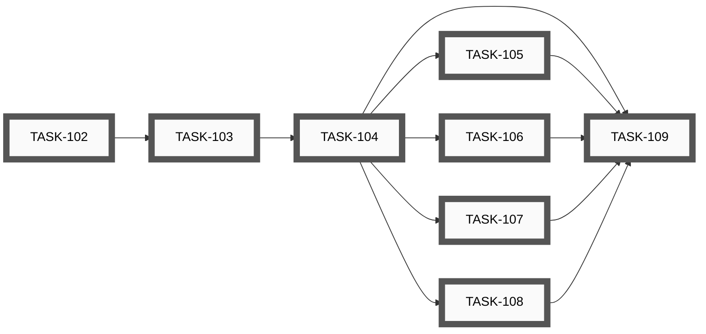

| Order | ID | Title | Status | Effort |
|-------|----|-------|--------|--------|
| 1 | [TASK-102](open/task-102-inventory-all-markdown-docs.md) | Inventory all .md docs and bucket by audience and freshness | ⚪ _open_ | Small (&lt;2h) |
| 2 | [TASK-103](open/task-103-drift-sweep-stale-claims.md) | Drift sweep — identify stale claims, retired scripts, and broken refs | ⚪ _open_ | Medium (2-8h) |
| 3 | [TASK-104](open/task-104-voice-unification-rewrite.md) | Voice unification — pick canonical voice and rewrite earlier docs forward | ⚪ _open_ | Large (8-24h) |
| 4 | [TASK-105](open/task-105-cross-reference-audit.md) | Cross-reference audit — internal links, TASK/EPIC/IDEA refs, code-path mentions | ⚪ _open_ | Small (&lt;2h) |
| 5 | [TASK-106](open/task-106-tutorial-alignment-with-epic-012.md) | Tutorial alignment — audit reference docs against EPIC-012's tutorial and gallery | ⚪ _open_ | Small (&lt;2h) |
| 6 | [TASK-107](open/task-107-test-plan-alignment-with-epic-011.md) | Test-plan alignment — audit "how it's tested" sections against EPIC-011's plan | ⚪ _open_ | Small (&lt;2h) |
| 7 | [TASK-108](open/task-108-annotate-idea-001-dossier.md) | Annotate the archived IDEA-001 dossier with what shipped vs what didn't | ⚪ _open_ | Small (&lt;2h) |
| 8 | [TASK-109](open/task-109-final-pass-readme-and-entry-points.md) | Final pass on README.md and top-level entry-point docs | ⚪ _open_ | Medium (2-8h) |

## Unassigned

[↑ back to top](#index)

**Status:** 🟢 closed — ██████████ 2/2 (100%)


| Order | ID | Title | Status | Effort |
|-------|----|-------|--------|--------|
| ? | ~~[TASK-060](closed/task-060-autonomous-implementation-mode.md)~~ | ~~Set up autonomous-implementation mode (AUTONOMY.md, /epic-run, HIL sweep, branch hygiene)~~ | 🟢 closed | Large (8-24h) |
| ? | ~~[TASK-075](closed/task-075-fix-idea-skill-template-markdownlint.md)~~ | ~~Fix /ts-idea-new template so generated files pass markdownlint on first run~~ | 🟢 closed | Small (&lt;2h) |
