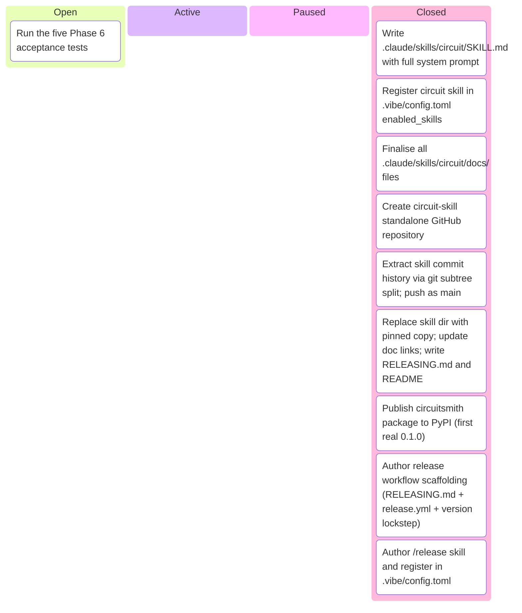

# Kanban Board

_Auto-generated by `housekeep.py`. Do not edit manually._

**Epics:** [circuit-skill-packaging](#circuit-skill-packaging)

## circuit-skill-packaging

_⚪ 1 open · 🔵 0 active · 🟡 0 paused · 🟢 9 closed · █████████░ 90%_

