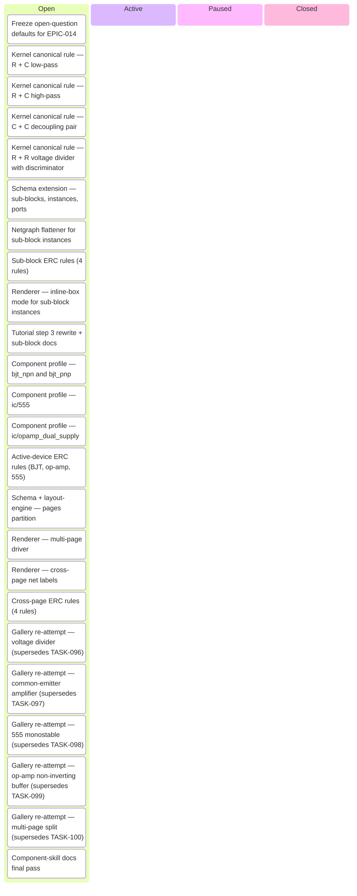
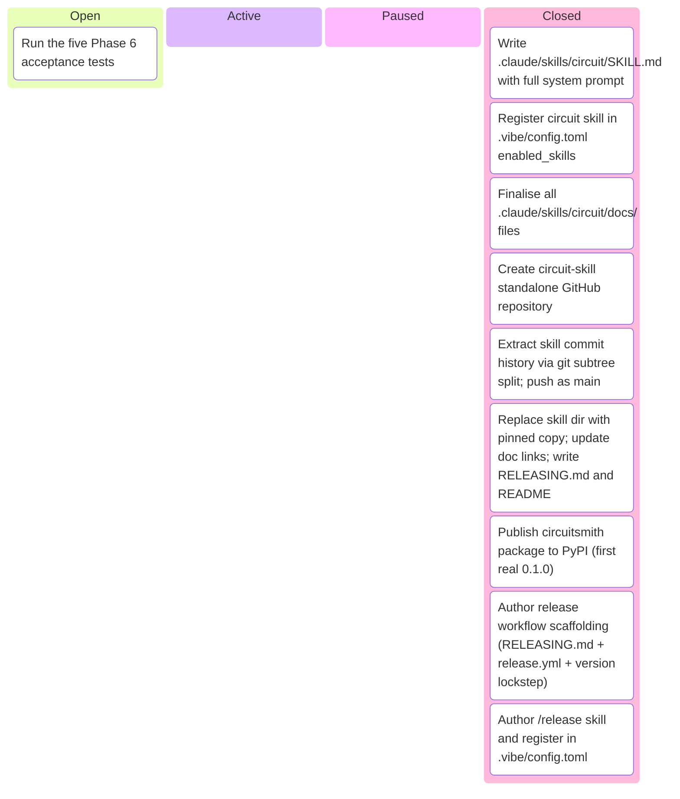
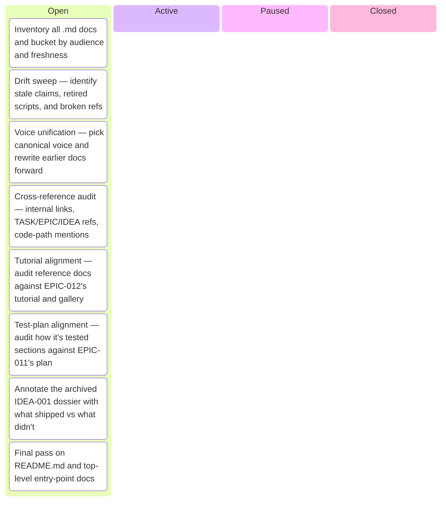
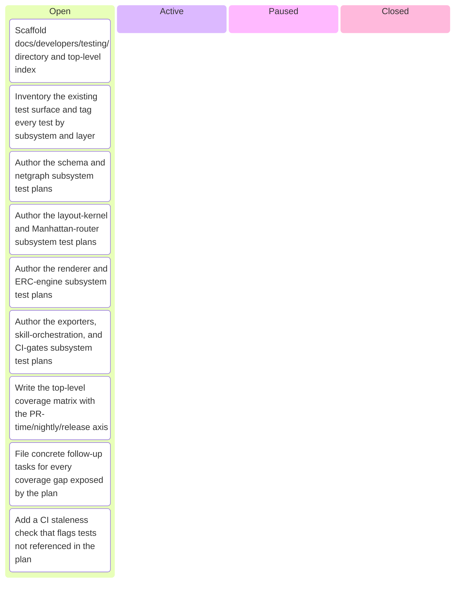

# Kanban Board

_Auto-generated by `housekeep.py`. Do not edit manually._

**Epics:** [circuit-library-and-renderer-v2](#circuit-library-and-renderer-v2) · [circuit-skill-packaging](#circuit-skill-packaging) · [post-epic-006-doc-audit](#post-epic-006-doc-audit) · [test-plan-and-coverage](#test-plan-and-coverage)

## circuit-library-and-renderer-v2

_⚪ 24 open · 🔵 0 active · 🟡 0 paused · 🟢 0 closed · ░░░░░░░░░░ 0%_

## circuit-skill-packaging

_⚪ 1 open · 🔵 0 active · 🟡 0 paused · 🟢 9 closed · █████████░ 90%_

## post-epic-006-doc-audit

_⚪ 8 open · 🔵 0 active · 🟡 0 paused · 🟢 0 closed · ░░░░░░░░░░ 0%_

## test-plan-and-coverage

_⚪ 9 open · 🔵 0 active · 🟡 0 paused · 🟢 0 closed · ░░░░░░░░░░ 0%_

