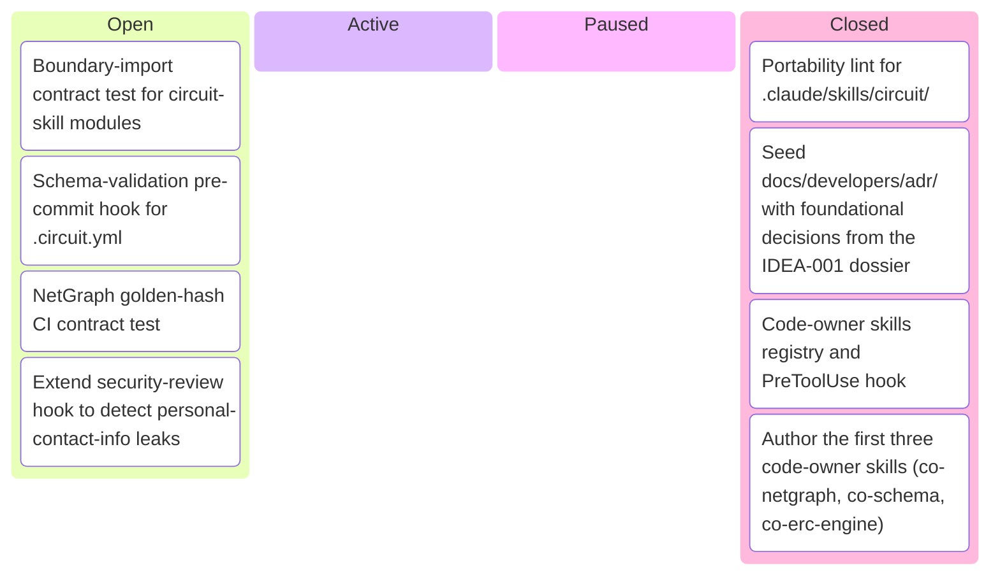
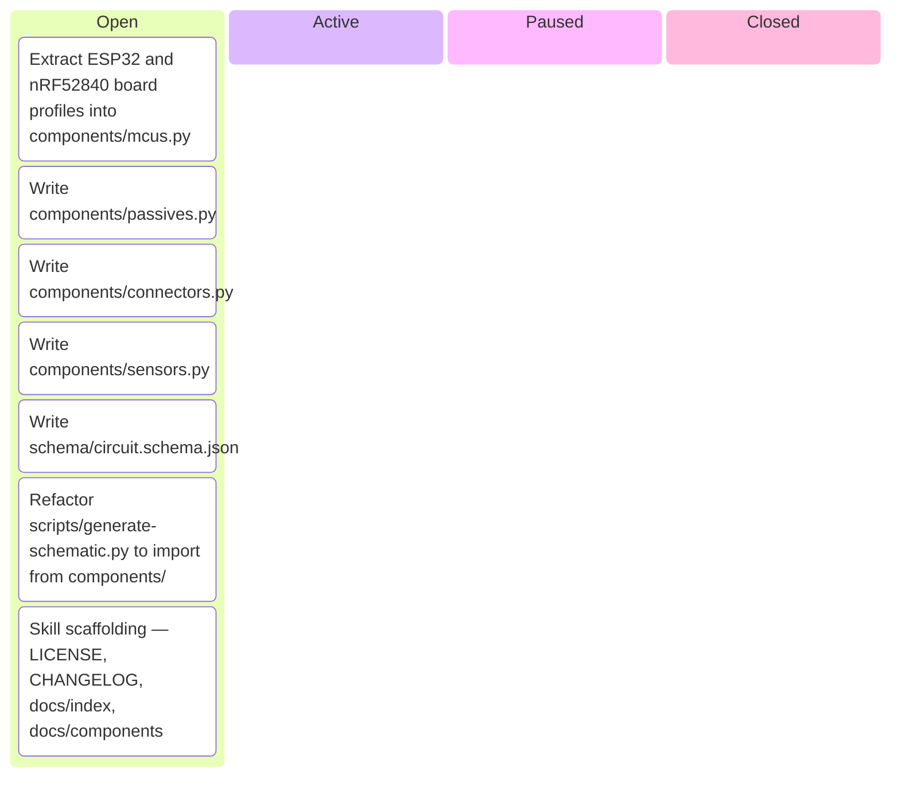
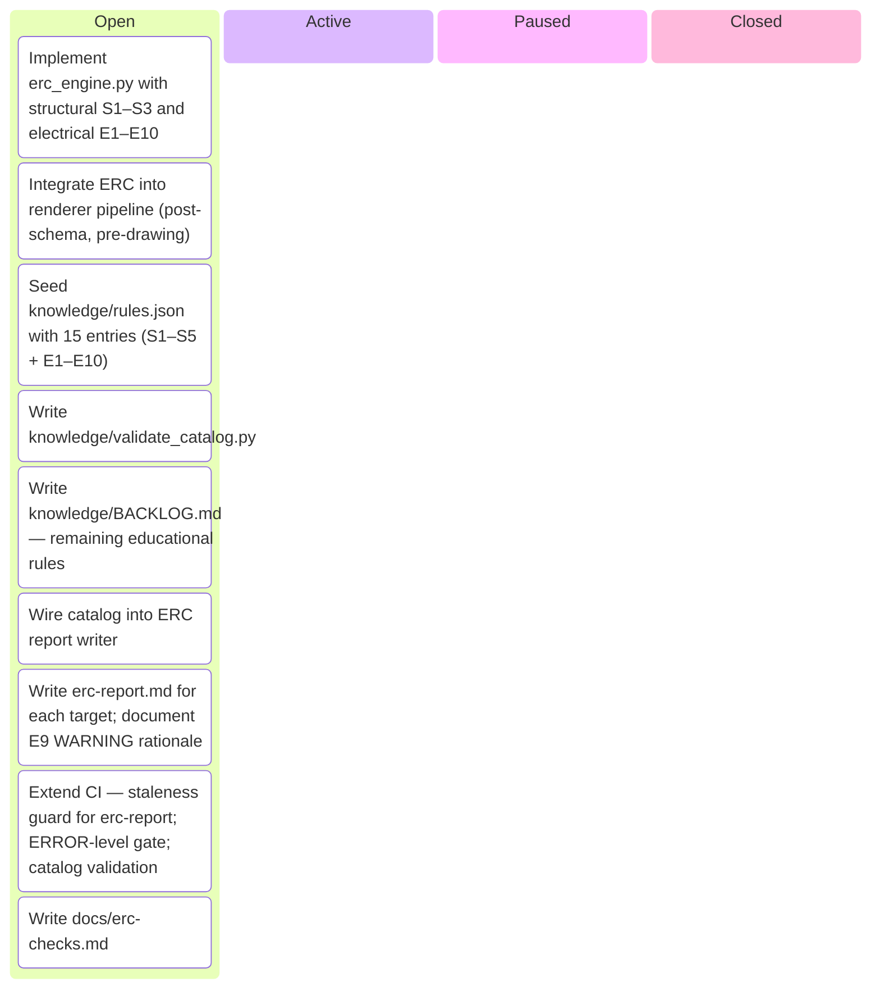
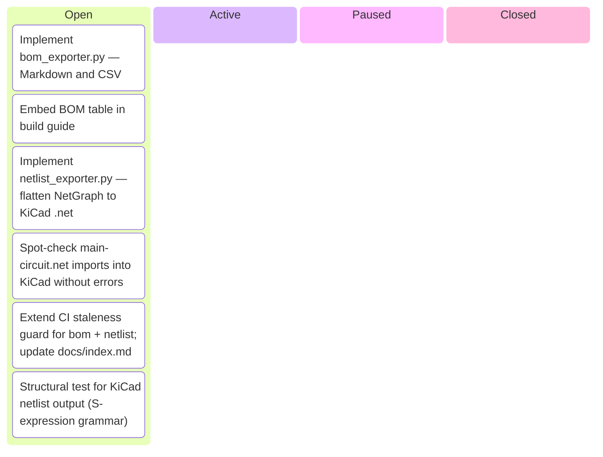
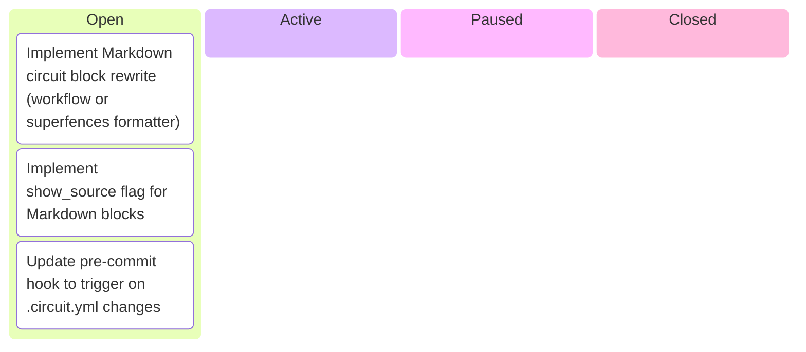
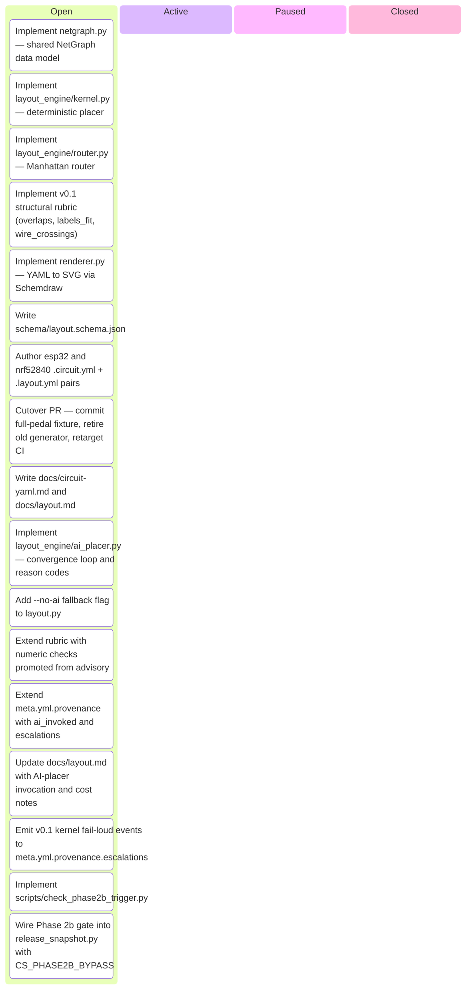

# Kanban Board

_Auto-generated by `housekeep.py`. Do not edit manually._

**Epics:** [architecture-fitness-functions](#architecture-fitness-functions) · [circuit-components](#circuit-components) · [circuit-erc](#circuit-erc) · [circuit-exporters](#circuit-exporters) · [circuit-markdown-integration](#circuit-markdown-integration) · [circuit-renderer-layout](#circuit-renderer-layout) · [circuit-skill-packaging](#circuit-skill-packaging)

## architecture-fitness-functions

_⚪ 4 open · 🔵 0 active · 🟡 0 paused · 🟢 4 closed · █████░░░░░ 50%_

## circuit-components

_⚪ 7 open · 🔵 0 active · 🟡 0 paused · 🟢 0 closed · ░░░░░░░░░░ 0%_

## circuit-erc

_⚪ 9 open · 🔵 0 active · 🟡 0 paused · 🟢 0 closed · ░░░░░░░░░░ 0%_

## circuit-exporters

_⚪ 6 open · 🔵 0 active · 🟡 0 paused · 🟢 0 closed · ░░░░░░░░░░ 0%_

## circuit-markdown-integration

_⚪ 3 open · 🔵 0 active · 🟡 0 paused · 🟢 0 closed · ░░░░░░░░░░ 0%_

## circuit-renderer-layout

_⚪ 17 open · 🔵 0 active · 🟡 0 paused · 🟢 0 closed · ░░░░░░░░░░ 0%_

## circuit-skill-packaging

_⚪ 7 open · 🔵 0 active · 🟡 0 paused · 🟢 0 closed · ░░░░░░░░░░ 0%_

