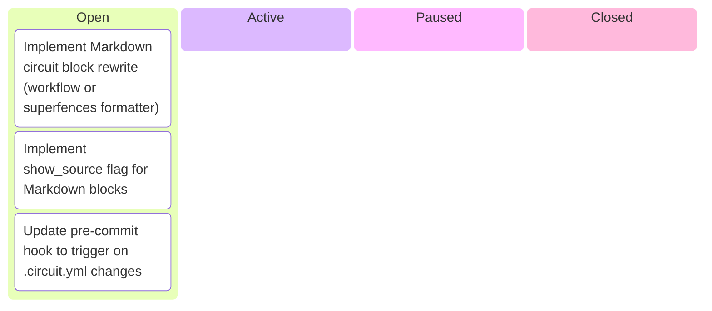
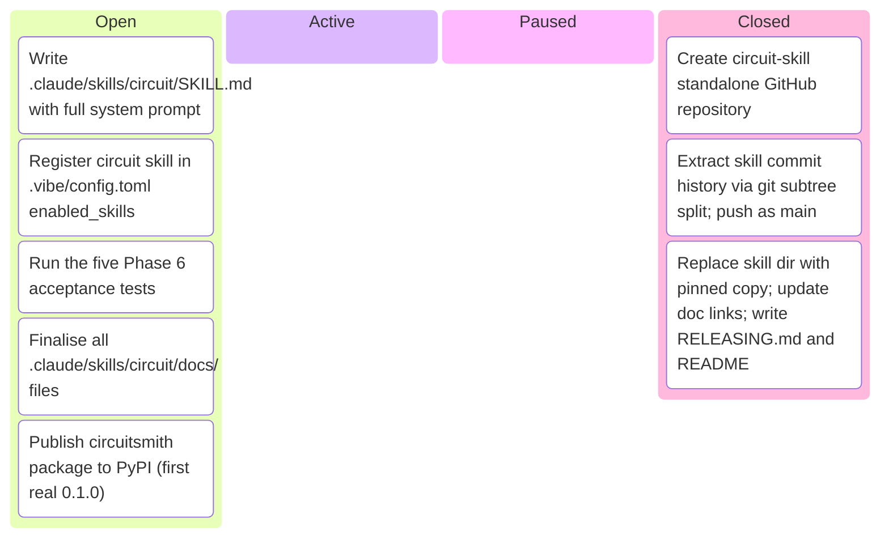

# Kanban Board

_Auto-generated by `housekeep.py`. Do not edit manually._

**Epics:** [circuit-markdown-integration](#circuit-markdown-integration) · [circuit-skill-packaging](#circuit-skill-packaging)

## circuit-markdown-integration

_⚪ 3 open · 🔵 0 active · 🟡 0 paused · 🟢 0 closed · ░░░░░░░░░░ 0%_

## circuit-skill-packaging

_⚪ 5 open · 🔵 0 active · 🟡 0 paused · 🟢 3 closed · ████░░░░░░ 38%_

