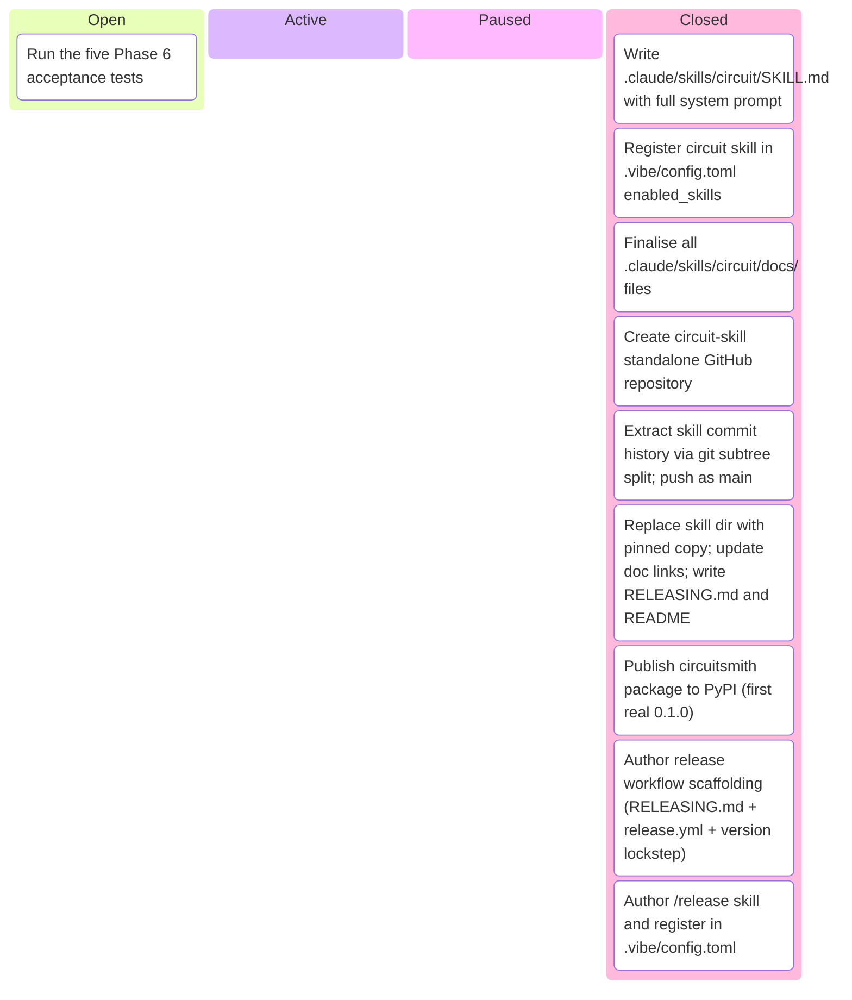
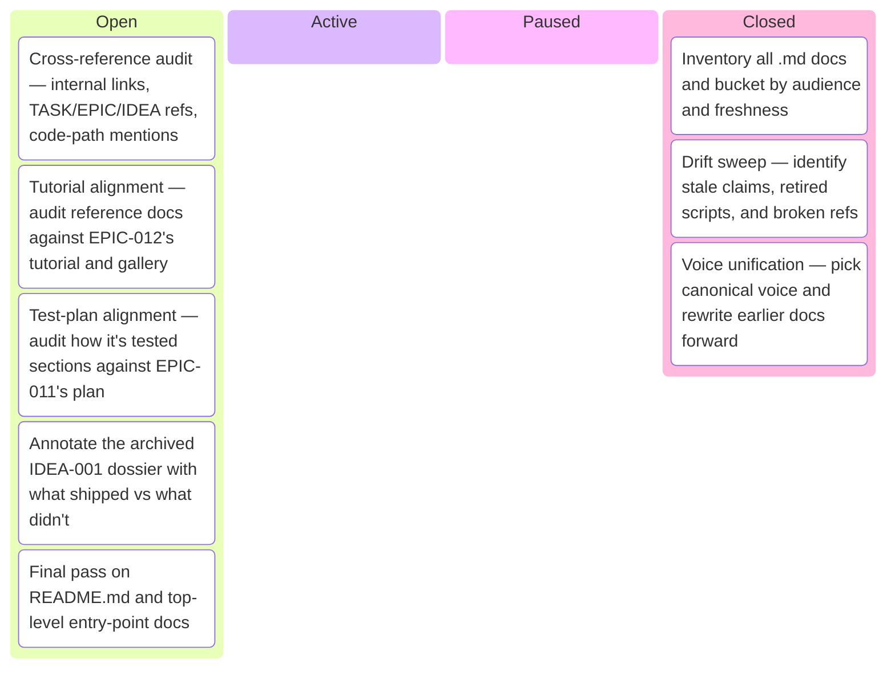
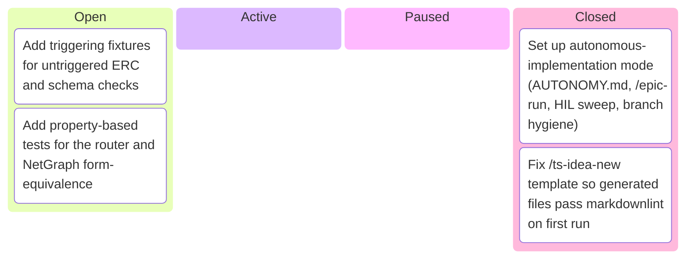

# Kanban Board

_Auto-generated by `housekeep.py`. Do not edit manually._

**Epics:** [circuit-skill-packaging](#circuit-skill-packaging) · [post-epic-006-doc-audit](#post-epic-006-doc-audit) · [Other](#other)

## circuit-skill-packaging

_⚪ 1 open · 🔵 0 active · 🟡 0 paused · 🟢 9 closed · █████████░ 90%_

```mermaid
kanban
  Open
    TASK_041["Run the five Phase 6 acceptance tests"]
  Active
  Paused
  Closed
    TASK_039["Write .claude/skills/circuit/SKILL.md with full system prompt"]
    TASK_040["Register circuit skill in .vibe/config.toml enabled_skills"]
    TASK_042["Finalise all .claude/skills/circuit/docs/ files"]
    TASK_043["Create circuit-skill standalone GitHub repository"]
    TASK_044["Extract skill commit history via git subtree split; push as main"]
    TASK_045["Replace skill dir with pinned copy; update doc links; write RELEASING.md and README"]
    TASK_080["Publish circuitsmith package to PyPI (first real 0.1.0)"]
    TASK_081["Author release workflow scaffolding (RELEASING.md + release.yml + version lockstep)"]
    TASK_082["Author /release skill and register in .vibe/config.toml"]
```

## post-epic-006-doc-audit

_⚪ 5 open · 🔵 0 active · 🟡 0 paused · 🟢 3 closed · ████░░░░░░ 38%_

```mermaid
kanban
  Open
    TASK_105["Cross-reference audit — internal links, TASK/EPIC/IDEA refs, code-path mentions"]
    TASK_106["Tutorial alignment — audit reference docs against EPIC-012's tutorial and gallery"]
    TASK_107["Test-plan alignment — audit how it's tested sections against EPIC-011's plan"]
    TASK_108["Annotate the archived IDEA-001 dossier with what shipped vs what didn't"]
    TASK_109["Final pass on README.md and top-level entry-point docs"]
  Active
  Paused
  Closed
    TASK_102["Inventory all .md docs and bucket by audience and freshness"]
    TASK_103["Drift sweep — identify stale claims, retired scripts, and broken refs"]
    TASK_104["Voice unification — pick canonical voice and rewrite earlier docs forward"]
```

## Other

_⚪ 2 open · 🔵 0 active · 🟡 0 paused · 🟢 2 closed · █████░░░░░ 50%_

```mermaid
kanban
  Open
    TASK_134["Add triggering fixtures for untriggered ERC and schema checks"]
    TASK_135["Add property-based tests for the router and NetGraph form-equivalence"]
  Active
  Paused
  Closed
    TASK_060["Set up autonomous-implementation mode (AUTONOMY.md, /epic-run, HIL sweep, branch hygiene)"]
    TASK_075["Fix /ts-idea-new template so generated files pass markdownlint on first run"]
```
