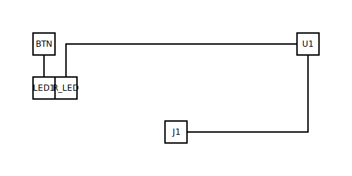

# 555 monostable timer

## What it demonstrates

The gallery's first **multi-pin IC** entry: an NE555 / LM555 wired
as a one-shot. A momentary low pulse on `TRIG` starts a timed-high
pulse on `OUT` whose width is set by the external R-C network on
`THRES` and `DISCH`. The example teaches: how the schema handles
a fixed-pin-package IC (silkscreen-pin keys with silicon-name
aliases), how the catalog's analog-timing rules apply to the
canonical 555 monostable, and how the kernel's pull-up rule covers
IC inputs (per ADR-0017) in addition to MCU GPIOs.

## The input

The committed `circuit.yml`:

```yaml
components:
  U1: { type: ic/555,             label: TIMER }
  J1: { type: connectors/usb_c,   label: 5V in }
  R_T: { type: passives/resistor,  value: 100000 }
  C_T: { type: passives/capacitor, value: 10e-6 }
  C_CTRL: { type: passives/capacitor, value: 10e-9 }
  R_TRIG: { type: passives/resistor, value: 10000 }
  BTN:    { type: passives/pushbutton, label: TRIGGER }
  R_LED: { type: passives/resistor, value: 330 }
  LED1:  { type: passives/led, color: red, label: PULSE }
```

Read the full source at [`circuit.yml`](circuit.yml) — the block
above is excerpted (components only), not re-typed.

The `connections:` section references the 555's pins in
silkscreen-pin form (`U1.1` through `U1.8`) to keep the ERC's
pin-naming-drift rule (TASK-123) silent. The silicon-name aliases
are documented here so readers can map silkscreen to function:

| Silkscreen | Silicon name | Direction |
|------------|--------------|-----------|
| `U1.1`     | `GND`        | ground    |
| `U1.2`     | `TRIG`       | input     |
| `U1.3`     | `OUT`        | output    |
| `U1.4`     | `RESET`      | input (tied to VCC) |
| `U1.5`     | `CTRL`       | input (bypassed to GND) |
| `U1.6`     | `THRES`      | input     |
| `U1.7`     | `DISCH`      | output (open-collector) |
| `U1.8`     | `VCC`        | power     |

## The output



`U1` lands in `right-column` (RULE_GENERIC_IC, per ADR-0010's IC
slot story); the timing pair `R_T` + `C_T` matches the
`rc-low-pass-R_T-C_T` synthetic region (R-in-path, C-to-GND
junction); `C_CTRL` falls to the `bus-V33` decoupling row (TASK-115
defaults); `R_TRIG` anchors to `U1.2` via the widened pull-up rule
and lands in `path-of-U1.2` (ADR-0017); `BTN` and `LED1` sit on the
`left-column` opposite the IC; `R_LED` attaches to `LED1`; the
USB-C jack lines up on `bottom-row`.

The full layout sidecar lives at [`layout.yml`](layout.yml); ERC
report at [`erc-report.md`](erc-report.md); provenance and rubric
metrics at [`meta.yml`](meta.yml).

## BOM

| Ref    | Type                    | Value   | Notes                          |
|--------|-------------------------|---------|--------------------------------|
| U1     | `ic/555`                | NE555   | Single-shot timer, 8-pin DIP   |
| J1     | `connectors/usb_c`      | —       | 5 V power input                |
| R_T    | `passives/resistor`     | 100 kΩ  | Timing resistor                |
| C_T    | `passives/capacitor`    | 10 µF   | Timing capacitor (electrolytic)|
| C_CTRL | `passives/capacitor`    | 10 nF   | CTRL bypass (ceramic)          |
| R_TRIG | `passives/resistor`     | 10 kΩ   | TRIG pull-up                   |
| BTN    | `passives/pushbutton`   | —       | Momentary trigger              |
| R_LED  | `passives/resistor`     | 330 Ω   | LED current limit              |
| LED1   | `passives/led`          | red     | Pulse indicator                |

The pulse width follows the canonical 555 monostable formula
`t = 1.1 × R_T × C_T = 1.1 × 100 kΩ × 10 µF ≈ 1.1 s`. One second
is deliberate — long enough to read on a single LED blink without
a scope. For shorter pulses drop `C_T` (`10 nF` gives `t ≈ 1.1 ms`,
useful for switch debounce); for longer pulses raise `R_T` toward
1 MΩ and switch to a low-leakage timing cap. The LED current at
`V_CC = 5 V`, `V_F ≈ 2.0 V` (red), `R_LED = 330 Ω` is
`I_LED ≈ (5 − 2) / 330 ≈ 9 mA` — well within the 555 output's
~200 mA sink/source budget.

## What makes it interesting

This entry is the gallery's first **multi-pin integrated-circuit**
example. Every prior entry uses dev-board MCUs or two-/three-
terminal devices. The 555 introduces three pieces of new vocabulary
the schema and kernel must handle:

- **Silkscreen-pin keys with silicon-name aliases.** The profile
  (TASK-121, `src/circuitsmith/components/ics.py`) uses pin keys
  `"1"` through `"8"` and exposes silicon names via `alt:` so a
  YAML author can write `U1.TRIG` and the validator resolves it to
  `U1.2`. The pin-naming-drift ERC rule (TASK-123, E18) warns when
  a single `.circuit.yml` mixes the two forms — silkscreen is the
  authoritative form here for ERC cleanliness.
- **Pull-ups to IC inputs.** `R_TRIG` is electrically the same
  shape as the tutorial's MCU pull-ups but the anchor pin is a
  555 SIGNAL_INPUT, not an MCU GPIO. ADR-0017 widens the kernel's
  `_shape_meta_pullup` to accept SIGNAL_INPUT, with rail-skip so
  the anchor reflects the resistor's signal-side terminal rather
  than an unrelated coincident pin on VCC (e.g. RESET tied high).
- **Generic-IC slot.** `RULE_GENERIC_IC` (id 17, TASK-121) places
  the 555 in `right-column` by dominant-pin-side, the same slot
  that `ic_opamp` will use when TASK-122 lands.

## Next example

[Op-amp non-inverting buffer](../opamp-non-inverting-buffer/) —
the gallery's first dual-supply IC, also scheduled under EPIC-014
(TASK-131).
