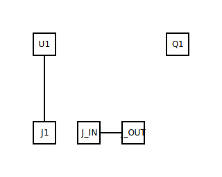

# Common-emitter amplifier

## What it demonstrates

The first analog-signal-flow gallery entry: a small-signal NPN
common-emitter amplifier. Biasing resistors set the quiescent
operating point, an input coupling capacitor blocks DC, an output
coupling capacitor delivers the amplified signal to the next stage,
and an emitter degeneration resistor stabilises gain across
temperature. The example teaches: how the catalog's analog-rule
chapter applies to a real biased active device, and how the layout
kernel handles a *direction-sensitive* component.

## The input

The committed `circuit.yml`:

```yaml
meta:
  title: Common-emitter amplifier
  target: esp32

components:
  U1: { type: mcu/esp32,          label: ESP32 }
  J1: { type: connectors/usb_c,   label: 5V in }
  Q1: { type: actives/bjt_npn,    label: AMP }
  R_B1: { type: passives/resistor, value: 47000, role: divider }
  R_B2: { type: passives/resistor, value: 10000, role: divider }
  R_C:  { type: passives/resistor, value: 2700 }
  R_E:  { type: passives/resistor, value: 270 }
  C_IN:  { type: passives/capacitor, value: 10e-6 }
  C_OUT: { type: passives/capacitor, value: 10e-6 }
  J_IN:  { type: connectors/mono_jack_6_35mm, label: Signal in }
  J_OUT: { type: connectors/mono_jack_6_35mm, label: Signal out }
```

Read the full source at [`circuit.yml`](circuit.yml) — the block
above is excerpted (components only), not re-typed.

## The output



`U1` lands in `mcu-center`; `Q1` in `right-column`; the
base-bias divider `R_B1`/`R_B2` in synthetic region `divider-BASE`
(TASK-114's R+R rule, gated by the `role: divider` override); the
collector load `R_C` in `bjt-load-Q1` and the emitter
degeneration `R_E` in `bjt-degen-Q1` (ADR-0016's two new kernel
rules); `C_IN` matches `rc-high-pass-*` (input-side DC block); the
USB-C jack and the two mono signal jacks line up on `bottom-row`.

The full layout sidecar lives at [`layout.yml`](layout.yml); ERC
report at [`erc-report.md`](erc-report.md); provenance and
rubric metrics at [`meta.yml`](meta.yml).

## BOM

| Ref   | Type                          | Value   | Notes                          |
|-------|-------------------------------|---------|--------------------------------|
| U1    | `mcu/esp32`                   | —       | ESP32 dev board (5 V via VIN)  |
| J1    | `connectors/usb_c`            | —       | 5 V power input                |
| Q1    | `actives/bjt_npn`             | 2N3904  | Small-signal NPN               |
| R_B1  | `passives/resistor`           | 47 kΩ   | Bias divider, top              |
| R_B2  | `passives/resistor`           | 10 kΩ   | Bias divider, bottom           |
| R_C   | `passives/resistor`           | 2.7 kΩ  | Collector load (sets Av)       |
| R_E   | `passives/resistor`           | 270 Ω   | Emitter degeneration           |
| C_IN  | `passives/capacitor`          | 10 µF   | Input coupling (DC block)      |
| C_OUT | `passives/capacitor`          | 10 µF   | Output coupling (DC block)     |
| J_IN  | `connectors/mono_jack_6_35mm` | —       | Signal input jack              |
| J_OUT | `connectors/mono_jack_6_35mm` | —       | Signal output jack             |

The bias divider sets `V_b ≈ V_CC × R_B2 / (R_B1 + R_B2) ≈ 0.88 V`,
which after the `V_BE ≈ 0.7 V` drop gives `V_E ≈ 0.18 V` and so
`I_C ≈ V_E / R_E ≈ 0.67 mA` (close to the 1 mA design point —
β-finite and `V_BE` non-ideality slide the operating point around
by tens of percent in any real build). The collector quiescent
voltage `V_C = V_CC − I_C × R_C ≈ 3.2 V`, comfortably mid-rail for
±1 V audio-band swing. The small-signal gain at the output cap is
approximately `A_v ≈ R_C / R_E ≈ 10`. This is a starting point;
for tighter specs (lower noise, higher gain, wider bandwidth),
adjust the bias for a specific operating point and consider
bypassing `R_E` with a large cap for AC gain.

## What makes it interesting

This entry is the first gallery example with a *direction-sensitive*
active device. Every previous example uses two-terminal passives
whose orientation is electrically symmetric. The layout kernel
needs to know that `Q1.C` goes "up" (toward the load) and `Q1.E`
goes "down" (toward GND), and the renderer needs to draw the
transistor symbol with the correct arrow direction. That's the new
mental model — encoded as `role: base|collector|emitter` on the
profile's per-pin attribute dict (per the EPIC-014 frozen-decisions
table; see ADR-0015).

Three kernel rules cooperate on the placement story:

- `RULE_BJT_TO_GND` (id 15) — Q1 itself, in `right-column`.
- `RULE_RR_VOLTAGE_DIVIDER` (id 14) — R_B1/R_B2, in
  `divider-BASE` (gated by `role: divider`).
- `RULE_BJT_LOAD` / `RULE_BJT_DEGENERATION` (ids 18 / 19,
  ADR-0016) — R_C / R_E, in `bjt-load-Q1` / `bjt-degen-Q1`.

ADR-0016 was the open-question resolution this entry triggered:
ADR-0015 promised "CE-amp renders deterministically" but only
covered the BJT and the base-drive resistor; the load and
degeneration resistors needed their own canonical-slot row.

## Next example

[555 monostable](../555-monostable/) — single-IC example with the
canonical 1-shot timing-cap topology, also scheduled under
EPIC-014 (TASK-130).
