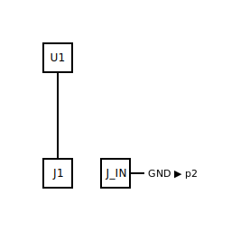
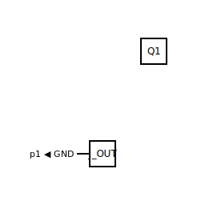

# Multi-page split — CE-amp chain across two sheets

## What it demonstrates

The gallery's stress-test entry: a single circuit rendered across
two SVG sheets. The example reuses the
[common-emitter amplifier](../common-emitter-amplifier/) topology
unchanged, then partitions it across two pages via `layout.yml`'s
`pages:` block — input-side components (host MCU, USB-C, signal-in
jack, coupling cap, base-bias divider) on `p1`; active-side
components (BJT, collector load, emitter degeneration, output
coupling cap, signal-out jack) on `p2`. The example teaches: how
`.layout.yml`'s page-partition vocabulary works (TASK-124), how
the renderer emits per-page SVGs (TASK-125), how cross-page net
labels render on both pages (TASK-126), and how the cross-page
ERC heuristic (TASK-127) gates against runaway splits.

## The input

The committed `circuit.yml`:

```yaml
components:
  U1: { type: mcu/esp32,          label: ESP32 }
  J1: { type: connectors/usb_c,   label: 5V in }
  Q1: { type: actives/bjt_npn,    label: AMP }
  R_B1: { type: passives/resistor, value: 47000, role: divider }
  R_B2: { type: passives/resistor, value: 10000, role: divider }
  R_C:  { type: passives/resistor, value: 2700 }
  R_E:  { type: passives/resistor, value: 270 }
  C_IN:  { type: passives/capacitor, value: 10e-6 }
  C_OUT: { type: passives/capacitor, value: 10e-6 }
  J_IN:  { type: connectors/mono_jack_6_35mm, label: Signal in }
  J_OUT: { type: connectors/mono_jack_6_35mm, label: Signal out }
```

Read the full source at [`circuit.yml`](circuit.yml).

The page partition lives in [`layout.yml`](layout.yml):

```yaml
pages:
  - { name: p1, title: Input section }
  - { name: p2, title: Active section }
placements:
  C_IN: { region: rc-high-pass-C_IN-R_B2, …, page: p1, … }
  C_OUT: { region: bus-V33, …,             page: p2, … }
  J1:   { region: bottom-row, …,           page: p1, … }
  J_IN: { region: bottom-row, …,           page: p1, … }
  J_OUT:{ region: bottom-row, …,           page: p2, … }
  Q1:   { region: right-column, …,         page: p2, … }
  R_B1: { region: divider-BASE, …,         page: p1, … }
  R_B2: { region: divider-BASE, …,         page: p1, … }
  R_C:  { region: bjt-load-Q1, …,          page: p2, … }
  R_E:  { region: bjt-degen-Q1, …,         page: p2, … }
  U1:   { region: mcu-center,              page: p1, … }
```

## The output

**Page 1 — Input section:**



**Page 2 — Active section:**



Three nets cross the page boundary: `VCC` (input side's `R_B1`
collector load on `p1` ↔ `R_C` on `p2`), `GND` (return path
spanning both supply jacks, the MCU, and both signal-jack
sleeves), and `BASE` (the audio signal entering `Q1.B` from the
input-side bias divider). `GND` renders the cross-page label
glyph (`GND ▶ p2` on page 1, `p1 ◀ GND` on page 2) because both
endpoints are coordinatised (USB-C jack on `bottom-row`, BJT
emitter degeneration on `bjt-degen-Q1`); `VCC` and `BASE` cross
on the schematic too, but their non-jack endpoints sit in v0.1's
uncoordinatised synthetic regions (`divider-BASE`,
`bjt-load-Q1`), so the router doesn't emit a routed wire for
them and the label glyph stays silent. The full cross-page-label
rendering of every spanning net unblocks when the router
coordinatises synthetic regions — a planned follow-up beyond
EPIC-014.

The full layout sidecar lives at [`layout.yml`](layout.yml); ERC
report at [`erc-report.md`](erc-report.md); provenance and rubric
metrics at [`meta.yml`](meta.yml).

## BOM

| Ref   | Type                          | Value   | Notes                          |
|-------|-------------------------------|---------|--------------------------------|
| U1    | `mcu/esp32`                   | —       | Host dev board (5 V via VIN)   |
| J1    | `connectors/usb_c`            | —       | 5 V power input                |
| Q1    | `actives/bjt_npn`             | 2N3904  | Small-signal NPN amp           |
| R_B1  | `passives/resistor`           | 47 kΩ   | Bias divider, top              |
| R_B2  | `passives/resistor`           | 10 kΩ   | Bias divider, bottom           |
| R_C   | `passives/resistor`           | 2.7 kΩ  | Collector load                 |
| R_E   | `passives/resistor`           | 270 Ω   | Emitter degeneration           |
| C_IN  | `passives/capacitor`          | 10 µF   | Input coupling (DC block)      |
| C_OUT | `passives/capacitor`          | 10 µF   | Output coupling (DC block)     |
| J_IN  | `connectors/mono_jack_6_35mm` | —       | Signal input jack              |
| J_OUT | `connectors/mono_jack_6_35mm` | —       | Signal output jack             |

The circuit-design values mirror the
[common-emitter amplifier](../common-emitter-amplifier/) entry —
~1 mA bias, `A_v ≈ R_C / R_E ≈ 10`, audio-band. The bias and
gain narration lives there; this example focuses purely on the
multi-page rendering mechanic.

## What makes it interesting

This is the only gallery entry whose primary purpose is to
exercise a *renderer* code path rather than teach a
circuit-design concept. Three things are worth pointing at:

- **Two SVG outputs from one `circuit.yml`.** The renderer's
  `_emit_pages_or_single` (TASK-125) sees the `pages:` block in
  the input `layout.yml` and emits `<stem>-p1.svg`,
  `<stem>-p2.svg` instead of a single `<stem>.svg`. The
  `.layout.yml` and `.meta.yml` sidecars stay singletons —
  they're whole-circuit provenance. Each page reuses the same
  `_emit_svg` code path with a per-page `LayoutResult` /
  `RouterResult` (cross-page wires dropped, then re-summarised
  as label glyphs).

- **Cross-page label glyphs.** TASK-126's
  `_cross_page_labels_for` walks the full route list and, for
  every routed wire whose endpoints are on different pages,
  emits a label stub at the local endpoint with a Unicode
  arrow (`▶` outgoing, `◀` incoming) plus the destination
  page name. The `GND ▶ p2` / `p1 ◀ GND` pair you see at the
  bottom of each page is the canonical example.

- **Cross-page ERC heuristic.** TASK-127's E22 warning fires
  when a circuit's page split forces more than six nets to
  span the boundary (configurable via
  `meta.erc.cross-page-threshold`). This circuit's split
  produces three cross-page nets — comfortably under the
  threshold, so the ERC report stays clean (one expected
  unrelated E9 warning on the USB-C jack).

The page split was chosen for narrative clarity: input
conditioning on `p1`, active gain stage on `p2`. The same
circuit could be split lots of other ways; the `page:`
assignments are user-authored metadata that the kernel
round-trips without modifying topology.

## Next

This is the last gallery entry. The
[CI regression-diff guard](../../../developers/tasks/closed/task-101-ci-regression-diff-for-gallery.md)
now runs the full pipeline against every committed
`.circuit.yml` (tutorial + all five gallery entries) and fails
the build on any drift — including this entry's two-page
output.
