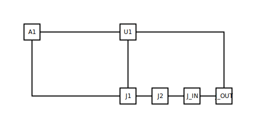

# Op-amp non-inverting buffer

## What it demonstrates

The gallery's first **dual-rail-supply** entry: a unity-gain
non-inverting buffer on a generic dual-supply op-amp. The signal
enters at `IN+`, the output is fed straight back to `IN-` (unity
feedback, no resistor divider — the gain is exactly 1), and the
buffered output goes to the load. The example teaches: op-amp pin
conventions (symbolic-pin keys per ADR-0010 — no silkscreen number
on a triangle symbol), split-rail power supply with one decoupling
cap per rail, and the catalog's power-pin-floating ERC rule
(E17, TASK-123) passing its negative case.

## The input

The committed `circuit.yml`:

```yaml
components:
  U1: { type: mcu/esp32,        label: ESP32 }
  A1: { type: ic/opamp_dual_supply, label: BUFFER }
  J1: { type: connectors/usb_c, label: +5V in }
  J2: { type: connectors/usb_c, label: -5V in }
  C_VCC: { type: passives/capacitor, value: 100e-9 }
  C_VEE: { type: passives/capacitor, value: 100e-9 }
  J_IN:  { type: connectors/mono_jack_6_35mm, label: Signal in }
  J_OUT: { type: connectors/mono_jack_6_35mm, label: Signal out }
```

Read the full source at [`circuit.yml`](circuit.yml) — the block
above is excerpted (components only), not re-typed.

## The output



`A1` lands in `left-column` (RULE_GENERIC_IC, dominant-side
resolves left because `IN+` and `IN-` are both on the left); the
two power-rail decoupling caps sit on their respective bus rows
(`bus-V_PLUS` for `C_VCC`, `bus-V_MINUS` for `C_VEE`); the four
connectors line up on `bottom-row` (cols 0..3); `U1` lands in
`mcu-center` per the MCU canonical slot. All 8 components placed
deterministically; no kernel escalations.

The full layout sidecar lives at [`layout.yml`](layout.yml); ERC
report at [`erc-report.md`](erc-report.md); provenance and rubric
metrics at [`meta.yml`](meta.yml).

## BOM

| Ref   | Type                          | Value   | Notes                          |
|-------|-------------------------------|---------|--------------------------------|
| U1    | `mcu/esp32`                   | —       | ESP32 dev board (target host)  |
| A1    | `ic/opamp_dual_supply`        | TL072   | Generic dual-supply op-amp     |
| J1    | `connectors/usb_c`            | —       | +5 V supply input              |
| J2    | `connectors/usb_c`            | —       | −5 V supply input              |
| C_VCC | `passives/capacitor`          | 100 nF  | V+ rail decoupling             |
| C_VEE | `passives/capacitor`          | 100 nF  | V− rail decoupling             |
| J_IN  | `connectors/mono_jack_6_35mm` | —       | Signal input                   |
| J_OUT | `connectors/mono_jack_6_35mm` | —       | Buffered signal output         |

A buffer has unity voltage gain by construction (`A_v = 1 +
R_f / R_g`; with `R_f = 0` and `R_g = ∞` the formula collapses to
`A_v = 1`). What the buffer *does* gain is **output drive** — the
op-amp's output stage sources/sinks several tens of milliamps at
near-zero output impedance, isolating a high-impedance source
(e.g. a guitar pickup at ~10 kΩ) from a low-impedance load (e.g.
the next stage's 10 kΩ input or a 32 Ω headphone jack). The
input bandwidth is set by the op-amp's GBW product — a TL072 at
~3 MHz GBW gives a unity-gain bandwidth of about 3 MHz, well
above audio.

## What makes it interesting

This entry is the gallery's first **dual-rail-supply** example.
Every prior gallery entry uses a single 5 V USB-C source; the
op-amp introduces three pieces of new vocabulary:

- **Symbolic pin keys.** The `ic/opamp_dual_supply` profile
  (TASK-122) uses `IN+`, `IN-`, `OUT`, `V+`, `V-` as pin keys,
  not silkscreen numbers — ADR-0010 doesn't apply because a
  triangle symbol carries no pin numbers to bind to. The schema
  validator accepts `+` and `-` in pin tokens via the
  pin-token regex (TASK-122 fixed it explicitly).
- **One decoupling cap per rail.** `C_VCC` and `C_VEE` land in
  separate bus rows (`bus-V_PLUS`, `bus-V_MINUS`) because they
  share neither rail. The C+C decoupling rule from TASK-113
  fires only when both caps share the same two nets (rail + GND);
  here the two caps are on different rails so each falls to the
  bare `RULE_DECOUPLING_CAP` slot, which is correct.
- **Power-pin-floating ERC, negative case.** E17 (TASK-123) raises
  an error when a `POWER_INPUT` pin (e.g. an op-amp's `V+`) is
  not on any net. With both supplies properly decoupled, both
  rails are connected and the check stays silent — this example
  is the gallery's witness for that negative case.

The unity-gain feedback (`A1.OUT ↔ A1.IN-`) is encoded as a single
net `BUF_OUT` containing both pins plus the output jack tip — one
of the [TASK-122 opamp profile tests](../../../developers/tasks/closed/task-122-component-profile-opamp.md)
asserts this collapse keeps the multi-net-pin ERC rule (E10)
quiet.

## Next example

[Multi-page split](../multi-page-split/) — the largest gallery
entry, scheduled under EPIC-014 (TASK-132). Exercises the
renderer's page-break path.
