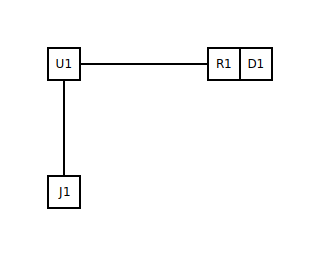

# Step 1 — Minimal circuit

## What you'll do

Author the smallest meaningful CircuitSmith circuit by hand: an ESP32
driving a single status LED through a current-limit resistor, powered
over USB-C. Then run the renderer once and look at what it produces.

By the end of this step you'll have written your first `.circuit.yml`
and seen all four pipeline artefacts the project emits (SVG, layout
sidecar, meta sidecar, ERC report).

## The `.circuit.yml`

The committed input lives next to this page at
[`01-minimal-circuit.circuit.yml`](01-minimal-circuit.circuit.yml).
Four components, three nets:

- `U1` — the ESP32 (the MCU is the heart of every circuit in the
  shipped library; the library does not have a standalone
  "voltage source" profile, so the MCU + USB pair is how power
  enters every example).
- `J1` — the USB-C connector that brings 5 V in on `VBUS`.
- `R1` — a 220 Ω current-limit resistor.
- `D1` — a red status LED.

The three nets:

| Net | Connects |
|---|---|
| `VCC` | `J1.VBUS` to `U1.VIN` |
| `GND` | `J1.GND` to `U1.GNDL`, `U1.GNDR` |
| `LED_STATUS` | `U1.D2` → `R1` → `D1` → back to `GND` (a `path:`) |

Two connection shapes appear here. `pins: […]` is for nets that just
*tie a set of terminals together* — no implied ordering — like VCC
and GND. `path: […]` is for nets that have a series ordering — the
MCU drives current through the resistor, then through the LED, then
home to ground. The renderer uses that ordering to route wires
left-to-right.

## Running the skill

From the repository root:

```bash
python -m circuitsmith.renderer \
  --circuit docs/users/tutorial/01-minimal-circuit.circuit.yml \
  --out    docs/users/tutorial/01-minimal-circuit.svg \
  --out-layout      docs/users/tutorial/01-minimal-circuit.layout.yml \
  --out-meta        docs/users/tutorial/01-minimal-circuit.meta.yml \
  --out-erc-report  docs/users/tutorial/01-minimal-circuit.erc-report.md \
  --no-ai
```

`--no-ai` keeps the run deterministic: the kernel placer alone, no
LLM in the loop. That matches CI's default and what
[ADR-0002](../../developers/adr/0002-ai-only-at-authoring-time.md)
locks in.

## The output



The committed artefacts you should see appear:

- [`01-minimal-circuit.svg`](01-minimal-circuit.svg) — the rendered
  schematic.
- [`01-minimal-circuit.layout.yml`](01-minimal-circuit.layout.yml) —
  the placer's slot assignment. `U1` lands in `mcu-center`, the LED
  in the right column with the resistor attached to it, the
  connector along the bottom row.
- [`01-minimal-circuit.meta.yml`](01-minimal-circuit.meta.yml) — the
  renderer's provenance + rubric scores (density, wire crossings,
  overlaps). For a four-component circuit there's not much rubric
  to talk about — that gets interesting in step 3.
- [`01-minimal-circuit.erc-report.md`](01-minimal-circuit.erc-report.md)
  — the ERC findings. Step 4 is where we read this report
  carefully; for now, notice that the run emits one **warning**
  (`E9 — Reverse-polarity unprotected` on `J1.VBUS`). That's an
  expected pending-promotion warning until the `diode` component
  category lands — your circuit is fine.

## What just happened

The pipeline you just ran end-to-end:

```text
.circuit.yml
  → schema validation
  → ERC               (15 catalog rules, see erc-checks.md)
  → layout kernel     (slot assignment, no LLM)
  → Manhattan router  (wire geometry)
  → Schemdraw render  (SVG emission)
  → rubric + meta.yml
```

Everything that just appeared on disk traces back to one of those
stages. The
[architecture overview](../../developers/ARCHITECTURE.md) is the
one-page version; each module has its own deeper reference under
the [`/circuit` skill docs](../../../.claude/skills/circuit/docs/).

## Next

[Step 2 — A second branch (fan-out)](02-fan-out.md) — add a second
LED and learn how nets are shared between components.
