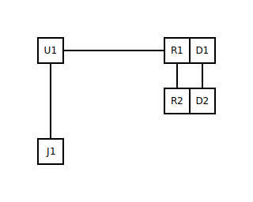

# Step 2 — A second branch (fan-out)

## What you'll do

Take the step 1 circuit and add a second LED branch on a different
GPIO. You'll see how nets are first-class — components share a node
just by referring to the same net name — and how the placer arranges
parallel branches stacked in the right-column region.

## The `.circuit.yml`

[`02-fan-out.circuit.yml`](02-fan-out.circuit.yml) is step 1's
circuit with two extras: `R2` + `D2` and a second `path:` net
(`LED_STATUS_B`) driven by `U1.D4` instead of `U1.D2`. Both branches
land on the same `GND` rail — the second `path:` ends in the literal
token `GND`, which the netgraph resolves to the same node as the
first branch's `GND` terminator and as the explicit `GND` net's pin
list.

The shared-node mechanic is the load-bearing idea of this step:

- The two `path:` entries each terminate in `GND`.
- The explicit `- net: GND` block lists `J1.GND`, `U1.GNDL`,
  `U1.GNDR`.
- All five of those pins (`D1.K`, `D2.K`, `J1.GND`, `U1.GNDL`,
  `U1.GNDR`) end up on the same node in the netgraph because the
  netgraph builder treats them as one.

You did not have to re-list `GND` in the second path's pin list, and
you did not have to invent a "shared-net" syntax. **References by
name are enough.**

## Running the skill

The renderer command is the same shape as step 1, just pointing at
the step 2 files:

```bash
python -m circuitsmith.renderer \
  --circuit docs/users/tutorial/02-fan-out.circuit.yml \
  --out    docs/users/tutorial/02-fan-out.svg \
  --out-layout      docs/users/tutorial/02-fan-out.layout.yml \
  --out-meta        docs/users/tutorial/02-fan-out.meta.yml \
  --out-erc-report  docs/users/tutorial/02-fan-out.erc-report.md \
  --no-ai
```

## The output



Look at the rendered SVG and the layout sidecar
([`02-fan-out.layout.yml`](02-fan-out.layout.yml)):

- Both LEDs land in `right-column` — `D1` on `row: 0`, `D2` on
  `row: 1`. The kernel knows that parallel branches off the same
  ground rail should stack vertically rather than fan outward.
- Each resistor is `attached-to:` its LED. `R1` rides with `D1`,
  `R2` rides with `D2`. The `attached-to:` relation tells the
  router to keep the resistor inline with its LED rather than
  scatter it elsewhere.

## What just happened

The netgraph builder is the subsystem doing the heavy lifting here.
It walks the `connections:` block, dedupes pin sets by net name, and
hands the placer a graph where shared ground is one node, not three.
The placer then assigns regions; the router lays down wires; the
renderer emits the SVG. Same five-stage pipeline as step 1 — just
more components flowing through it.

The relevant developer-doc deep dives:

- [`netgraph.md`](../../../.claude/skills/circuit/docs/circuit-yaml.md)
  in the `/circuit` skill docs covers the `pins:` / `path:` / `bus:`
  connection forms in full.
- [`layout.md`](../../../.claude/skills/circuit/docs/layout.md)
  covers slot vocabulary, `attached-to:`, and the regions the
  kernel knows about.

## Next

[Step 3 — Sub-blocks](03-sub-blocks.md) — push the same pattern
further by repeating a small composite (an RC filter) twice in one
circuit.
