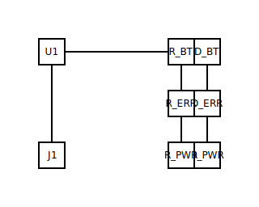

# Step 3 — Sub-blocks

## What you'll do

Push step 2's "second branch" idea to a third copy of the same
pattern, and learn how the layout kernel handles **repeated
sub-blocks** — identical R+LED pairs that the placer recognises as
one shape repeated three times rather than three unrelated
components.

## A note on what a "sub-block" is here

CircuitSmith's v0.1 `.circuit.yml` does not have a first-class
`sub-block:` keyword. A sub-block is, today, *whatever repeated
component pattern the layout kernel recognises as one canonical
shape* — R+LED pairs are one such pattern. Each `(R + LED)` you
list becomes one slot in the right-column stack; the kernel reads
the topology fingerprint and treats all three copies as
instantiations of the same sub-block.

A first-class `sub-blocks:` keyword (where you'd write the RC
filter once and instantiate it twice) is scheduled under
[EPIC-014](../../developers/tasks/open/epic-014-circuit-library-and-renderer-v2.md)
(seeded by IDEA-008). Until that epic closes, this step
demonstrates the underlying kernel behaviour rather than the
surface syntax; the rewrite to first-class sub-blocks lands in
TASK-119.

## The `.circuit.yml`

[`03-sub-blocks.circuit.yml`](03-sub-blocks.circuit.yml) is step 2's
two-LED circuit with one more copy of the same `(R + LED)` shape
added — three indicator LEDs on three GPIO pins (`D2`, `D4`, `D5`)
with three current-limit resistors. The labels (`PWR`, `BLUETOOTH`,
`ERROR`) tell the reader what each LED would mean in a real status
panel; the topology is what the kernel sees.

## Running the skill

Same renderer command as before:

```bash
python -m circuitsmith.renderer \
  --circuit docs/users/tutorial/03-sub-blocks.circuit.yml \
  --out    docs/users/tutorial/03-sub-blocks.svg \
  --out-layout      docs/users/tutorial/03-sub-blocks.layout.yml \
  --out-meta        docs/users/tutorial/03-sub-blocks.meta.yml \
  --out-erc-report  docs/users/tutorial/03-sub-blocks.erc-report.md \
  --no-ai
```

## The output



Read [`03-sub-blocks.layout.yml`](03-sub-blocks.layout.yml) and look
at what the placer did:

- All three LEDs (`D_PWR`, `D_BT`, `D_ERR`) land in
  `region: right-column`, on rows `0`, `1`, `2`.
- Each resistor is `attached-to:` its LED. The kernel applied the
  same "resistor rides with the LED" rule three times — once per
  sub-block.
- Every LED carries the same `topology-fingerprint` *shape* (a
  resistor on its anode side, GND on its cathode side); only the
  identifying labels differ. That fingerprint is the canonical
  hash the kernel matches against to recognise "same shape, do the
  same thing."

This is what repeated-sub-block placement looks like in v0.1.
Three instances of one canonical pattern, stacked in the region
where that pattern belongs.

## What just happened

The two new subsystems exercised in this step:

- The **layout kernel's canonical-rule matcher**. Every
  `(R + LED → GND)` triple matches one rule; the kernel applies
  that rule to each match independently, in a stable order, and
  the result is the stack you see above.
- The **topology-fingerprint** mechanism the kernel uses to
  recognise that three different netlist subtrees are the same
  shape. The fingerprints appear verbatim in the layout sidecar
  next to each placement.

Deep-dive references:

- [`layout.md`](../../../.claude/skills/circuit/docs/layout.md) —
  slot vocabulary, region names, what each canonical rule
  covers.
- [ADR-0001](../../developers/adr/0001-slots-not-coordinates.md) —
  why the kernel speaks slots rather than coordinates; the
  invariant the canonical-rule matcher leans on.

## Next

You've now seen authoring, fan-out, and repeated sub-blocks. The
tutorial pivots from authoring to **diagnostics** in the second
half.

[Step 4 — Fixing an ERC failure](04-erc-fix.md) — author a circuit
that the ERC engine rejects, read the diagnostic, fix it.
