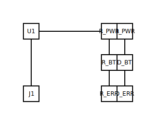

# Step 6 — Iterating on layout

## What you'll do

Take the step 3 circuit's auto-generated layout, copy it to a new
`.layout.yml`, change the row order so the LEDs appear in their
declaration order (`PWR`, `BT`, `ERR`) instead of the kernel's
alphabetical-on-fingerprint default, and re-render with the
modified layout. You'll see the resulting SVG reflect the
override and learn how the layout layer separates *what is
connected* from *what is drawn where*.

## Starting from the kernel's output

Step 3's render produced
[`03-sub-blocks.layout.yml`](03-sub-blocks.layout.yml). Read it: the
kernel ordered the three LEDs as `D_BT` (row 0), `D_ERR` (row 1),
`D_PWR` (row 2). That ordering is stable but arbitrary — it falls
out of how the kernel canonicalises topology fingerprints, not from
any author intent.

## The edited layout

[`06-layout-iteration.layout.yml`](06-layout-iteration.layout.yml)
re-orders the rows so the LEDs appear in their `components:`
declaration order. Two things to notice in the file:

- Every placement keeps its `topology-fingerprint` line — the
  layout-schema validator rejects placements without one
  (`'topology-fingerprint' is a required property`), and the
  fingerprint anchors each placement to a specific component
  identity in the circuit. Copy the fingerprints from the kernel's
  output rather than inventing new ones.
- The `attached-to:` relations are unchanged. Each resistor still
  rides with its LED; only the LED rows moved.

## Running the renderer with the override

The flag is `--layout`, pointing at the edited file:

```bash
python -m circuitsmith.renderer \
  --circuit         docs/users/tutorial/03-sub-blocks.circuit.yml \
  --layout          docs/users/tutorial/06-layout-iteration.layout.yml \
  --out             docs/users/tutorial/06-layout-iteration.svg \
  --out-layout      docs/users/tutorial/06-layout-iteration.out.layout.yml \
  --out-meta        docs/users/tutorial/06-layout-iteration.meta.yml \
  --out-erc-report  docs/users/tutorial/06-layout-iteration.erc-report.md \
  --no-ai
```

The `--layout` input is *advisory*: the kernel reads it, accepts
the placements that fit its slot vocabulary, and uses them in place
of its own kernel pass. The `--out-layout` path receives the
*effective* layout (the kernel's view after honouring the input);
keeping them on different paths makes it obvious which version is
which.

## The output

Original (step 3, kernel-ordered):


Iterated (step 6, author-ordered):



Compare the two SVGs side by side. The topology is identical — same
nets, same component count, same connectivity — but the rendered
ordering of the right column matches the author's intent in the
second image.

## What just happened

Two subsystems exercised:

- **The layout-schema validator** rejected the first draft (which
  omitted `topology-fingerprint`) and forced you to anchor each
  placement to a specific component identity. The schema lives at
  [`src/circuitsmith/schema/layout.schema.json`](../../../src/circuitsmith/schema/layout.schema.json).
- **The kernel's "honour the input" mode** — when `--layout` is
  passed, the kernel skips its own canonical-rule placement pass
  for placements you've named and falls back to its defaults only
  for components you've omitted. The slot vocabulary
  ([ADR-0001](../../developers/adr/0001-slots-not-coordinates.md))
  is what makes this composable: you describe placement in *slot*
  terms (`region: right-column, row: 0`), not pixel coordinates,
  so a single override fits cleanly into the kernel's regional
  layout without breaking anything else.

## Where the tutorial ends

This is the last step. You've now:

- Authored a minimal circuit and seen all four artefact types (step 1).
- Added a second branch and learned the shared-net mechanic (step 2).
- Repeated a canonical sub-block three times (step 3).
- Triggered an ERC warning, read the rule's rationale, and fixed
  the YAML (step 4).
- Exported the BOM in two forms and walked the manual PartsLedger
  round-trip (step 5).
- Overridden the kernel's layout to match author intent (step 6).

For finished circuits to read cold, jump to the
[example gallery](../examples/). For the reference docs each step
linked into, the entry points are
[`circuit-yaml.md`](../../../.claude/skills/circuit/docs/circuit-yaml.md),
[`layout.md`](../../../.claude/skills/circuit/docs/layout.md), and
[`erc-checks.md`](../../../.claude/skills/circuit/docs/erc-checks.md).
